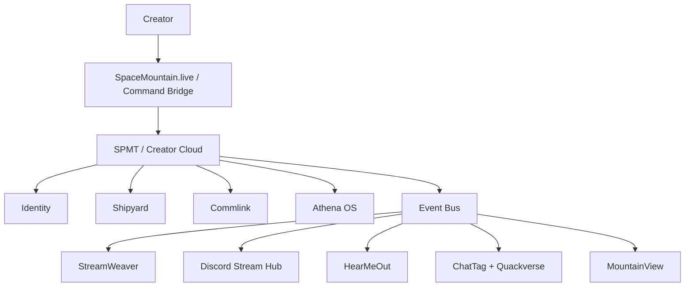

# Architecture

## High-Level Map

## SPMT Responsibilities

SPMT should answer:

- Who is the user?
- What apps can they access?
- What apps are installed?
- What permissions are granted?
- What messages and notifications exist?
- What events happened?
- What context should Athena know?

## SpaceMountain.live Responsibilities

SpaceMountain.live should present:

- the current creator workspace
- app launch state
- notifications
- Commlink
- Athena
- docs
- controls
- dashboards
- embedded/docked app surfaces

## App Responsibilities

Apps should focus on their specialty and publish useful ecosystem events.

They should not duplicate authentication, user profiles, global notifications, cross-app messaging, app registry state, or Athena memory.
