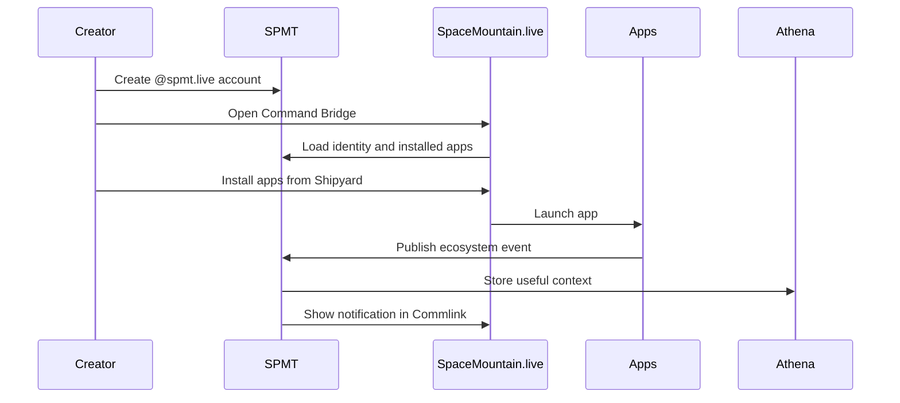

# Creator Journey

```mermaid
sequenceDiagram
  participant C as Creator
  participant S as SPMT
  participant B as SpaceMountain.live
  participant A as Apps
  participant AI as Athena

  C->>S: Create @spmt.live account
  C->>B: Open Command Bridge
  B->>S: Load identity and installed apps
  C->>B: Install apps from Shipyard
  B->>A: Launch app
  A->>S: Publish ecosystem event
  S->>AI: Store useful context
  S->>B: Show notification in Commlink
```

The goal is that every app feels like part of the same workspace, not a separate website.
