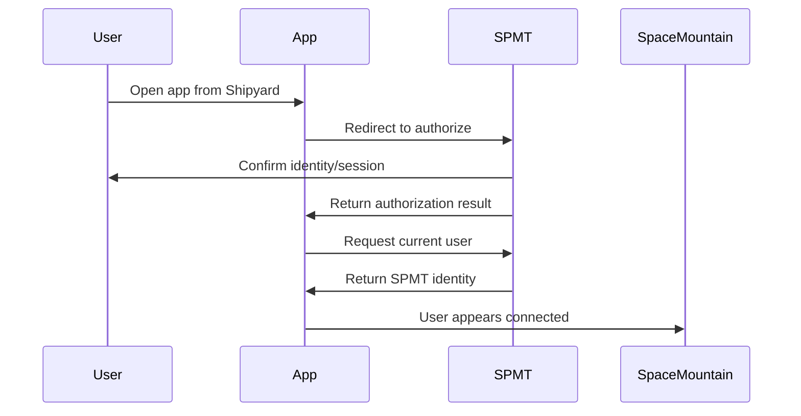

# OAuth Flow

SPMT should be the identity provider for first-party and future ecosystem apps.

## Flow

## App Requirements

- Do not create a fake user when SPMT identity is missing.
- Redirect to SPMT when identity is required.
- Store sensitive tokens server-side where practical.
- Use linked account fields for Twitch/Discord matching.
- Keep app-specific profiles optional and tied to SPMT identity.
