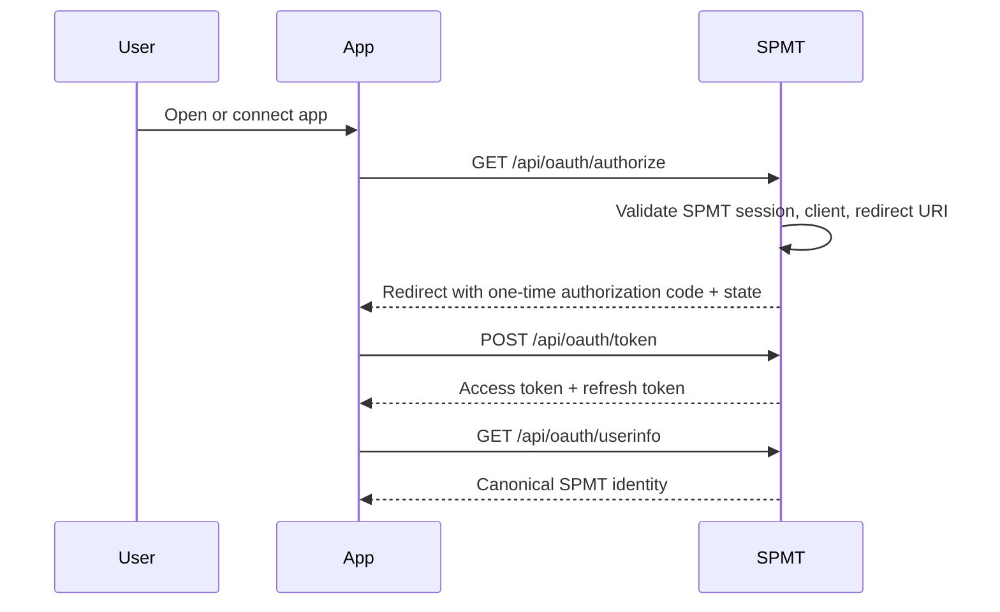

# OAuth Flow

SPMT is the identity provider for first-party and future ecosystem apps. Apps should use the canonical SPMT account instead of creating a separate identity whenever SPMT identity is required.

## First-Party Authorization Code Flow


```mermaid
sequenceDiagram
  participant User
  participant App
  participant SPMT

  User->>App: Open or connect app
  App->>SPMT: GET /api/oauth/authorize
  SPMT->>SPMT: Validate SPMT session, client, redirect URI
  SPMT-->>App: Redirect with one-time authorization code + state
  App->>SPMT: POST /api/oauth/token
  SPMT-->>App: Access token + refresh token
  App->>SPMT: GET /api/oauth/userinfo
  SPMT-->>App: Canonical SPMT identity
```

### 1. Redirect to SPMT

Send the browser to `/api/oauth/authorize` with the registered `client_id`, exact registered `redirect_uri`, and an application-generated `state` value.

The user must already have, or establish, a valid SPMT session. SPMT returns the browser to the registered callback with the same `state` and a short-lived one-time authorization code.

### 2. Exchange the authorization code server-side

The app backend exchanges the code at `POST /api/oauth/token` using:

```json
{
  "grant_type": "authorization_code",
  "code": "one-time-code",
  "client_id": "your-app-id",
  "client_secret": "server-side-client-secret",
  "redirect_uri": "https://your-app.example/auth/spmt/callback"
}
```

Authorization codes are one-time use. A replayed code is rejected.

Client secrets must remain on the server. Do not embed a first-party OAuth client secret in browser JavaScript, desktop webviews, or public source bundles.

### 3. Read the canonical identity

Use the returned access token with:

```http
GET /api/oauth/userinfo
Authorization: Bearer <access_token>
```

The returned identity is the SPMT account the app should attach its local profile and app-owned state to.

### 4. Refresh without creating a second account

The token response includes a refresh token for the app's server-side session lifecycle. Apps should refresh or re-authorize when needed rather than inventing a replacement local identity.

## Provider-Linked and Imported Accounts

Twitch and Discord are linked providers, not competing account authorities.

- Immutable provider user IDs are ownership evidence; display names and usernames are not.
- Existing app users may be grandfathered into SPMT only through a trusted server-to-server path that has verified the provider identity.
- Provider-owned/imported identities can later claim credentials without losing the canonical SPMT user ID.
- Name collisions must not merge two people merely because their display names match.
- Legacy app sessions may remain as compatibility paths during migration, but they must not silently grant new SPMT authority.

The scoped SDK/server operation for trusted migrations is `client.identity.grandfather(...)`, backed by the app-bound platform identity contract.

## App Requirements

- Use SPMT identity as the primary ecosystem identity.
- Preserve and validate OAuth `state`.
- Register exact callback URLs and reject unregistered redirects.
- Exchange authorization codes from the backend.
- Store sensitive tokens and client secrets server-side where practical.
- Use linked provider IDs for Twitch/Discord attribution and matching.
- Keep app-specific profiles optional and tied to the immutable SPMT user ID.
- Handle logout, refresh failure, account switching, revoked credentials, and unavailable SPMT without creating duplicate users.
- Request only the scopes the app actually needs.

## Verification

The repository includes an end-to-end first-party OAuth regression test covering the registered SpaceMountain, Discord Stream Hub, StreamWeaver, ChatTag, HearMeOut, and MountainView clients. It verifies authorization, callback state, token exchange, userinfo identity, and one-time-code replay rejection against the canonical SPMT database.
