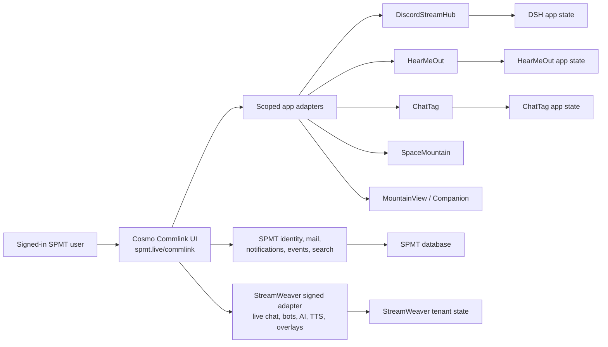

# Cosmo Commlink Integration Plan

Updated: 2026-07-30

Status: canonical, comprehensive UI/UX-first integration plan; Passes 1 through
3 are deployed, and Pass 4 adds receipt-backed deliberate provider actions

Owners:

- SPMT owns identity, authorization, durable Commlink mail, conversations, notifications, app-event summaries, search, and shared contracts.
- Cosmo becomes the user-facing messaging experience at `spmt.live`.
- StreamWeaver remains the high-volume live-chat, bot, AI conversation, TTS, overlay, and workflow runtime.
- Each ecosystem app retains authority over its domain actions and app state.

## Outcome

Create one signed-in messaging workspace at the planned
`https://spmt.live/commlink` route, branded as Cosmo Commlink, where a user can:

- combine selected Twitch, Kick, YouTube, and Discord channels into one chat box;
- preserve each provider's visual identity, badges, emotes, redeems, channel
  points, memberships, gifts, donations, and platform-specific event cards;
- save named multi-chat boxes to the SPMT account and reopen the same box from
  any SPMT app;
- compose to every writable channel in the current box or target exactly one
  channel with an autocomplete-backed `@channel` destination;
- show SPMT identity and XP without flattening provider identities;
- curate Discord servers, channels, and threads through DiscordStreamHub's
  existing authority;
- keep direct/group/app/AI/voice messages, notifications, and app-event
  summaries accessible without crowding the live-chat experience.

This is a convergence of user experience and contracts, not a merger of every
runtime into one process.

## Canonical Scope And Recorded Product Decisions

This file is the single detailed source for the Cosmo, ChatSpace, Commlink Desk,
and Social Stream Ninja reference work planned in this session. The ecosystem
roadmap, document registry, and README link here but must not maintain a second
copy of these requirements.

The following user decisions are requirements, not optional ideas:

1. Plan and approve the experience before writing application code.
2. Reuse Cosmo primarily for its UI, look, friendliness, and usability rather
   than treating its current backend behavior as the desired architecture.
3. Make SPMT messaging a one-stop workspace for Twitch, Kick, YouTube, Discord,
   and SPMT-native messages and events.
4. Preserve full provider presentation and behavior, including badges, emotes,
   memberships, gifts, donations, redeems, Twitch channel points, YouTube paid
   events, Discord roles/replies/attachments, and SPMT XP.
5. Let a user combine several chats into one named ChatSpace, save it to their
   SPMT account, and reopen it from any SPMT app.
6. Let a user open several ChatSpaces and event combinations simultaneously in
   one saved Commlink Desk.
7. Allow an operator to target one exact channel in a multi-chat composer with
   an autocomplete-backed `@provider/channel` destination before any deliberate
   send-to-all behavior.
8. Never forward incoming viewer messages across providers automatically.
9. Include Discord channel curation without removing DiscordStreamHub's
   authority or advanced management surfaces.
10. Give Commlink every applicable appearance and layout setting currently
    available in SpaceMountain, with SPMT account sync and explicit
    conflict/offline behavior.
11. Adopt the useful operator-console patterns found in Social Stream Ninja:
    addressable panels, synchronized operator state, smart staging, event-only
    displays, history/replay/export, truthful source capabilities, guarded
    automation, TTS controls, production shortcuts, and attachable show tools.
12. Preserve every existing ecosystem capability by migrating it, linking to
    its owning app, or retiring it only after explicit approval.

### Inspected references

- Cosmo repository `Mtman1987/Cosmo`, branch `Cosmo`, inspected at
  `0fba8817e069fb202fd76006fa15503b06f38323`.
- Local Social Stream Ninja reference `_reference/social_stream`, inspected at
  `27eafa34a884d1dc5b5ab4048a1ef092c38d0b40`.
- Current SpaceMountain `WorkspaceProfileV1`, portable-workspace consumer,
  settings UI, and Commlink compatibility surface.
- Existing SPMT messaging, workspace-profile, notification, event, identity,
  and SDK contracts plus StreamWeaver live-chat ownership.

### Implementation progress

Pass 1 started on 2026-07-30:

- `/commlink/` is a synthetic-data, no-provider-side-effect prototype for
  testing the Cosmo visual direction, saved-space rail, combined feed,
  provider/event cards, context inspector, destination preview, and multi-panel
  Desk.
- The appearance drawer reads and explicitly saves the existing
  `WorkspaceProfileV1` through its authenticated ETag/`If-Match` contract.
- Provider connections, real message sends, and durable ChatSpace/Desk records
  are intentionally not part of Pass 1.
- User review of the deployed prototype is the Phase 1 design feedback input;
  changes from that review are folded into the canonical plan before enabling
  provider side effects.

Pass 2 delivery on 2026-07-30:

- Persist ChatSpaces, Desks, active selections, source combinations, and
  destination choices as revision-protected `cosmo-commlink/workspace` SPMT app
  state.
- Add three account-backed hidden discoveries: the existing SpaceMountain
  Battle Arena, the Cosmo Black Hole, and the Commlink Constellation.
- Completing all three unlocks the original Cosmo `Lord Puzzler` title and the
  `Count Puzzle` hidden chatbot personality contract.
- Keep provider sends synthetic during this pass.

Pass 3 delivery on 2026-07-30:

- StreamWeaver remains the live-chat authority and exports its existing
  tenant-isolated `shared-chat-event.v1` replay through a service-key-protected,
  read-only SPMT route.
- Twitch and Discord retain their existing ingestion paths. Kick and YouTube
  now record their real incoming messages through the same normalized replay
  contract instead of stopping at the in-memory multi-platform event emitter.
- SPMT merges the StreamWeaver window with the signed-in account's real direct,
  group, voice, app-event, and non-duplicate notification records.
- The merger applies tenant isolation, bounded limits, timestamp search/replay,
  native-versus-bridge deduplication, source health, channel discovery, and
  degraded-upstream reporting.
- Commlink polls this account feed read-only, preserves provider identity,
  avatars, roles, badges, media, donations, memberships, rewards, replies, and
  SPMT records, and exposes bounded history search plus a side-effect-free
  five-minute replay.
- Signed-out users retain the labeled synthetic preview. Signed-in users see an
  explicitly labeled degraded preview only when the real feed cannot load.
- Compose, reply, moderation, TTS, feature, queue, and provider-send actions
  remain disabled or synthetic until Pass 4/5; replay never re-triggers XP,
  TTS, bots, moderation, or automation.

Pass 4 delivery on 2026-07-30:

- SPMT owns durable, per-user idempotency records and grouped outbound receipts.
- The signed-in UI requires exact destination chips and an explicit review
  before dispatch; `@channel` selects exactly one verified destination.
- Fan-out becomes one child request per destination with partial failure shown
  per target and retry limited to failed children.
- Reply is source-locked to the selected replay event. Twitch reply, Twitch
  timeout, and Discord delete are validated against the same tenant/channel
  replay boundary before StreamWeaver executes them.
- Compose is enabled only for a tenant-validated Twitch, Kick, or Discord
  channel. YouTube remains visibly read-only until its runtime is tenant-scoped;
  it is never silently included in send-all.
- The partner SDK exposes the same dispatch group and receipt contract through a
  `messages:write` scoped platform-key route.
- Discord channel curation uses the authorized channels returned by the account
  feed; DiscordStreamHub remains the permission and advanced-management owner.

Navigation and visual convergence requirements clarified during Pass 3:

- `/commlink/` must become a primary SPMT sidebar destination before cutover;
  the direct route alone is not a finished navigation integration.
- Legacy SPMT messaging entry points must converge on Commlink instead of
  remaining separate sources of truth.
- Commlink's shell is the visual reference for the wider SPMT product. Migrate
  shared sidebar, top bar, panels, drawers, typography, settings, and responsive
  behavior surface-by-surface while preserving specialized app workspaces.
- The SDK and typed events are the extension seam for other developers: apps
  publish or request scoped messaging through SPMT rather than creating another
  inbox or bypassing Commlink receipts.

### Compressed release-pass plan

Target: seven total deploy-and-test passes, with a permitted range of six to
eight when a dependency needs to move. Each pass should contain one intentional
SPMT commit/push whenever possible.

| Pass | Testable delivery |
| --- | --- |
| 1 — deployed | Synthetic Cosmo Commlink UI, combined feed, Desk, destination preview, and portable appearance profile |
| 2 — deployed | Durable ChatSpaces/Desks plus the three-discovery easter-egg and final reward system |
| 3 — deployed | Real read-only Twitch, Kick, YouTube, Discord, and SPMT feeds with fidelity, history, replay, health, and dedupe |
| 4 — deployed | Scoped compose, source-locked reply, deliberate fan-out, partial receipts, moderation, Discord curation, and SDK dispatch |
| 5 — implemented in coordinated release | Smart staging, panel roles/sync, receipt-backed TTS/show controls, native bot/AI/voice/translation/avatar links, and pop-outs |
| 6 — implemented in coordinated release | Typed event panels, guarded typed staging rules, show tools, named OBS output discovery, and allowlisted Stream Deck/Companion/MIDI mappings |
| 7 — implemented in coordinated release | Capability-truth app adapter matrix, SDK feed/control/integration contracts, Commlink-primary navigation, legacy rollback, failure tests, and cleanup held for approval |

### Passes 5–7 coordinated release boundary

The coordinated Pass 5–7 implementation deliberately reuses capability owners
instead of copying their systems into the browser:

- StreamWeaver owns tenant replay, pin/queue/feature state, the featured OBS
  output, TTS generation/queueing, bots and AI, voice, translation, and avatar
  presentation. Its SPMT service bridge validates tenant context and returns
  explicit delivered, skipped, or failed results.
- SPMT owns idempotency, durable operator receipts, saved panel roles, explicit
  synchronization groups, staging rules, control bindings, adapter status, and
  the primary Commlink navigation.
- Smart staging accepts typed events only, is off by default, exposes dry run,
  never runs during history/replay, and is limited to safe pin/queue actions.
- Companion execution continues through its existing paired-device capability
  allowlist. An offline or unpaired device is shown as unavailable; no browser
  command is reported as complete without the SPMT command receipt.
- Commlink is the primary messaging entry. The legacy inbox remains a labeled
  rollback surface for the observation window. No historical record, old route,
  Firebase data, or standalone Cosmo repository is deleted by this release.

This release does **not** convert source validation into live operator proof.
Audible TTS, a real paired Companion control, forced reconnect, concurrent
two-account browser sessions, and cleanup approval remain operator/observation
gates even when their automated isolation and failure fixtures pass.

Local release evidence before the coordinated push:

- StreamWeaver: 135/135 repository isolation tests, the automation-variable
  persistence check, lint, typecheck, and a 221-route production build passed.
- SPMT: typecheck, server build, SDK declaration/package build, and the
  237-check smoke suite passed.
- Browser QA: the unsigned local Commlink preview rendered at desktop and
  390-pixel mobile widths; the production dock opened; the guarded redeem dry
  run found one typed match without executing an action; the SPMT account shell
  rendered with the shared Commlink visual system; and no browser console
  warning or error was observed.

### Canonical workspace correction after Pass 7

The first user test of the coordinated release exposed a usability gap: the
capability contracts were present, but `/commlink/` still behaved too much like
a separate application. The correction makes the SPMT shell and Commlink
workspace the canonical path without deleting the standalone route:

- the SPMT sidebar opens Commlink inside the signed-in SPMT header/sidebar
  context; `/?view=commlink` is the primary surface, `/commlink/?embedded=1` is
  the SDK/app iframe surface, and `/commlink/` remains the pop-out surface;
- ChatSpaces and Desks can be created, renamed, edited, and deleted; Desks can
  contain selected ChatSpaces; workspace changes continue to use the
  revision-protected SPMT app-state record;
- a new ChatSpace starts empty. Its editor lists real account/provider
  connections, points to SPMT Connections for sign-in, and allows source
  membership to be checked or unchecked instead of inventing an SPMT direct
  destination;
- compose-capable destinations stay visible and are highlighted/unhighlighted
  for fast targeting. Read-only destinations stay visible but disabled, and
  therefore never inflate the send count;
- `bridgeSourceIds` saves which sources are intentionally combined in a
  ChatSpace. Incoming viewer messages are still never copied between provider
  chats;
- Desk mode derives provider tabs from connected sources, saves hide/show state
  per Desk, and displays the ChatSpaces assigned to that Desk;
- the ChatSpace source editor exposes each discovered Discord channel plus an
  `All Discord channels` read lane, and does the same for an all-Twitch read
  lane. Aggregate lanes never become a dangerous compose fan-out; selecting a
  message still replies to its exact source channel;
- Focus mode has no permanent empty inspector column. Selecting a message slides
  its context rail in; closing or toggling the selection slides it out;
- rich message cards render bounded images, GIFs, video, audio, emotes, and
  links; Discord `<@userID>` text resolves from supplied mention metadata and
  remains unchanged when no verified display name exists;
- the composer includes an emoji picker and browser speech-to-text when
  supported; provider tabs can open supported Twitch, YouTube, and Kick
  audio/video players, and connected-source chips expose separate Twitch
  `Audio` and `Video` controls so an operator can hear or see the streamer react
  without leaving the chat. The UI does not pretend an unsupported TikTok embed
  exists;
- the authenticated account XP endpoint supplies the current user balance.
  Message-level SPMT XP is shown only after an identity mapping is verified;
- StreamWeaver's tenant-scoped command catalog, points/level, cards, and
  command-invocation metadata enrich the tenant's Commlink event stream.
  Command events and provider-native redeems retain typed, filterable event
  treatment instead of becoming plain chat text.
- DiscordStreamHub `/messages`, StreamWeaver `/chat`, HearMeOut `/messages`, and
  Chat Tag `/messages` now host the canonical embedded Commlink surface inside
  their existing app chrome. Each includes a full SPMT-workspace link, while
  DSH and StreamWeaver retain explicit links to their native advanced tools.

#### Global and tenant-scoped viewer data

- Gym badges are global SPMT achievements. They may appear in every tenant's
  Commlink context and must be labeled `Global gym badges`.
- Stream/channel points and StreamWeaver cards remain tenant-scoped and are
  labeled with the owning tenant/channel context. They must not be silently
  summed or exposed to another tenant.
- A future moderator-only `Other streams` dropdown may show cross-tenant point
  summaries only after an explicit user/creator sharing policy, a role-gated
  API contract, audit logging, and two-tenant privacy tests exist. This release
  deliberately does not add that disclosure.

## Hidden Discovery And Reward Contract

The easter eggs remain discoverable through interaction, not a visible menu or
checklist. Commlink may show only three unlabeled progress lights until a signal
is found.

1. **The Hidden Battle Arena** is discovered through SpaceMountain's existing
   rocket collision path. SPMT recognizes the resulting authenticated
   `spacemountain-live/arena` app-state record; the arena must not return to
   normal navigation.
2. **The Cosmo Black Hole** reuses a simplified version of Cosmo's logo puzzle:
   activate the Cosmo mark and guide three station artifacts into the
   singularity.
3. **The Commlink Constellation** is found by touching the named Desk-panel
   signals in their intended sequence: `main-chat`, `discord-ops`, `redeems`.

SPMT stores discovery rows per account. Browser storage is never authoritative.
Undiscovered API entries do not reveal their names. On completion:

- title: `Lord Puzzler`;
- hidden chatbot personality: `count-puzzle`, displayed as **Count Puzzle**;
- persona: a theatrical gothic puzzle-smith/stowaway who prefers riddles and
  rhymes but remains helpful;
- one actionable account notification links back to `/commlink/`;
- StreamWeaver becomes the eventual live model/TTS authority; SPMT owns the
  unlock and profile reference and does not pretend a model response occurred.

## Clarified Product Priority

The first product is the UI and its usability. Cosmo is valuable here because
it feels like a complete, friendly command center instead of an API dashboard.
The plan should preserve and refine:

- deep navy space background with blue and violet accents;
- optional animated stars, nebula, and planet rather than mandatory motion;
- translucent/glass cards with clear depth and strong contrast;
- Space Grotesk headings and Inter body text;
- a visible active avatar or assistant presence without taking space away from
  chat;
- compact navigation, a focused main conversation area, and a slide-out
  settings/inspector panel;
- pop-out and distraction-free modes;
- friendly empty states and plain-language controls.

The integration must improve the weak parts of the old Cosmo UI:

- avoid a large decorative header that reduces the useful chat area;
- do not hide important routing in a generic settings drawer;
- keep the current destination visible beside the Send button;
- make platform color a secondary cue, never the only cue;
- support reduced motion, keyboard navigation, high contrast, mobile layout,
  screen readers, and large chat volumes;
- never present unavailable providers or actions as working toggles.

## SpaceMountain Settings Parity And Account Sync

Cosmo Commlink must consume the existing SPMT-owned `WorkspaceProfileV1`
appearance contract. It must not create a separate Commlink theme profile or
copy SpaceMountain settings into browser-only storage.

Every current SpaceMountain appearance control must have an equivalent
Commlink effect where the surface exists:

| Shared setting | Required Commlink behavior |
| --- | --- |
| Theme preset / `themeId` | Apply the same palette and semantic theme tokens to the Commlink shell, cards, drawers, tabs, and dialogs |
| Glow intensity | Scale focus, active-panel, unread, and selected-message glow without reducing text contrast |
| Star density and shooting stars | Control the optional cosmic background; honor reduced motion |
| Glass opacity and blur strength | Apply to rails, panels, composer, drawers, and menus |
| Nebula intensity and parallax depth | Control background decoration only; never affect readability or pointer behavior |
| Border strength and corner radius | Apply consistently to panels, cards, chips, menus, inputs, and pop-outs |
| UI density | Map to comfortable, compact, or spacious feed rows, toolbars, and panel padding |
| Sidebar collapsed/style/position | Control the ChatSpace rail as docked, floating, hidden, left, or right where the viewport allows |
| Top-bar style | Use transparent or glass presentation without hiding source health |
| Tab style and position | Apply pills, underline, or cards and supported top, bottom, left, or right placement |
| Chat transparency | Apply only to message and event surfaces, not text or accessibility backplates |
| Show avatars | Hide or show avatars while preserving sender names, roles, and message text |
| UI animations, particles, smooth transitions, animation speed | Apply consistently and disable cleanly for reduced-motion users |
| Push to talk | Expose only in voice-capable Commlink surfaces; ignore safely elsewhere |
| TTS subscriptions | Use the shared subscription IDs while keeping live queues and provider state in StreamWeaver |
| App theme mappings | Allow Commlink to follow the workspace or use an approved app-specific mapping |

The Commlink settings drawer must use the same groups users recognize in
SpaceMountain:

1. theme presets;
2. background, glass, blur, glow, and stars;
3. layout and density;
4. chat and tabs;
5. motion and effects;
6. TTS subscriptions;
7. per-app theme mapping;
8. portable-workspace status and recovery.

### Sync behavior

- SPMT is authoritative; a per-user browser cache is startup/offline assistance
  only.
- Load account settings before showing a fully interactive Desk, preventing one
  user's appearance or Desk state from flashing into another account.
- Debounce and serialize writes by revision.
- Send `If-Match` with the last `ETag`; handle `409` as a visible conflict and
  never silently overwrite newer device changes.
- Show `loading`, `unsaved`, `saving`, `saved`, `offline`, `conflict`, and
  `error` states with retry and reload actions.
- Support confirmed reset plus versioned export/import.
- Receive `workspace.profile.updated` notifications and offer reload when a
  different device changes the profile.
- Preserve local-only window bounds, monitor placement, draft text, scroll
  position, and volume as device preferences. Do not sync them as account
  truth.
- Never store provider tokens, API keys, session IDs, signed launch grants, or
  credential-bearing URLs in `WorkspaceProfileV1`.

### Ownership boundary

Shared appearance, active overlay scene reference, TTS subscription references,
and app theme mappings stay in `WorkspaceProfileV1`. Saved ChatSpaces,
Commlink Desks, operator-role grants, rules, history cursors, and show-tool
instances are separately versioned SPMT app-state records so the existing
portable profile does not become an unbounded application database.

## Core Screen: Saved Multi-Chat Workspace

Working name: **ChatSpace**. The name can change during design approval.

```text
┌ Saved ChatSpaces ─┬──────── Cosmo Commlink: Friday Stream ────────┬ Context ┐
│ Friday Stream     │ Twitch · Kick · YouTube · Discord    LIVE 4/4 │ User    │
│ Partner Night     ├───────────────────────────────────────────────┤ Badges  │
│ Mod Watch         │ [Twitch] creatorA  [MOD][SUB] message + emote │ XP      │
│ + New ChatSpace   │ [YouTube] creatorB [MEMBER] highlighted chat  │ Actions │
│                   │ [Kick] creatorC [OG] message + gift event     │ Queue   │
│                   │ [Discord] #live-chat role badge + attachment  │         │
├───────────────────┴───────────────────────────────────────────────┴─────────┤
│ Destinations: [All 4]  or  [@YouTube creatorB ×]                           │
│ Type a message…                                      [Preview] [Send → 4]  │
└─────────────────────────────────────────────────────────────────────────────┘
```

## Multiple Open ChatSpaces: Commlink Desk

A user should not be limited to one saved combination at a time. Working name:
**Commlink Desk**.

A Desk is a saved arrangement of several live ChatSpaces and event panels:

```text
┌ Commlink Desk: Live Show ───────────────────────────────────────────────────┐
│ [Main Multistream] [Discord Ops] [Redeems + XP] [Partner Watch]       + Add │
├──────────────────────────────────┬───────────────────────────────────────────┤
│ Main Multistream                 │ Discord Ops                               │
│ Twitch + Kick + YouTube          │ #live-chat + #mods                        │
│ combined conversation feed       │ curated Discord messages                  │
│ composer: ask / target / all 3   │ composer: #live-chat                      │
├──────────────────────────────────┼───────────────────────────────────────────┤
│ Redeems + XP                     │ Partner Watch                             │
│ points · rewards · subs · XP     │ partner Twitch + partner YouTube          │
│ events-only, no composer         │ view-only until send access is granted    │
└──────────────────────────────────┴───────────────────────────────────────────┘
```

### Desk behavior

- Open multiple ChatSpaces as tabs, split panes, a tiled dashboard, or separate
  pop-out windows.
- Drag, resize, reorder, minimize, maximize, and move a ChatSpace to another
  monitor.
- Allow different source combinations in every pane.
- Allow chat-only, events-only, or mixed panes. An events pane can combine
  channel-point redeems, donations, follows, raids, memberships, Discord
  events, app events, and SPMT XP without duplicating the main conversation.
- Save several named Desks such as `Live Show`, `Mod Shift`, `Partner Night`,
  and `Phone Setup`, then reopen them from any SPMT app.
- Show unread/activity indicators on background tabs and minimized panes.
- Offer a temporary unsaved Desk for one-off sessions.
- Reuse one authenticated multiplexed feed connection per browser session
  rather than creating a provider connection for every panel.
- Give every panel a stable user-editable label, such as `main-chat`,
  `discord-ops`, `redeems`, or `partner-watch`, plus an immutable panel ID.
  API, keyboard, hardware, overlay, and automation actions target an exact
  panel ID/label instead of affecting every open panel.
- Allow selected panels to join a synchronization group for pin, queue,
  feature, clear, and selection state while preserving independent sources,
  filters, layouts, and composer targets.
- Support owner, operator, helper, view-only, queue-only, and pinned-only panel
  modes. Permissions come from SPMT grants; hiding a button is not
  authorization.

### Routing safety with several panes

- Each ChatSpace has its own destination bar and compose policy.
- Keyboard focus, selected pane, and send target must be visually unmistakable.
- A message composed in one pane never inherits destinations from another pane.
- A Desk-wide broadcast control is excluded from the first release. It can be
  considered later only with an explicit destination review.
- Replies remain locked to the originating provider/channel.
- Events-only and view-only panes have no active composer.
- Closing a pane does not delete its saved ChatSpace; deleting requires a
  separate explicit action.

### Desk state

```ts
type CommlinkDeskV1 = {
  schemaVersion: 1;
  id: string;
  ownerUserId: string;
  name: string;
  panels: Array<{
    panelId: string;
    label: string;
    chatSpaceId: string;
    mode: "tab" | "tile" | "popout";
    accessMode:
      | "owner"
      | "operator"
      | "helper"
      | "view-only"
      | "queue-only"
      | "pinned-only";
    syncGroupId?: string;
    position?: { x: number; y: number; width: number; height: number };
    minimized?: boolean;
  }>;
  activePanelId?: string;
  revision: number;
  createdAt: string;
  updatedAt: string;
};
```

Like `ChatSpaceV1`, this is SPMT account state. Device-specific window bounds
may remain a local preference, while the logical panel arrangement, open
ChatSpaces, and active layout persist across apps and devices.

### Left rail

- Saved ChatSpaces with color/icon, unread count, live/degraded indicator, and
  last-opened time.
- Create, duplicate, rename, reorder, archive, export, and import.
- Fast open through recent/favorite spaces.
- One-tap compact mode for embedding in another SPMT app.

### Source bar

- Shows every selected account/channel as a removable destination chip.
- Separates `connected`, `read-only`, `can send`, `needs sign-in`, `degraded`,
  and `offline`.
- Supports adding Twitch channels, Kick channels, YouTube live chats, Discord
  servers/channels/threads, and future providers without redesigning the page.
- Lets the user temporarily mute a source without removing it from the saved
  ChatSpace.

### Unified feed

- One chronological feed with optional grouping by provider or channel.
- Stable platform icon, channel label, avatar, display name, username, roles,
  badges, timestamp, and reply context.
- Native emote/image segments render inline rather than becoming plain text.
- Redeems, Twitch channel points, raids, follows, memberships, gifts, Super
  Chats, donations, Discord replies/attachments/reactions, and SPMT XP appear as
  typed cards.
- Search and filters cover platform, channel, role, badge, event type, amount,
  reward, mention, media, and text.
- Selected messages can be pinned, queued, featured, sent to TTS, or opened in
  their owning app when authorized.
- Smart staging rules may automatically pin or queue donations, questions,
  memberships, redeems, raids, first-time chatters, verified high-XP members,
  or other typed events. Rules must be visible, scoped to one ChatSpace, and
  easy to pause.
- Queue controls include next, previous, random-next, timed auto-advance,
  per-message hold, and clear-with-confirmation.
- History supports search, bounded replay into a newly opened ChatSpace, and a
  show-log export of messages/events that were pinned, queued, featured,
  moderated, read through TTS, or awarded XP.

### Right context drawer

- Opens for the selected message or user.
- Shows provider profile, linked SPMT identity where known, SPMT XP/level,
  recent rewards, roles, badges, moderation capability, and safe app links.
- Hosts Discord channel curation, feature/queue controls, and provider-specific
  actions without cluttering every message card.
- Never implies that accounts are the same person unless SPMT identity mapping
  is verified.
- Shows provider-scoped history, first-time chatter/question signals,
  block/allow/VIP state where supported, and the reason every moderation or
  send control is available or unavailable.

### Composer

- The destination bar is always visible.
- Default behavior for a saved ChatSpace is configurable as `all`, `last used`,
  `single`, or `always ask`. The initial safe default is `always ask`; the user
  can deliberately save `all`.
- `@channel` routing uses autocomplete and creates a destination chip. It is not
  inferred from ordinary text mentions.
- Recommended syntax:
  - `@twitch/creatorA:` targets only that Twitch channel;
  - `@kick/creatorC:` targets only that Kick channel;
  - `@youtube/creatorB:` targets only that YouTube live chat;
  - `@discord/server/#live-chat:` targets only that Discord channel.
- When no single-channel target is selected and the ChatSpace is configured for
  `all`, the button says the exact fan-out count, such as `Send → 4`.
- Before multi-send, a preview lists each destination and flags any read-only or
  unavailable target. Failed destinations remain individually retryable.
- Replying to a message always targets only that message's source/channel,
  regardless of the ChatSpace default.
- Incoming viewer messages are never automatically forwarded into the other
  channels. Cross-posting applies only to a message intentionally composed by
  the signed-in operator.

## Saved ChatSpace Contract

The UI needs one account-owned `ChatSpaceV1` record:

```ts
type ChatSpaceV1 = {
  schemaVersion: 1;
  id: string;
  ownerUserId: string;
  name: string;
  icon?: string;
  color?: string;
  sources: Array<{
    provider: "twitch" | "kick" | "youtube" | "discord";
    accountId: string;
    channelId: string;
    channelLabel: string;
    enabled: boolean;
  }>;
  view: {
    layout: "combined" | "columns" | "grouped";
    density: "comfortable" | "compact";
    sort: "received" | "provider-time";
    filters: Record<string, unknown>;
  };
  composer: {
    defaultMode: "ask" | "all" | "last-used" | "single";
    lastDestinationIds: string[];
  };
  presentation: {
    showBadges: boolean;
    showXp: boolean;
    animations: boolean;
  };
  staging: {
    autoPin: Array<"donation" | "question" | "membership" | "redeem" | "raid" | "first-time" | "high-xp">;
    autoQueue: Array<"donation" | "question" | "membership" | "redeem" | "raid" | "first-time" | "high-xp">;
    autoAdvanceSeconds?: number;
    nextMode: "ordered" | "random";
  };
  history: {
    retentionClass: string;
    lastReadCursor?: string;
  };
  ruleSetId?: string;
  revision: number;
  createdAt: string;
  updatedAt: string;
};
```

This is app state and belongs in the SPMT database. It is not a secret, public
runtime configuration, or browser-only preference. Browser storage may keep
only a disposable last-opened cache for fast startup.

## Operator Console Features Adopted From Social Stream Ninja

Social Stream Ninja is a reference for operator workflow, not a runtime to copy
wholesale. Its most useful patterns become first-class Commlink requirements.

### Addressable outputs and synchronized control

- Stable panel labels target a specific ChatSpace, event panel, TTS queue, or
  browser/OBS output.
- A message can be featured to one named output without changing every Desk.
- Synchronized groups share selected operator state only when explicitly
  joined.
- Collaborators can use helper, view-only, queue-only, or pinned-only modes.

### Smart inbox and staging

- Auto-pin or auto-queue questions, donations, memberships, redeems, raids,
  first-time chatters, and approved SPMT XP thresholds.
- Auto-feature is opt-in, destination-specific, time bounded, and interruptible.
- Operators can advance sequentially or randomly, hold an item, or clear the
  queue with an audit record.
- Viewer self-queue commands are optional, rate limited, provider scoped, and
  subject to moderation filters.

### Event panels and show-tool library

Attachable Desk panels and output widgets may include:

- redeems, channel points, donations, follows, raids, subscriptions,
  memberships, gifts, Discord activity, SPMT XP, viewer counts, and hype;
- polls, giveaways, waitlists, timers, word clouds, contribution and XP
  leaderboards, tickers, floating emotes, reaction bursts, confetti, and
  scoreboards;
- a controller view for operators and a separate read-only output view for
  OBS/browser sources;
- saved presets and SPMT-owned state rather than authoritative `localStorage`.

These are delivered after the core combined-chat and routing gates. Each widget
accepts typed events and must not guess that an ordinary chat message is a
redeem, reaction, ticker, or poll vote.

### TTS and production controls

- Per-ChatSpace TTS profiles can filter by provider, channel, role, member
  status, command, or typed event.
- Provide play, pause, skip, clear, volume, rate, pitch, and selected voice with
  a visible shared queue.
- Stream Deck, Bitfocus Companion, and MIDI shortcuts may focus a panel,
  feature/clear a message, advance a queue, toggle TTS, mute a source, or launch
  a saved Desk.
- Every shortcut targets a stable ID/label and uses the same authorization and
  receipt path as the UI.

### Guarded ChatSpace Rules

A later visual rules surface uses `trigger -> filters/state -> action` recipes.
Initial safe triggers include typed message/event, provider, channel, user
role, channel-point redeem, text match, schedule, and approved OBS events.
Initial actions include pin, queue, feature, TTS, send through an authorized
destination, add canonical SPMT XP, show a widget, and call a signed allowlisted
webhook.

Rules require:

- dry run and fixture preview;
- cooldown, throttle, counter, queue, and gate primitives;
- stable event IDs, idempotency, reflection markers, and loop prevention;
- per-rule permissions, audit history, pause/disable, and failure visibility;
- signed/scoped webhooks and explicit external destinations;
- no arbitrary JavaScript, shell execution, credential interpolation, or
  unreviewed URL actions.

### Source health and truthful capabilities

Every source reports connection and capability independently:

- connection: `connecting`, `connected`, `degraded`, `offline`, `auth-required`;
- ingress: capture messages, typed events, history/replay;
- egress: compose, reply, attachments, cross-post;
- actions: moderate, delete, timeout, block, feature, redeem handling;
- presentation: badges, native emotes, roles, money, media, reply context;
- integrations: TTS, bot-readable, overlay output, automation triggers.

“Supported” never means all capabilities. Capture support must not imply
send-back, moderation, rich events, or parity across extension, native API, and
fallback bridge modes.

### History, recovery, and export

- Search and replay use authoritative server history with bounded retention.
- A new panel can request a recent replay without duplicating XP, alerts, sends,
  or workflow actions.
- Exported show logs include stable IDs and action receipts while excluding
  secrets and protected message bodies by default.
- Recovery tools distinguish reconnect, replay, import, and restore; none
  silently re-trigger external side effects.

### Explicit non-goals from the reference

Do not copy:

- a 120-provider scrape catalog as the initial product target;
- session IDs, passwords, or provider credentials in URLs;
- browser `localStorage` as authoritative application state;
- a giant untyped URL-parameter configuration surface;
- arbitrary custom JavaScript/eval;
- unsigned webhook delivery;
- one provider connection per open panel;
- loose global send-back or Desk-wide broadcast controls.

## Reusable Across Every SPMT App

Cosmo Commlink should have three presentation modes backed by the same account
state and message feed:

1. **Full workspace** at the planned `spmt.live/commlink` route.
2. **Docked panel** opened inside SpaceMountain, StreamWeaver,
   DiscordStreamHub, HearMeOut, ChatTag, and future SPMT apps.
3. **Pop-out window** for a dedicated monitor or creator/moderator workflow.

An app supplies context such as `open ChatSpace Friday Stream` or `focus Discord
#live-chat`; it does not create another inbox or save another copy of the
ChatSpace. Authorization and source capabilities remain tied to the signed-in
SPMT user.

## Provider-Fidelity Requirements

The unified feed must normalize routing while retaining presentation data.
Plain `username + text` is not sufficient.

| Provider | Minimum fidelity before calling it supported |
| --- | --- |
| Twitch | broadcaster/mod/VIP/sub/founder badges, native emotes, replies, raids, follows, subs/gifts, bits, channel-point reward/redeem details, source-room identity, shared-chat reflection markers |
| Kick | channel/account identity, available badges/emotes, subs/gifts and reply metadata exposed by the approved adapter |
| YouTube | channel identity, badges, custom emoji, memberships, gifted memberships, Super Chats/Stickers, replies, moderation capability |
| Discord | guild/channel/thread, roles, replies, attachments, embeds, reactions, mentions, and permission-aware actions |
| SPMT | linked identity, XP/level, reward and app-event cards, notification state, and source app |

Provider-specific data may stay in a bounded `meta` extension, but anything used
for rendering, filtering, routing, XP, or moderation should graduate into a
versioned typed field.

## SPMT XP Behavior

- Show XP/level only for a verified SPMT identity mapping.
- Treat global SPMT gym badges separately from tenant-owned StreamWeaver
  points/cards; global badge visibility does not authorize cross-tenant point
  disclosure.
- Award XP through the canonical SPMT ledger with the immutable upstream
  provider event/message ID as the idempotency source.
- Replay, reconnect, mirrored Twitch shared chat, and multi-source ingestion
  must not award XP twice.
- XP gains may animate in the Cosmo UI, but the ledger receipt is authoritative.
- A viewer without a linked SPMT identity keeps their provider identity and does
  not receive a guessed SPMT account.

## Discord Channel Curator

DiscordStreamHub remains the Discord permission and action owner. Cosmo
Commlink adds a curator experience that can:

- browse authorized guilds, channels, and threads;
- add selected Discord destinations to a ChatSpace;
- save channel groups such as `Community`, `Mods`, or `Live Show`;
- feature or queue a Discord message alongside stream-platform messages;
- open the native DiscordStreamHub management surface for templates, calendar,
  shoutouts, applications, and advanced moderation;
- send only to channels where the current app/user grant allows it;
- show partial fan-out results instead of claiming every Discord target
  succeeded.

The curator does not duplicate DiscordStreamHub's server configuration or bot
token.

## Verified Starting Point

### Cosmo

- Repository: `Mtman1987/Cosmo`
- Default branch: `Cosmo`
- Inspected commit: `0fba8817e069fb202fd76006fa15503b06f38323`
- Commit date: 2025-09-19
- Current capabilities include AI chat, bot profiles, Firebase chat history,
  forum/direct messages, Twitch and Discord adapters, STT, translation, TTS,
  talking avatars, subtitles/pop-outs, avatar generation, bot publishing, and
  extensive theme/settings UI.
- A clean `npm ci` completed, but `npm run typecheck` fails. Failures include
  missing chat/UI modules, incompatible Firebase client/admin types, outdated
  Genkit APIs, unsupported Next configuration, and Twitch/Discord adapter type
  errors.
- Several routes are scaffolds rather than safe multi-tenant contracts. For
  example, outbound Discord uses one configured channel, Twitch replies omit a
  stable destination contract, and incoming chat is forwarded to a local URL.

Conclusion: reuse Cosmo's product concepts and selected UI components, but do
not deploy or copy the repository wholesale into SPMT.

### SPMT and the current ecosystem

- SPMT already has authenticated users, linked accounts, OAuth/embed handoff,
  direct/group/app/AI/voice conversation records, notifications, app events,
  search, an SDK, and tenant-aware shared contracts.
- `SharedChatEventV1` already records stable upstream IDs, tenant, platform,
  source, channel, sender, media, money, reply context, timestamps, dedupe, and
  routing capabilities.
- StreamWeaver already owns normalized high-volume live chat, bounded replay,
  SSE reconnect, filters, pin/queue/feature state, manual TTS, Twitch reply, and
  the featured-message browser source.
- SpaceMountain currently presents Commlink as four lanes: Mail, Live Chat,
  Notifications, and App Events. Its Live Chat lane uses StreamWeaver's signed
  tenant session instead of copying the chat database into SPMT.
- The current production roadmap intentionally keeps mail/direct messages and
  live chat as different data types even when one workspace presents both.

## Product and Architecture Decision

Cosmo is the messaging product experience. Commlink remains the platform
contract and durable message service.



### Deployment shape

1. Add a dedicated React client under the SPMT repository and compile it to a
   route-owned asset directory served at `/commlink`.
2. Extract only reusable Cosmo presentation components and interaction models.
   Replace Next server actions, Firebase calls, and direct provider clients with
   versioned SPMT/StreamWeaver clients.
3. Keep `spmt.live` as the same-origin identity and durable-message authority.
4. Use signed short-lived embed/session exchange for StreamWeaver and other app
   surfaces. Never place SPMT access tokens or provider credentials in an iframe
   URL.
5. Keep the current SPMT message UI and SpaceMountain Commlink as compatibility
   surfaces until the new route passes the full migration gate.

## Capability Ownership Matrix

| Capability | Authority after integration | Preservation rule |
| --- | --- | --- |
| SPMT direct/group mail | SPMT | Cosmo UI uses SPMT conversations and messages; no Firebase duplicate |
| App and bot messages | SPMT contract; producing app owns content | Use scoped app identity, source app, stable idempotency key, and link |
| Notifications | SPMT | Keep actionable links, unread state, source app, and read-all behavior |
| App-event summaries | SPMT event bus | Show summaries; do not copy noisy operational logs into Commlink |
| Twitch/Discord/YouTube/Kick live chat | StreamWeaver | Continue `SharedChatEventV1`, replay, dedupe, SSE, and tenant isolation |
| Provider replies and moderation | Owning provider adapter | UI renders controls only when capability metadata authorizes them |
| AI conversation runtime | StreamWeaver initially; SPMT control plane later | SPMT stores conversation references/status; never claim a prompt was routed when unavailable |
| Bot profiles/personas | StreamWeaver runtime with SPMT account references | Import Cosmo profiles without moving secrets or breaking existing bots |
| STT, translation, TTS | StreamWeaver/shared mixer and approved media adapters | Preserve provider selection and failure UI; remove browser-stored secrets |
| Talking avatar/subtitles/pop-outs | Cosmo UI plus StreamWeaver overlay runtime | Preserve clean OBS/browser-source routes and transparent empty states |
| Forum and community discussions | SPMT/DSH according to current route | Present in Cosmo without creating a third forum database |
| HearMeOut rooms/voice/media | HearMeOut | Cosmo can message, launch, and display state; HearMeOut executes room/media actions |
| ChatTag games, XP, rewards | ChatTag for game; SPMT for canonical XP ledger | Messages link to the game and publish idempotent XP/events |
| SpaceMountain shell/workspace | SpaceMountain and SPMT workspace contracts | Cosmo is launchable and embeddable without replacing workspace settings |
| Avatar Forge and bot store | Cosmo feature track until separately migrated | Keep available as linked tools; migrate only after storage/licensing contracts are explicit |
| App settings | Owning app or SPMT portable profile | Never flatten app-specific settings into a global messaging record |

## Contracts to Freeze Before UI Migration

### 1. `CommlinkMessageV1`

Version the existing message shape instead of relying on loose database rows.
It must include:

- stable message and conversation IDs;
- sender kind: user, app, bot, AI, or system;
- SPMT user ID and source app where applicable;
- message type, subject, plain body, safe rich-body representation;
- validated attachments, mentions, reply context, and action links;
- created, edited, deleted, delivered, failed, and read timestamps/status;
- idempotency key for app or external side effects;
- visibility and retention class;
- no raw provider token, webhook, secret, or private credential.

### 2. `CommlinkConversationV1`

Add explicit participant kinds, membership roles, unread cursor, retention,
source-app ownership, and direct/group/app/bot/AI/voice type validation.

### 3. `MessagingCapabilityV1`

Every live source or app adapter reports capabilities separately:

- read;
- compose;
- reply;
- moderate;
- bot-readable;
- bot-reply;
- TTS;
- voice;
- attachments;
- launch/details/manage links.
- typed-event families and history/replay;
- native badges/emotes/media fidelity;
- connection health, adapter mode, and last successful ingress/egress times.

Capability metadata is destination-specific. A generic `canReply: true` is not
enough without a validated tenant/source/channel target.

### 4. `OutboundMessageRequestV1` and receipt

All side-effecting sends require:

- SPMT user, tenant, source app, destination, and provider identifiers;
- user authorization and app scope;
- stable idempotency key;
- optional reply-to ID;
- normalized content/attachments;
- accepted, dispatched, delivered, failed, or unavailable receipt;
- provider-safe retry rules.

The UI must never turn an accepted queue request into a false “sent” message.

### 5. Bot and AI conversation contract

Replace the current unavailable SPMT AI scaffold with an asynchronous,
auditable dispatch contract before Cosmo exposes AI send:

- requested bot/persona and version;
- tenant/user conversation context;
- bounded memory references;
- streaming response events;
- tool/action permission boundary;
- TTS/avatar presentation metadata;
- cancellation, timeout, unavailable, and failure states.

### 6. `CommlinkPanelTargetV1` and operator grants

Freeze stable panel/output IDs, user-editable labels, synchronization groups,
access modes, allowed actions, and scoped collaborator grants. Labels are
convenient selectors; immutable IDs are authoritative.

### 7. `CommlinkRuleSetV1` and `CommlinkShowToolV1`

Store versioned, validated trigger/filter/state/action graphs and attachable
show-tool instances separately from `WorkspaceProfileV1`. Include dry-run
fixtures, permissions, cooldown/state, revision, audit, output target, and
enabled/paused status.

## Configuration and State Classification

| Value | Classification | Authority |
| --- | --- | --- |
| SPMT signing keys, OAuth client secrets, provider tokens, app API keys | Secret | Environment/Fly secrets only |
| App origins, enabled adapters, source labels, public feature flags | Public runtime config | Volume-backed versioned JSON |
| Messages, conversations, read cursors, notifications, grants | App state | SPMT database |
| Live-chat replay, bot state, TTS queues, provider routing | App state | StreamWeaver tenant store/database |
| HearMeOut room/media state | App state | HearMeOut |
| ChatTag game state | App state | ChatTag |
| Theme and portable workspace choices | App/account state | `WorkspaceProfileV1` or owning app |
| ChatSpaces, Desks, rules, operator grants, show-tool state | App state | Versioned SPMT Commlink records |
| Disposable UI draft, scroll position, audio volume | Device preference | Browser storage with no authority |
| Developer-only endpoint overrides | Local-only debug | Ignored local environment |

Firebase remains a migration source during the compatibility window. It does not
become a second production identity or Commlink authority.

## Design Approval Gate — Required Before Coding

No application implementation begins until these artifacts are reviewed:

1. low-fidelity desktop and mobile wireframes for combined, columns, and grouped
   layouts plus a multi-ChatSpace Desk;
2. three visual treatments derived from Cosmo's space/glass language, all using
   the same information architecture;
3. a click-through prototype covering create ChatSpace, add four providers,
   save, reopen, open several ChatSpaces in one Desk, tile/tab/pop out panels,
   `@channel` single-send, deliberate send-to-all, reply, filter, feature, and
   degraded-source recovery;
4. a message-card gallery for every provider/event type in the fidelity table;
5. keyboard, screen-reader, reduced-motion, compact/embed, and mobile behavior;
6. SpaceMountain-settings parity, sync-state, conflict, offline, reset, and
   account-switch prototype states;
7. addressable-panel, helper/view-only, smart-queue, source-health, history, and
   event-panel workflows;
8. explicit approval of the product name, layout, composer routing, and safe
   default send mode.

The prototype uses synthetic data and causes no provider side effects.

## Step-By-Step Integration Plan

### Phase 0 — Preserve and baseline

1. Tag or record the inspected Cosmo SHA and export its route/capability
   inventory.
2. Capture screenshots and behavior checks for every Cosmo page.
3. Add a capability-preservation test ledger with `present`, `migrated`,
   `linked`, `blocked`, or `retired-by-decision` status.
4. Repair Cosmo's typecheck only on a preservation branch if needed to run
   behavior tests. Do not mix those repairs with SPMT integration commits.
5. Back up SPMT and any Firebase collections before the first state migration.
6. Record the inspected Social Stream Ninja SHA and build a reference ledger
   for addressable docks, synchronized modes, smart staging, Event Flow,
   history/recovery, TTS, controls, and show tools.

Exit: every Cosmo and ecosystem capability has an explicit owner and test.

### Phase 1 — Approve the reusable UI system

1. Freeze the ChatSpace information architecture.
2. Freeze the multi-ChatSpace Commlink Desk behavior and terminology.
3. Approve the Cosmo visual tokens: background, surface, accent, typography,
   spacing, density, motion, focus, status, and provider accents.
4. Approve combined, columns, grouped, tiled Desk, docked, pop-out, mobile, and
   accessibility behavior.
5. Freeze composer target-chip and `@channel` semantics with synthetic tests.
6. Freeze the provider message-card gallery before connecting live data.
7. Map every SpaceMountain appearance setting to a Commlink semantic surface
   and prototype follow-workspace versus app-mapped theme behavior.
8. Prototype loading, saving, saved, offline, conflict, retry, reload, import,
   export, reset, and account-switch settings states.
9. Prototype stable panel labels, sync groups, operator/helper/view-only modes,
   smart staging, source health, history, and events-only panels.

Exit: approved clickable prototype and design-token/component inventory.

### Phase 2 — Harden SPMT messaging contracts

1. Add the versioned contracts and SDK types above.
2. Add `ChatSpaceV1` and `CommlinkDeskV1` with revision conflicts,
   export/import, reset, and account-isolation tests.
3. Add panel targets, operator grants, rules, show-tool, source-health, and
   history/export contracts without expanding `WorkspaceProfileV1` into an
   application-state blob.
4. Replace global app messaging authorization with scoped per-app credentials
   and `messages:read`/`messages:write` grants.
5. Add cursor pagination, edit/delete/tombstone behavior, delivery state, and
   idempotency.
6. Add authenticated SSE for mail, notifications, app events, workspace
   revision notifications, and dispatch
   receipts.
7. Add retention, attachment validation, audit, rate limits, and two-tenant
   tests.

Exit: owner contract is deployed and smoke-tested before the Cosmo UI depends on
it.

### Phase 3 — Build a read-only Cosmo Commlink shell

1. Create the SPMT-owned `/commlink` client.
2. Port Cosmo layout, message cards, bot/avatar presentation, voice controls,
   subtitles, theming hooks, and accessibility behavior.
3. Implement truthful empty, loading, offline, reconnecting, permission-denied,
   dependency-failed, and retry states.
4. Implement saved ChatSpaces, multi-ChatSpace Desks, source bar,
   combined/columns/grouped views, tabs/tiles, filters, context drawer, and
   cross-app dock/pop-out modes with synthetic data first.
5. Apply `WorkspaceProfileV1` settings and all portable-workspace sync/error
   states through the same semantic mapping used by SpaceMountain.
6. Implement stable panel labels, synchronization groups, role modes, and
   truthful capability/health presentation with fixtures.
7. Connect read-only provider feeds only after their message-card fixtures pass.
8. Keep lanes distinct: ChatSpaces, Mail, Notifications, App Events, Bots/AI,
   and Voice.
9. Make every deep link open the owning app in the authenticated suite shell.

Exit: read-only UI works for two SPMT accounts without cross-account data.

### Phase 4 — Add deliberate single-target and multi-send compose

1. Implement destination chips and autocomplete-backed `@channel` parsing.
2. Require an exact destination preview for multi-send.
3. Dispatch one idempotent child request per destination and return a grouped
   receipt with per-target success/failure.
4. Make reply source-locked and prevent automatic inbound cross-forwarding.
5. Verify Twitch, Kick, YouTube, and Discord independently before allowing an
   `all` policy to include them.

Exit: single-target, reply, partial failure, retry, and deliberate fan-out tests
pass without duplicate sends.

### Phase 5 — Migrate durable mail and app messaging

1. Wire direct/group/app conversations, notifications, search, read state, and
   attachments to SPMT.
2. Migrate Cosmo forum/direct-message records with stable legacy IDs and a
   restartable idempotent importer.
3. Keep a read-only Firebase compatibility view until count/hash/user sampling
   proves parity.
4. Migrate one app producer at a time to scoped app messaging:
   DiscordStreamHub, StreamWeaver, HearMeOut, ChatTag, then the remaining apps.

Exit: no new production message is written to Firebase; rollback remains
available.

### Phase 6 — Integrate live chat without moving its database

1. Consume StreamWeaver's signed `SharedChatEventV1` history and SSE feed.
2. Preserve source/channel filters, saved filters, unread cursors, badges,
   roles, donations, memberships, media, degraded state, replay, and dedupe.
3. Preserve pin, queue, feature, next, auto-show, clear, TTS, and featured
   browser-source behavior.
4. Add smart pin/queue staging, source-scoped user context, first-time/question
   signals, bounded history/replay, and show-log export.
5. Gate replies and moderation by destination-specific capabilities.
6. Complete missing Discord, YouTube, Kick, and Social Stream adapter proof in
   their owning runtimes.

Exit: two simultaneous real sources, forced reconnect, and two-tenant denial
tests pass.

### Phase 7 — Connect Cosmo bots, AI, voice, and presentation

1. Import Cosmo bot/persona profiles into a versioned account-owned profile
   contract; media references remain in approved storage.
2. Route model calls, memory, workflow actions, and TTS through StreamWeaver's
   tenant runtime.
3. Add streaming AI receipts/results to SPMT conversations.
4. Port STT, translation, manual/automatic TTS, talking avatar, subtitles, and
   pop-outs.
5. Keep Forge, bot store, and advanced media generation as linked Cosmo tools
   until their storage, provider, billing, licensing, and moderation contracts
   pass a separate migration gate.
6. Add per-ChatSpace TTS profiles and targetable queue controls after the shared
   mixer receipt path is proven.

Exit: a user can converse with a selected bot and receive text/audio/avatar
output without exposing provider credentials or crossing tenants.

### Phase 8 — Add guarded automation and show tools

1. Ship typed events-only panels for redeems, donations, subscriptions,
   memberships, raids, Discord activity, SPMT XP, viewers, and hype.
2. Add controller/output-separated polls, giveaways, waitlists, timers, word
   clouds, leaderboards, tickers, emotes, reactions, confetti, and scoreboards
   one widget at a time.
3. Add the visual rules editor with fixtures, dry run, cooldowns, throttles,
   counters, queues, gates, audit, and loop prevention.
4. Add named OBS/browser outputs with revocable read-only grants.
5. Add Stream Deck, Companion, and MIDI mappings through the same scoped action
   contracts and receipts.

Exit: every tool has typed input, durable SPMT state, exact output targeting,
authorization, idempotency, recovery behavior, and live owner/output proof.

### Phase 9 — Complete every app adapter

For each app, in order:

1. document supported message/event/action types;
2. issue the minimum scopes;
3. add inbound normalization and outbound receipt handling;
4. test unavailable, timeout, denied, duplicate, and partial dependency states;
5. deploy the owner, migrate the consumer, and run one live cross-app flow;
6. preserve a deep link to the app's full native capability surface.

No adapter may simulate an unsupported capability.

### Phase 10 — Cutover and cleanup

1. Run legacy and Cosmo Commlink surfaces in parallel behind a public runtime
   feature flag.
2. Compare message counts, unread state, event summaries, provider receipts,
   latency, and errors.
3. Make `/commlink` primary only after the exit matrix passes.
4. Keep rollback for at least one verified release window.
5. Remove old UI and Firebase writes only after usage evidence confirms no
   active dependency.
6. Archive the standalone Cosmo repository as preservation history only after
   the user explicitly approves retirement.

## Required Verification Matrix

Every phase must cover:

- two users and two tenants operating concurrently;
- direct, group, app, bot, AI, voice, notification, event, and live-chat types;
- desktop, mobile, embedded SpaceMountain, pop-out, and OBS/browser-source
  surfaces where applicable;
- every SpaceMountain appearance field, cross-device sync, concurrent conflict,
  offline cache, retry, reload, export/import, reset, and account switch;
- panel labels, synchronization groups, operator/helper/view-only grants,
  addressable outputs, and attempts to act outside the granted panel;
- refresh, reconnect, duplicate delivery, out-of-order delivery, and bounded
  replay;
- unauthenticated, expired session, missing scope, wrong tenant, disabled app,
  provider outage, rate limit, and invalid attachment;
- side-effect idempotency for reply, moderation, TTS, room, game, workflow, and
  webhook actions;
- smart staging, queue ordering/randomization, history export, rules dry run,
  throttle/cooldown, rule loops, hardware shortcuts, and show-tool recovery;
- backup, restore, migration restart, rollback, and deployed-SHA parity;
- logs containing request, user/tenant, source app, destination, and failure
  class without secrets or raw message content by default.

## Pre-Code Planning Tickets

1. Capture the best Cosmo UI patterns and the current StreamWeaver shared-chat
   controls in a visual inventory.
2. Produce low-fidelity desktop/mobile wireframes for combined, columns,
   grouped, multi-ChatSpace Desk, docked, and pop-out layouts.
3. Produce three comparable Cosmo-derived visual treatments.
4. Prototype create/save/reopen ChatSpace, add/remove/mute sources, open several
   ChatSpaces in a saved Desk, tab/tile/pop out panels, `@channel`
   single-send, deliberate send-to-all, reply, filtering, feature, and
   degraded-source recovery using synthetic data only.
5. Build the provider message-card fixture gallery and capability matrix.
6. Build the SpaceMountain-settings parity matrix and portable sync-state
   prototype.
7. Prototype stable labels, synchronized panels, collaborator modes, smart
   staging, source health, history/export, and event-only panels.
8. Define the first safe show-tool set and rules vocabulary without custom
   JavaScript.
9. Review and approve the safe default composer mode.
10. Approve the product name and whether `ChatSpace` is the user-facing term.

## First Implementation Tickets After Design Approval

1. Add the Cosmo capability-preservation ledger and approved design artifacts.
2. Add `ChatSpaceV1`, `CommlinkDeskV1`, `CommlinkMessageV1`,
   `CommlinkConversationV1`, `MessagingCapabilityV1`, and
   `OutboundMessageRequestV1`, panel-target/operator-grant, rule-set, and
   show-tool contracts to the SPMT SDK.
3. Replace the global `/api/system/message` key path with scoped platform-key
   messaging endpoints while retaining a time-bounded compatibility adapter.
4. Add cursor pagination, idempotency, delivery receipts, and messaging SSE.
5. Add SPMT owner-side contract, authorization, retention, and two-tenant tests.
6. Scaffold the planned SPMT `/commlink` client from the approved design system.
7. Implement saved ChatSpaces, multi-ChatSpace Desks, and read-only provider
   fixtures.
8. Apply every `WorkspaceProfileV1` appearance setting with sync, conflict,
   offline, account-switch, export/import, and reset behavior.
9. Add addressable labels, panel sync groups, role modes, capability health,
   bounded history, and smart staging.
10. Integrate provider feeds one at a time with full-fidelity cards.
11. Add single-target `@channel`, source-locked reply, grouped multi-send
   receipts, and partial retry.
12. Implement Mail, Notifications, App Events, and app deep links.
13. Integrate the signed StreamWeaver live-chat operator controls.
14. Add Discord channel curation through DiscordStreamHub.
15. Define and implement the bot/persona import contract.
16. Replace the unavailable AI scaffold with a truthful StreamWeaver dispatch
    job and result stream.
17. Port voice, translation, TTS, avatar, subtitle, and pop-out behavior.
18. Add typed event panels, then guarded rules, show tools, named outputs, and
    hardware controls behind separate flags.
19. Migrate app producers one at a time and run their cross-app tests.
20. Run the full operator, OBS, mobile, reconnect, and tenant-isolation matrix.
21. Cut over behind a public runtime flag, observe, then request explicit
    approval before retiring any legacy surface.

## Stop Conditions

Stop the rollout immediately for:

- cross-user or cross-tenant message, chat, bot, voice, TTS, action, or media
  leakage;
- a provider secret, SPMT token, webhook, or credential in JSON, browser
  storage, logs, URLs, or message payloads;
- duplicate external side effects after retry or replay;
- a UI “sent,” “replied,” “moderated,” or “completed” state without a matching
  owner receipt;
- state migration without verified backups and restartable rollback;
- loss of an existing app capability without an explicit user-approved
  retirement decision;
- copying StreamWeaver's live-chat database into SPMT;
- treating browser state, an unsigned URL, or an unscoped panel label as
  authoritative;
- arbitrary rule JavaScript, shell execution, credential interpolation, or
  unsigned external webhooks;
- a settings save that silently overwrites a newer account revision;
- deploying the current Cosmo repository as-is despite its failing baseline.

## Definition of Done

Cosmo Commlink is complete only when one SPMT identity can use all messaging
lanes and authorized app actions across devices; two tenants cannot read or act
across boundaries; every existing capability is preserved, migrated, linked, or
explicitly retired; provider side effects are idempotent and receipt-backed; all
production and failure paths pass; every applicable SpaceMountain setting
follows the account with visible conflict/offline recovery; several saved
ChatSpaces and event panels can run together with exact labels, roles, and
destinations; smart staging, history, TTS, rules, show tools, and external
controls remain scoped and recoverable; backups and rollback are proven; and
the deployed source SHA matches the verified repositories.
