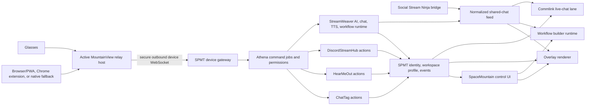

# SpaceMountain Ecosystem Production Roadmap

Updated: 2026-07-16

Status: active engineering source of truth

Owner: SPMT repository (`docs/ecosystem`)

## Mission

Finish, harden, test, document, and either ship or deliberately retire everything already started in the SpaceMountain ecosystem before adding another major product surface.

This roadmap uses production evidence, not the existence of a page, route, container, or successful build, as the definition of done.

A feature is production-ready only when:

1. Its data and runtime owner are explicit.
2. Authentication, authorization, and tenant isolation are tested.
3. State survives refresh, browser/device changes, deploys, and machine rotation where required.
4. Normal use, empty state, dependency failure, timeout, and permission failure are visible and recoverable.
5. Automated tests and a real production smoke test exercise the same contract.
6. Logs identify the user/tenant, request, source app, and failure without exposing secrets.
7. Backup, restore, rollback, and owner support paths are documented and tested.
8. The UI tells the truth about unavailable, experimental, and ready capabilities.

## Immediate Product Decision

Stop starting unrelated features until Production Gates 0 through 3 are complete.

The immediate goal is not to make every idea large. It is to make the current identity, chat, settings, overlays, workflows, and app connections dependable enough that one account behaves consistently everywhere.

## Verified Production Snapshot

The snapshot below was verified against local `main`, GitHub Actions, Fly state, live health endpoints, and current source on 2026-07-13.

| Product | Current production state | What is real now | What prevents production-ready status |
| --- | --- | --- | --- |
| SPMT (`spmt.live`) | Live, health passing, 12 real users at the latest slice | Identity, sessions, account recovery, partner SDK/app review, apps, Commlink messages/conversations, notifications, events, `WorkspaceProfileV1`, overlay workspace JSON, Athena memory/routes | Owner recovery operations still need a durable admin audit path; app identity adoption is incomplete; event authorization and retention need hardening; legacy overlay/builder storage remains unversioned; Athena reports capabilities it does not execute |
| SpaceMountain (`spacemountain.live`) | Live, health passing | Suite shell, launcher, rocket arena easter egg, SPMT mail/notifications/events, account-backed appearance and three URL slots, personal overlay canvas, builder definitions, MountainView surface | Other apps do not consume shared theme tokens yet; overlay has no clean output URL; builder test buttons only show notifications; inbox is not a combined live-chat dock; `App.tsx` remains too large and its production bundle still needs code splitting |
| StreamWeaver | Live, health passing | Bot/AI runtime, chat processing, TTS, public overlays/listeners, shared TTS mixer, partial multi-tenant storage | Its own active TODO documents global botshare, AI, TTS, chat, metrics, welcome, gamble, voice, and other tenant-state leaks; these block feeding every bot the shared chat safely |
| DiscordStreamHub | Live, health passing | Discord interactions, dashboards, community/live state, calendar, shoutout/moderation flows, SPMT event bridge | SPMT identity/session is not the only identity; community authority/spotlight contracts need completion; cross-app events and launch targets need full production verification |
| HearMeOut + DJ worker | Both live with passing checks | Rooms, LiveKit configuration, watch/listen state, Discord Activity paths, overlays, voice/media event publishing | Media behavior still has multiple truth paths; production media roadmap has 510 unchecked documentation tasks; player/source/Activity/OBS behavior needs contract consolidation and end-to-end tests |
| ChatTag + bot | Both live with passing checks | Game UI/bot, health endpoint, event publishing, arena/game mechanics | SPMT player identity and linked accounts are incomplete; XP/level/reward authority is split across apps; app and bot event paths need a full two-user live test |
| MountainView inside rotator | Live, health passing, status reports `phone-side` and `connected:false` | Authenticated command definitions, direct app calls, voice routing, media/vision routes, memory/log/device tables, Android/Expo bridge work | No SPMT device identity/pairing; no dedicated MountainView owner password or encryption secret; no MountainView SPMT API key; defaults fall back to rotator/Fly credentials; no cloud device socket; hardware access still depends on a phone-side Bluetooth bridge |
| Fly machine rotator | Live, health passing | Machine rotation, log monitoring, MountainView host | Rotator reliability/security is coupled to experimental MountainView code; the boundary needs isolation even if both remain in one Fly app to avoid another bill |
| Space Mountain dashboard | Local/GitHub project, no latest GitHub Actions deploy | Dashboard concept/site source | No defined production owner or deployment; must be merged into SpaceMountain, deployed with a purpose, or retired |
| AETHERRA | Partner-owned live Fly app, health passing, 1 GB VM, GameVerse UI | Intended first external adopter and conformance test for the future SPMT SDK; its product data, billing, rooms/queue/cards, and release decisions remain partner-owned | No matching source repository is present in this workspace; the SPMT SDK integration is not implemented; its ownership/source/deploy boundary must be documented; the health response reported its latest backup as 2026-06-30 and restore proof is still required; it is not Athena OS |

All listed Fly-backed repositories had a successful latest GitHub deployment at this snapshot. That proves deployability, not complete product behavior.

## Persistence Hardening Ledger — 2026-07-16

This pass applies the workspace storage policy without changing database schemas before backup/restore proof. Browser storage remains acceptable only for device preferences, replay cursors, and disposable startup caches; it is not authentication or tenant app-state authority.

| App | Value classification | Durable authority | Hardened in this slice | Remaining gate |
| --- | --- | --- | --- | --- |
| StreamWeaver | Tenant automation variables are app state | Existing tenant-scoped volume store pending the Gate 8 database migration | Runtime handlers now load, cache, and write by tenant; legacy browser persistence was removed; an isolation/durability regression check was added | Complete the documented global botshare, AI/TTS, welcome, metrics, gamble, shared-chat, and voice tenant-state work, then migrate authoritative JSON only after backup/restore proof |
| DiscordStreamHub | SPMT token is session credential; profile fields are cache; community settings are app state | SPMT-validated HttpOnly DSH session plus DSH database/runtime | SPMT exchange/refresh moved server-side; browser token storage removed; logout clears the server cookie; embedded auth re-establishes the validated session | Replace remaining page-level local identity reads with one current-session client and move calendar/leaderboard/setup/theme settings to their explicit owners |
| HearMeOut | Shared watch queue/playback/progress are app state; listener volume/TTS replay state are device preferences | Existing `/data/watch-state.json` volume state pending the detailed media/database track | Watch state now saves through atomic replacement with a last-known-good backup and fallback; duplicate browser-only Discord identity was removed | Prove restart/restore on Fly, then consolidate media truth paths and migrate app state only after backup/restore evidence |
| ChatTag | Signed login token is session credential; displayed Twitch profile is cache | HttpOnly signed session cookie plus ChatTag volume state | Session token was removed from redirect URLs/local storage; profile hydration is server-authoritative; logout now clears the HttpOnly cookie through a server route | Adopt canonical SPMT identity/XP contracts and run the required two-user app/bot test |

Current evidence for this slice is local type checking plus the StreamWeaver tenant persistence regression check. Deployment, Fly restart survival, browser/device tests, and the common production smoke matrix remain required before marking the rows production-complete.

## Direct Answers To The Current Questions

### Is Athena OS ready, and should MountainView glasses use it?

Not yet.

Athena currently has three different partial meanings:

1. SPMT exposes Athena metadata, memory, context, and command routes.
2. StreamWeaver is the working AI/chat/TTS runtime and contains the real Athena persona/bot behavior.
3. MountainView directly selects and calls app endpoints, falling back to StreamWeaver when SPMT/Athena authorization is unavailable.

The first Gate 0 slice removes the false-success behavior: SPMT reports capability states, rejects command dispatch as unavailable without creating fake jobs, and SpaceMountain no longer offers the simulated Athena Send control. A durable command job and adapter dispatcher still need to be built in Gate 6.

Decision:

- SPMT will own the Athena control plane: user context, permissions, memory index, command jobs, app adapter registry, audit, and results.
- StreamWeaver will own the Athena runtime: model calls, conversational context, bot personality, TTS, and workflow execution.
- Each app will own its actual domain action.
- MountainView will use Athena only after command jobs, scoped adapters, and result delivery pass Gate 6.
- Until then, MountainView must label direct StreamWeaver/app routing honestly rather than calling it completed Athena OS routing.

### Is the inbox like Social Stream Ninja now?

No. It is improved Commlink, not a Social Stream-style combined chat dock.

What exists:

- SPMT direct/group/app messages.
- Search and basic filters.
- Notifications with read-one/read-all.
- A nearby combined app-event timeline.

What is missing:

- Normalized live Twitch/YouTube/Kick/Discord/Social Stream messages.
- Source/channel badges, donations, memberships, media, replies, and stable source IDs.
- Pin, queue, feature, auto-show, next, and clear-feature controls.
- Reply routing back to the correct source.
- Per-source filters and operator modes.
- Replay, retention, deduplication, and reconnect behavior.
- Bot feed subscriptions and per-bot reply permissions.
- A selected-message browser-source overlay.

The target is one Commlink workspace with separate but connected lanes for Mail, Live Chat, Notifications, and App Events. High-volume raw chat remains owned by StreamWeaver; SPMT indexes safe summaries and authorization metadata rather than duplicating every chat database.

### Is the builder like Social Stream Ninja now?

No. It is a saved form, not an automation engine.

The current page stores rows containing one trigger, one filter, one action, and one destination inside the SPMT overlay-workspace JSON. `Test` only displays a local notification. There are no executable nodes, branches, state, retries, credentials, run history, payload inspector, or output renderer.

Social Stream parity requires, at minimum:

- Chat, event, source, OBS, timing, random, and custom triggers.
- Message, integration, media, overlay, OBS, TTS, state, and webhook actions.
- AND/OR/NOT logic plus gates, counters, throttles, and delays.
- Templates, transforms, branches, idempotency, and loop protection.
- Dry runs using recorded/synthetic payloads.
- Import/export, templates, versioning, run history, retries, and visible node failures.

This is Gate 5, after tenant isolation and normalized chat are safe.

### Do overlays, URL slots, and themes persist across apps now?

Partially, with the first Gate 2 consumer now implemented.

- `WorkspaceProfileV1` stores every current SpaceMountain appearance control and all three dock slots in the signed-in SPMT account with validation and revision conflicts.
- SpaceMountain migrates `spmtEmbedSlots` once, uses an account-specific local cache only for startup/offline visibility, and shows save, retry, conflict, reload, and reset states.
- Overlay widget positions and builder rows still share the legacy `spmt-live.overlay_workspaces` blob and must be split into versioned scene and workflow records.
- Other apps do not consume shared theme tokens yet.
- The overlay still renders only on top of SpaceMountain; there is no controls-free OBS/browser-source route.

Tickets 13 through 15 are complete for the owner plus first consumer. Gate 2 remains open for overlay/TTS selectors and one-at-a-time app theme adoption. Gate 4 creates the actual overlay studio and output URLs.

### Can the glasses connect directly to the cloud without the mobile app?

The cloud can own nearly all intelligence, state, credentials, and integrations. The current glasses still need a nearby radio gateway, but that gateway does not have to be the primary phone or a large native control app. It can be a supported computer, Chromebook, Android tablet, or spare Android phone.

The present MountainView runtime explicitly reports `bridgeMode: "phone-side"`. The AiMB/RDGlass work in this repository uses Android Bluetooth/BLE and headset media-button behavior. The currently available Meta Wearables toolkit also exposes supported glasses to iOS/Android applications rather than providing a general direct-to-third-party-cloud runtime.

Production target:

- Make `MountainView Relay` host-neutral and keep one cloud protocol regardless of which local host is used.
- Ship a stable HTTPS browser/PWA relay first for foreground use on platforms where Chrome Web Bluetooth can access the glasses' required BLE GATT services.
- Add a Manifest V3 Chrome extension/side-panel relay for desktop convenience, pairing state, launch-on-use, and diagnostics. It must survive extension service-worker restarts and must not rely on an immortal background worker.
- Keep a thin native Android foreground-service relay as the reliability fallback for 24/7 background reconnect, media buttons, camera/audio paths, or BLE characteristics unavailable to the browser.
- Add a desktop native tray relay only if the glasses require Bluetooth Classic/RFCOMM, vendor-native APIs, or background behavior Chrome cannot provide.
- The relay owns only Bluetooth/BLE, microphone/camera/button capture, audio output, local permission prompts, reconnect, and a short offline buffer.
- It holds one revocable SPMT device token, not app provider credentials.
- It maintains a secure outbound WebSocket to the SPMT device gateway.
- Athena, StreamWeaver, Commlink, storage, workflows, and all app calls run in the cloud 24/7.

This makes the system primary-phone-free whenever another compatible host is nearby. It does not make the glasses radio-gateway-free: a local device must still speak Bluetooth unless the exact glasses expose their own supported Internet runtime.

Browser constraints are part of the design, not hidden edge cases:

- Web Bluetooth requires a secure context and a user gesture for the initial device chooser.
- Support is limited to compatible Chrome/platform combinations and BLE GATT capabilities; it must be proven against the exact glasses before committing.
- A normal browser page/PWA is the portable route for Android tablets and spare phones. Do not make mobile Chrome-extension support a requirement.
- Manifest V3 extension workers can be terminated while idle, so pairing/session state must persist and the relay must reconnect idempotently.
- Standard headset audio may be handled by the host OS and browser microphone/speaker APIs. Glasses camera, hardware buttons, and vendor-specific commands require documented BLE/serial/native access and cannot be assumed.
- A foreground browser/PWA is valid for interactive use. The native Android relay remains the supported always-on option until device and OS soak tests prove equivalent browser behavior.

## Canonical Ownership And Data Boundaries

| Concern | Production owner | Storage/transport rule |
| --- | --- | --- |
| Account, profile, linked identities, session | SPMT | SPMT database and signed sessions |
| Device identity, pairing, revocation | SPMT | Device records and short-lived pairing codes; hashed device tokens |
| Portable appearance, URL slots, workspace selection | SPMT | Versioned workspace profile JSON in database |
| Overlay scenes and read-only output grants | SPMT + SpaceMountain renderer | SPMT database; SpaceMountain renders; no provider secrets in scene JSON |
| App install, permissions, launch targets | SPMT | Registry plus scoped grants |
| Notifications, account messages, app summaries | SPMT Commlink | SPMT database |
| Raw normalized live chat and bot memory | StreamWeaver | Tenant-scoped StreamWeaver database/storage |
| TTS queues, playback, bot responses | StreamWeaver | Tenant-scoped replayable queues |
| Workflow definitions, execution, and run history | StreamWeaver | Tenant-scoped database; SPMT authorizes identity/scopes |
| Discord/community state | DiscordStreamHub | DSH database/runtime; publish summaries to SPMT |
| Rooms, voice, media, playback | HearMeOut | HearMeOut database/runtime; publish summaries to SPMT |
| Game mechanics and match state | ChatTag | ChatTag database/runtime |
| Canonical cross-app XP/level | SPMT profile stats | App reward events map into one ledger/API |
| Athena jobs, permissions, context index, audit | SPMT | Durable job records and scoped dispatch |
| Athena model/chat/TTS runtime | StreamWeaver | Tenant-scoped model and memory services |
| MountainView relay protocol and device session | SPMT + MountainView | One versioned protocol shared by browser/PWA, extension, and native relay hosts |
| Hardware Bluetooth/BLE and capture | Active MountainView relay host | Local only; browser/PWA where proven, Chrome extension for desktop convenience, native relay where background/vendor access is required |
| AETHERRA product state and operations | AETHERRA partner | Partner-owned database, billing, deployment, and backups; SPMT receives only granted identity/profile/events |
| AETHERRA SPMT integration contract | SPMT SDK + partner adapter | OAuth/scopes, `/api/me`, portable theme tokens, events/webhooks, revocation, and conformance tests |
| Secrets | Fly/GitHub secret stores | Never JSON, database output, client bundle, logs, or URLs |
| Public operational config | Volume-backed JSON | Non-secret URLs, flags, capability settings |
| App state | Owning app database | No local JSON as production source of truth |

## Target System



## Production Gate 0 — Stabilize, Secure, And Tell The Truth

No feature expansion passes this gate until all items below are complete.

### Step 0.1 — Create a production inventory manifest

For every Fly app, domain, repository, process, volume, worker, OAuth application, webhook, and scheduled job, record:

- Purpose and owner.
- Repository and deployed commit.
- Public and internal URLs.
- Fly app, process, region, size, machine count, volume, and auto-start/stop policy.
- Required secret names and public runtime config file.
- Database/volume location and backup policy.
- Health and deep-readiness endpoints.
- Upstream/downstream dependencies.
- Monthly keep/retire/consolidate decision.

Include `aetherra`, the dashboard, all bot/worker apps, and any app outside this workspace. A partner-owned app can remain outside this monorepo, but its owner, source-of-truth repository, deployment responsibility, integration contract, support contact, and recovery evidence must be explicit.

### Step 0.2 — Capture a reproducible live baseline

1. Record current commits and successful deploy runs.
2. Save health, readiness, and key route responses.
3. Record current Fly machine/volume state.
4. Save a redacted secret-name inventory.
5. Capture 24–48 hours of errors by app and group them by root cause.
6. Create one reproducible smoke script per app.
7. Add the baseline to a release manifest rather than scattered TODO files.

### Step 0.3 — Remove credential fallbacks

1. Set dedicated `MOUNTAINVIEW_OWNER_PASSWORD` and `MOUNTAINVIEW_TOKEN_ENCRYPTION_KEY` Fly secrets.
2. Set a scoped MountainView SPMT service credential after Gate 1's device/service contract exists.
3. Remove fallback to `mountainview-dev`, `mountainview-dev-key`, `FLY_API_TOKEN`, and the rotator action token.
4. Fail startup or report not-ready when required production secrets are absent.
5. Configure `SPMT_ADMIN_RECOVERY_KEY`, issue the locked-out tenant a recovery code through the owner path, and document rotation.
6. Audit JWT/session fallback strings in every app and remove production defaults.
7. Add rate limits and audit entries to login, recovery, pairing, token, webhook, and workflow-trigger routes.

### Step 0.4 — Prove backup and restore

1. Identify every authoritative database and volume.
2. Create a backup now.
3. Restore each database into an isolated temporary app or local fixture.
4. Verify account, configuration, messages, workflows, overlays, room/game state, and device records as applicable.
5. Ask the AETHERRA owner to prove a current backup and isolated restore under the partner boundary; SPMT integration must not assume ownership of AETHERRA's database or billing state.
6. Document RPO/RTO and who can perform recovery.

### Step 0.5 — Make health truthful

Each service needs:

- Liveness: process responds.
- Readiness: database/volume and required internal dependencies work.
- Dependency detail: degraded dependencies without leaking credentials.
- Version/build SHA.
- Capability flags derived from configured and tested adapters, not hardcoded optimism.

Change Athena from `status: online` with every capability `true` to `ready`, `degraded`, `configured`, or `unavailable` per capability.

### Step 0.6 — Add visible product truth

Mark scaffolds, simulated test buttons, unavailable hardware controls, and experimental media paths clearly. Never return `routed: true` unless a durable job was accepted; never show success unless the target result is known.

### Gate 0 exit criteria

- Every paid runtime has an owner/source/keep decision.
- Every required secret has no production fallback.
- Backup and restore are proven.
- Athena and MountainView capability/status output is truthful.
- A baseline smoke pack and error inventory exist.
- No unresolved P0 auth, data-loss, or cross-tenant issue remains open.

## Production Gate 1 — One Identity, Strict Tenant Isolation, One XP Ledger

### Step 1.1 — Finish SPMT identity adoption

For DSH, StreamWeaver, HearMeOut, ChatTag, MountainView, and SpaceMountain:

1. Use SPMT OAuth/session restore as the primary signed-in identity.
2. Keep provider OAuth as a linked grant, not another app identity.
3. Replace local/fake identity and manual ID entry where the SPMT account supplies it.
4. Validate top-level and embedded login/logout/session refresh together.
5. Register exact launch/callback URLs and allowed origins.
6. Add account deletion/export and provider disconnect behavior.

### Step 1.2 — Enforce server-to-server scopes

1. Inventory every SPMT write performed by each app.
2. Issue a unique scoped credential per app/environment.
3. Verify audience, app ID, tenant/user subject, scopes, expiry, and request ID.
4. Reject a key for another app or scope.
5. Rotate keys without downtime.
6. Add contract tests for allowed and forbidden writes.

### Step 1.3 — Finish StreamWeaver tenant isolation before shared chat

Resolve all active high/medium tenant TODOs, especially:

- Botshare mode and cross-bot mention matching.
- AI and TTS configuration.
- Shared-chat tokens and mode.
- Walk-on shoutout, EventSub, welcome, metrics, stats, gamble, clips, translation, and chat monitor state.
- Voice and WebSocket broadcasts.
- `/api/chat/send`, AI memory, TTS, leaderboard, and other global API routes.

Test with two tenants concurrently. Tenant A must not change, hear, invoke, read, or reply through tenant B.

### Step 1.4 — Create canonical profile stats

1. Add an SPMT XP/level/reward ledger contract.
2. Map ChatTag, DSH, arena, and SpaceMountain rewards into typed ledger events.
3. Keep game-specific state in ChatTag.
4. Make every shared level display read the canonical endpoint.
5. Add idempotency keys so event retries cannot award twice.

### Gate 1 exit criteria

- Two accounts can use every app in the same browser and separate browsers without state leakage.
- Embedded and direct login/logout/refresh work.
- Every server write is scoped and attributable.
- One XP/level value appears across SpaceMountain, arena, ChatTag, and DSH.

## Production Gate 2 — Portable Workspace, Theme, URL Slots, And Settings

### Step 2.1 — Define `WorkspaceProfileV1`

Add a versioned account-backed contract containing only non-secret user state:

```ts
type WorkspaceProfileV1 = {
  schemaVersion: 1;
  revision: number;
  appearance: {
    themeId: string;
    glowIntensity: number;
    starDensity: number;
    glassOpacity: number;
    blurStrength: number;
    borderStrength: number;
    cornerRadius: string;
    density: string;
    animation: { enabled: boolean; speed: number; particles: boolean };
  };
  dockSlots: Array<{
    id: 1 | 2 | 3;
    title: string;
    url: string;
    collapsed: boolean;
    volume: number;
    muted: boolean;
  }>;
  activeOverlaySceneId: string | null;
  ttsSubscriptions: string[];
  appThemeMappings: Record<string, string>;
  updatedAt: string;
};
```

Overlay scenes and workflow definitions get their own records; do not keep expanding one unvalidated layout blob.

### Step 2.2 — Build the SPMT API

1. Add database migration, validation, revision, and timestamps.
2. Add authenticated GET/PUT/PATCH APIs.
3. Support optimistic concurrency using revision/ETag.
4. Return validation errors per field.
5. Publish `workspace.profile.updated` events without embedding private URLs in broad event feeds.
6. Add export/import and reset-to-default.

### Step 2.3 — Migrate SpaceMountain

1. Replace `/api/user/:id/preference` with the authenticated SPMT profile API.
2. Load the profile after session restoration.
3. Migrate `spmtEmbedSlots` from localStorage once, then mark migration complete.
4. Move all theme sliders/toggles into the versioned profile.
5. Add save state, last-saved time, retry, conflict, offline, and reset UI.
6. Keep a local cache only for fast startup; SPMT remains authoritative.

### Step 2.4 — Share supported settings with apps

1. Publish a small versioned SPMT client package/helper.
2. Give every app a shared token map: background, surface, text, accent, radius, density, motion.
3. Let apps map shared tokens to their own visual system instead of forcing identical CSS.
4. Keep app-only preferences in the owning app.
5. Add a per-app “follow SpaceMountain theme” switch.

### Gate 2 exit criteria

- Change theme, overlay selection, URL slots, and TTS subscriptions on device A; device B restores them after login.
- Sign out and sign in as another user; no settings cross over.
- Supported embedded apps visibly adopt shared theme tokens.
- A failed save is visible and retryable.
- No secret/token is stored in the profile JSON or custom URL query by default.

## Production Gate 3 — Combined Commlink And Social Stream-Style Inbox

### Step 3.1 — Freeze the normalized message contract

StreamWeaver owns a tenant-scoped `SharedChatEventV1` with:

- Stable event ID and upstream source ID.
- Tenant, platform, source, channel, and event type.
- Sender ID/name/avatar/badges/roles.
- Message text, sanitized HTML, media, links, donation, membership, reward, and reply context.
- Original timestamp, received timestamp, edited/deleted state.
- `meta` for provider-specific extensions.
- Deduplication, reflection, and routing markers.

### Step 3.2 — Finish ingestion

1. Treat Social Stream Ninja as a supported bridge/reference, not copied code.
2. Finish its managed listener with reconnect, backoff, heartbeat, replay cursor, deduplication, and per-tenant configuration.
3. Normalize existing Twitch, Discord, Kick, YouTube, and app events into the same contract where available.
4. Store bounded replay history and retention policy.
5. Record dead-letter events that fail validation.

### Step 3.3 — Expose safe feed APIs

1. Paginated history with cursor.
2. Authenticated WebSocket/SSE live feed.
3. Source, channel, role, donation, membership, text, and event filters.
4. Feature/pin/queue state.
5. Reply/send-back capability metadata per source.
6. Read/unread and per-user cursor state.
7. Bot subscription scopes and reply destination rules.

### Step 3.4 — Rebuild Commlink as four lanes

1. Mail: SPMT direct/group/app conversations.
2. Live Chat: StreamWeaver normalized feed.
3. Notifications: actionable SPMT notifications.
4. App Events: searchable summaries, not noisy raw logs.

The Live Chat lane must include:

- Source/channel badges and message cards.
- Search and saved filters.
- Pin, queue, feature, next, auto-show, clear-feature.
- TTS listen/mute/skip routing to the shared mixer.
- Reply where the source supports it.
- Media/donation/member rendering.
- Operator/view-only modes.
- Connection/replay/degraded indicators.

### Step 3.5 — Add the featured-message output

Create a clean scene widget and browser-source URL for the selected message. It must support labels, styling, duration, queue advance, clear, and a transparent empty state.

### Gate 3 exit criteria

- Two real sources stream simultaneously into one account.
- Refresh/reconnect does not duplicate or lose the replay window.
- Feature/queue/pin/TTS/reply are verified against real sources.
- Tenant A cannot subscribe or reply to tenant B.
- A bot can be granted read-only feed access without reply access.
- Mail and live chat remain distinct data types even though they share one workspace.

## Production Gate 4 — Overlay Studio And Stable URLs

### Step 4.1 — Split editor from output

Create explicit routes:

- `/crew/overlays` — authenticated editor and preview.
- `/overlay/{sceneSlug}` — controls-free renderer.
- `/overlay/{sceneSlug}/preview` — authenticated preview with diagnostics.

Output authorization uses a revocable, hashed, read-only scene grant. Do not put an SPMT login token or provider secret in an OBS URL.

### Step 4.2 — Create scene records

Each scene includes:

- Canvas size/aspect preset and responsive rules.
- Widget IDs, type, source app, position, size, crop/fit, opacity, z-index, anchors, visibility, interactivity, and audio policy.
- Theme override or shared-theme inheritance.
- Revision, owner, created/updated timestamps.
- Read-only output grant(s).

### Step 4.3 — Add production editor behavior

1. Drag, resize, snap, guides, layers, lock, hide, duplicate, and delete.
2. Desktop, portrait, mobile, and custom preview sizes.
3. Responsive anchors and safe-area bounds.
4. Undo/redo and explicit save state.
5. Scene duplicate, import/export, and template library.
6. Widget connection, iframe refusal/CSP, audio-unlock, and stale-data diagnostics.
7. Never show editor controls on output routes.

### Step 4.4 — Add app widget manifests

Apps publish safe, discoverable widget entries:

- ChatTag: game, arena, leaderboard, status.
- HearMeOut: now playing, room, voice/media outputs.
- StreamWeaver: avatar, alerts, TTS mixer, featured chat, counters.
- DSH: shoutout, live spotlight, calendar.
- MountainView: device health and capture status only where privacy permits.
- Custom URL: with framing/CSP compatibility test and warning.

### Step 4.5 — Preserve and improve the three bottom slots

1. Keep exactly three convenience slots.
2. Store them in `WorkspaceProfileV1`.
3. Add mute/volume, collapse, reload, health, and open-direct controls.
4. Do not consume them for multiple TTS listeners; use one shared mixer widget with many selected queues.
5. Allow a slot to be promoted into an overlay scene widget.

### Gate 4 exit criteria

- Build a scene on one device and load its output URL in another browser/OBS profile.
- No editor chrome appears in output.
- Refresh/deploy does not move widgets or reset audio choices.
- Revoking the scene grant disables the old URL.
- Broken iframe/audio/source states are visible in preview.
- TTS from multiple selected queues plays through one mixer and one volume/mute control.

## Production Gate 5 — Real Workflow Builder And Runtime

### Step 5.1 — Define `WorkflowDefinitionV1`

Use a graph contract with:

- Typed trigger, logic, state, transform, action, and destination nodes.
- Versioned node configuration schemas.
- Edges and branch labels.
- Enabled/draft state, revision, owner, tenant, scopes.
- Retry, timeout, failure, concurrency, and idempotency policy.
- Created/updated/published versions.

### Step 5.2 — Move ownership to StreamWeaver

1. Store definitions, versions, secrets references, and run history in a tenant-scoped database.
2. Keep credentials in secret/grant storage, referenced by ID only.
3. Let SpaceMountain remain the builder UI.
4. Use SPMT identity/scopes to authorize edit, publish, test, and execute.
5. Migrate current four-field rows as disabled draft templates; never pretend they already executed.

### Step 5.3 — Implement the minimum useful node catalog

Start with:

- Triggers: normalized chat, app event, Commlink, webhook, time interval, time of day, manual test.
- Filters: source, channel, user/role, contains/starts/ends/regex, donation/member, event type.
- Logic/state: AND, OR, NOT, delay, gate, counter, throttle, random chance.
- Actions: feature message, TTS, show/hide overlay widget, send Commlink notification, run StreamWeaver command, call scoped app action, webhook.
- Destinations: StreamWeaver, overlay scene/widget, DSH, HearMeOut, ChatTag, MountainView device, Commlink.

Add OBS, Spotify, MIDI, custom JS, and destructive moderation only after the core authorization/audit path is safe.

### Step 5.4 — Build testing and operations

1. Synthetic and recorded payload test runner.
2. Per-node input/output inspector with redaction.
3. Dry run that blocks side effects.
4. Explicit live test requiring confirmation for external sends.
5. Run history, duration, retries, result, and failed node.
6. Replay from a selected event.
7. Idempotency and no-reflection/loop detection.
8. Disable/kill switch per workflow and per tenant.

### Step 5.5 — Give the builder stable URLs

- `/builder` — workflow list.
- `/builder/{workflowId}` — editor.
- `/builder/{workflowId}/runs` — run history.
- Scoped webhook trigger URLs with rotatable secrets.
- Import/export files that never include credentials.

### Gate 5 exit criteria

- A chat message can pass through a filter, trigger TTS and an overlay, and create a visible run record.
- A failure identifies the exact node and can be retried safely.
- A replay cannot duplicate a completed external side effect.
- Cross-tenant execution is impossible in automated tests.
- Import/export and publish/version rollback work.

## Production Gate 6 — Turn Athena From Labels Into A Real Control Plane

### Step 6.1 — Create durable command jobs

Replace the current record-only response with:

1. Accept authenticated command and context.
2. Create a job ID with `queued` status.
3. Resolve intent and candidate app adapter.
4. Check user/app/device permissions.
5. Request confirmation for destructive or external side effects.
6. Dispatch through a scoped adapter.
7. Store progress, result, error, and source references.
8. Publish result to the requesting web/device session and relevant Commlink lane.

### Step 6.2 — Build a real adapter registry

Each adapter declares:

- App and action ID.
- Input/output schema.
- Required user and service scopes.
- Idempotency behavior.
- Timeout/retry rules.
- Read-only/destructive classification.
- Health and version.

Start with safe read/list/open actions, then StreamWeaver TTS/commands, HearMeOut room actions, DSH community actions, ChatTag status, and overlay scene controls.

### Step 6.3 — Build context deliberately

Athena receives:

- Current user and linked identities.
- Installed apps and grants.
- Bounded recent Commlink/app summaries.
- Explicitly granted shared-chat excerpts.
- Current room/stream/game/device state.
- Relevant workflow/job history.
- User memory with provenance and deletion controls.

It does not receive every tenant's raw chat, secrets, or unbounded logs.

### Step 6.4 — Connect StreamWeaver as runtime

1. Define the authenticated model/runtime call contract.
2. Pass tenant, bot/persona, context references, and allowed tools.
3. Return structured intent/tool requests and user-facing response.
4. Route TTS through the shared mixer/device channel.
5. Add provider/model fallback and visible degraded state.
6. Add prompt/tool evaluation fixtures and cost/rate controls.

### Step 6.5 — Make UI truthful and useful

1. SpaceMountain submits real jobs.
2. Show queued/running/waiting-confirmation/succeeded/failed.
3. Link every result to its source app and audit record.
4. Replace hardcoded crew/skills “ready” states with adapter health.
5. Allow memory review/delete and bot/chat feed permission controls.

### Gate 6 exit criteria

- Athena executes at least one read and one safe write in every core app through scoped adapters.
- The UI never reports success before a target result.
- Failed/unavailable adapters are visible and do not silently fall back to the wrong action.
- Memory and source provenance are inspectable/deletable.
- Two-tenant tool and context isolation tests pass.

## Production Gate 7 — MountainView Cloud Device Architecture

### Step 7.1 — Isolate MountainView from rotator authority

To avoid another Fly bill initially, MountainView may remain in the `mtman-machine-rotator` Fly app, but it must have a separate module boundary, database tables/files, scoped secrets, logs, and health/readiness. It must not use the Fly management token or rotator action token for MountainView encryption or user authentication.

Split into another Fly process/app only if load, failure isolation, or security testing proves the shared deployment unsafe.

### Step 7.2 — Add SPMT device pairing

1. User opens MountainView setup in SpaceMountain.
2. SPMT creates a short-lived pairing code/QR.
3. Relay exchanges the code for a device ID and revocable device token.
4. SPMT stores hashed token, owner, device model, capabilities, last seen, app version, and revocation state.
5. User can name, inspect, revoke, and re-pair the device.
6. Pairing, capture, and command permissions are separate grants.

### Step 7.3 — Add the cloud device gateway

1. Authenticated outbound WebSocket from relay to SPMT.
2. Heartbeat, reconnect with backoff, sequence numbers, acknowledgement, and bounded replay.
3. Typed events: button, transcript, audio chunk/reference, image/frame, QR, battery, connection, permission, error.
4. Typed commands: speak, play tone, request capture, update status, show supported display payload, stop session.
5. Per-device rate/size limits and media upload grants.
6. Correlation ID from device event through Athena job and app result.

### Step 7.4 — Define one host-neutral relay protocol

Create a versioned `MountainViewRelayV1` contract independent of the host implementation:

- Capability negotiation for BLE GATT, headset audio, buttons, camera, display, foreground/background mode, and offline buffering.
- Device event and cloud command schemas, sequence numbers, acknowledgements, retry/idempotency keys, and protocol-version negotiation.
- One SPMT pairing/device token flow for every host; tokens are revocable per relay installation.
- Local privacy indicators and permission state for microphone/camera/capture.
- Persisted reconnect state with no provider credentials and no cloud business logic on the host.

The relay UI on every host should show only paired account/device, hardware connection, cloud connection, permissions, last command/result, reconnect, privacy, unpair, and diagnostics. Integrations, command templates, AI memory, workflow configuration, credentials, and history belong in the cloud UI.

### Step 7.5 — Prove the exact hardware transport

Before choosing the default host, inventory the exact glasses model and test:

1. Whether Chrome can discover the device and required BLE GATT services after an explicit user action.
2. Which characteristics provide notifications, button events, status, camera/capture commands, or audio controls.
3. Whether the device instead requires Bluetooth Classic/RFCOMM, a vendor SDK, or a native mobile-only entitlement.
4. Whether normal host headset audio supplies the microphone/output path independently of device-control BLE.
5. Reconnect behavior after tab sleep, screen lock, browser restart, Bluetooth loss, and network loss.
6. Windows, ChromeOS, macOS, and Android Chrome support for the exact operations—not just generic Web Bluetooth availability.

Publish a capability matrix with evidence. Do not select a browser relay based only on the presence of Bluetooth pairing in the operating system.

### Step 7.6 — Ship the browser/PWA relay

1. Serve it from a stable HTTPS route such as `mtnview.spmt.live/relay` or the equivalent final domain.
2. Use Web Bluetooth only after an explicit Connect action and remember the selected device/session safely where the platform permits.
3. Use browser microphone/output APIs for standard headset audio; request camera separately and visibly.
4. Pair with SPMT, maintain the authenticated cloud WebSocket, expose connection/permission diagnostics, and allow immediate revoke/unpair.
5. Register as a PWA for a dedicated window and easy launch on computers, Chromebooks, Android tablets, and spare Android phones.
6. Treat foreground/interactive operation as the initial support level and display a warning when the page loses the ability to relay.

### Step 7.7 — Ship the Chrome extension relay

Use a Manifest V3 extension as a desktop convenience layer, not as a different backend:

1. Put Connect, status, permissions, privacy, and diagnostics in an extension page or side panel.
2. Reuse `MountainViewRelayV1`, SPMT pairing, and the same device/cloud session records.
3. Persist all recoverable state because the extension service worker can be terminated while idle.
4. Make reconnect and event delivery idempotent; an active WebSocket may extend worker activity on supported Chrome versions but is not the sole lifecycle guarantee.
5. Prove which extension context can perform the needed Bluetooth/media operations; do not assume an offscreen document has Bluetooth access.
6. Keep the PWA path for tablet/phone Chrome instead of depending on mobile extension installation.

### Step 7.8 — Keep native reliability fallbacks narrow

- Android: foreground service, boot/reconnect behavior, media-button capture, clear persistent notification, battery guidance, and crash restart for true always-on use.
- Desktop: native tray bridge only if Classic Bluetooth, a vendor library, or background behavior requires it.
- iOS: support only what the platform/vendor SDK permits and state suspension limitations honestly.

All native hosts must remain thin implementations of the same relay protocol; none owns Athena, StreamWeaver, app credentials, or workspace state.

### Step 7.9 — Route through Athena

1. Relay sends transcript/capture reference to SPMT.
2. SPMT creates an Athena job using device/user grants.
3. Athena uses StreamWeaver/app adapters.
4. Job result returns to the device socket.
5. StreamWeaver creates spoken audio or text; relay plays it through the active headset route.
6. Relevant result is stored in device command history and Commlink; raw media follows retention/privacy policy.

### Step 7.10 — Decide gateway-free hardware feasibility

For the exact glasses model, require documented proof of:

- Independent Wi-Fi/cellular Internet transport.
- Programmable third-party runtime or supported cloud protocol.
- Camera/microphone/button access.
- Background process lifecycle.
- Secure token storage and update path.
- Acceptable battery/thermal behavior.

If any are absent, keep the relay. A computer, Chromebook, Android tablet, or spare Android phone can replace the primary phone when the hardware/browser capability matrix passes, but it does not eliminate the nearby Bluetooth gateway.

### Gate 7 exit criteria

- Pair/unpair/revoke works without developer intervention.
- The same paired device/session model works from at least one desktop Chrome browser/PWA and the Android reliability fallback.
- Extension/PWA/native relay reconnects after the lifecycle events each host claims to support, Bluetooth loss, network loss, process restart, and cloud deploy.
- One voice command and one image capture complete through cloud Athena and return a result.
- No provider, Fly, or broad SPMT credentials exist on the relay.
- Camera/mic use is visible, permissioned, and auditable.
- A 24-hour native-relay soak and a foreground browser/extension soak record connection uptime, suspension behavior, battery effect, retries, and no duplicate command execution.

## Production Gate 8 — Finish Each App Track

These tracks can run after shared contracts stabilize, but each must pass the common release gate.

### StreamWeaver

1. Finish all tenant isolation from Gate 1.
2. Finish Social Stream listener and normalized feed.
3. Make shared TTS queues replayable and tenant-scoped.
4. Implement workflow engine/run history.
5. Add SPMT identity/grants to owner controls while preserving intended public listeners/overlays.
6. Replace JSON production app state with database-backed state where still authoritative.
7. Add contract/e2e tests for chat, reply, bot routing, TTS, workflow, and reconnect.

### HearMeOut

Use `docs/HEARMEOUT_PROD_READY_MEDIA_ROADMAP.md` as the detailed track:

1. Baseline known-good and known-bad movie/music flows.
2. Freeze one media contract and routing source of truth.
3. Reject unplayable shared media before enqueue.
4. Align watch page, Discord Activity, rooms, and overlay players.
5. Stabilize LiveKit voice and separate media/voice audio state.
6. Add media-only and voice-only OBS URLs.
7. Deprecate old routes only after live traffic evidence.
8. Add player, worker, Activity, and overlay telemetry and real playback smoke tests.

### DiscordStreamHub

1. Complete SPMT OAuth/session restore and linked identity use.
2. Make DSH the authoritative online/spotlight/community endpoint.
3. Register dashboard, calendar, leaderboard, review, shoutout, and spotlight launch targets.
4. Publish scoped, deduplicated events and user-facing notifications.
5. Test Discord interaction, OAuth callback, review persistence, Twitch callback, and worker handoff.
6. Verify clip worker health/readiness; it currently has no Fly health check.

### ChatTag

1. Adopt SPMT profile/link identity.
2. Map rewards into canonical XP ledger.
3. Register game/arena/leaderboard/reward/overlay targets.
4. Verify game and bot event paths with two linked users.
5. Archive the completed spam TODO after production verification.
6. Resolve or explicitly remove Quackverse references if no maintained app exists in the workspace.

### SpaceMountain

1. Split `App.tsx` into owned route/features after regression tests exist.
2. Drive apps and launch targets from SPMT registry.
3. Finish portable settings, Commlink, overlay studio, builder, and Athena job UI.
4. Add iframe health/auth/error surfaces.
5. Code-split large routes and enforce a bundle budget.
6. Add desktop/mobile/touch/keyboard accessibility e2e tests, including the arena easter egg.

### SPMT

1. Harden auth, recovery, scopes, events, device pairing, workspace profiles, and Athena jobs.
2. Add event retention/replay and notification mapping policies.
3. Publish and version a real shared client/SDK.
4. Add admin support tools with audit and least privilege.
5. Add user export/delete and app grant/revocation controls.

### Dashboard decision

Decide whether `space-mountain-dashboard` becomes a real operations view inside SpaceMountain or is retired; do not maintain a second shell without a distinct user.

### AETHERRA — first external SPMT SDK adopter

AETHERRA remains the partner's app and its product state, billing, source, deploys, and roadmap remain partner-owned. Its role in this ecosystem is the first real proof that an independently owned application can adopt SPMT without being absorbed into this monorepo.

1. Record the partner owner, source-of-truth repository, deploy target, test environment, support path, and data-controller boundary; importing the source here is not required.
2. Finish and version the minimal SPMT SDK/client contract before claiming integration: authorize/login, callback/session validation, `/api/me`, scoped grants, refresh/logout, event publish, webhook verification, and grant revocation.
3. Define the least scopes AETHERRA needs and keep AETHERRA database, billing, rooms, cards, queues, and game rules outside SPMT.
4. Map portable SPMT profile/theme tokens into AETHERRA without letting either app overwrite the other's product settings.
5. Publish at least one real AETHERRA event to Commlink and consume one SPMT notification/webhook with idempotency and tenant checks.
6. Add black-box SDK conformance tests runnable against staging by both the SPMT repository and the partner repository.
7. Verify AETHERRA's backup/restore and billing-webhook behavior with the partner owner before production certification.
8. Document disconnect/revoke behavior so removing the SPMT grant does not delete or corrupt the partner's AETHERRA account.
9. Never confuse AETHERRA GameVerse with Athena OS; similarity of the names does not imply a runtime or ownership relationship.

## Production Gate 9 — Reliability, Security, Testing, And Updates

### Common CI gate for every deploy

1. Install from lockfile.
2. Typecheck.
3. Lint touched code plus full lint where stable.
4. Unit and contract tests.
5. Build.
6. Database migration test forward and rollback/restore rehearsal.
7. Secret/config policy check.
8. Dependency vulnerability report with triaged exceptions.
9. Container start and readiness check.
10. Deploy to production only from reviewed `main`.
11. Verify GitHub conclusion, Fly machine version/checks, and feature smoke.
12. Keep previous image/release identified for rollback.

### Shared end-to-end matrix

| Area | Required test |
| --- | --- |
| Identity | Register, recover, login, refresh, logout, embedded restore, provider link/unlink, revoke |
| Tenant isolation | Two users concurrently across chat, TTS, workflows, overlays, devices, rooms, games, app events |
| Portable settings | Save on A, restore on B, conflict, offline/retry, reset, user switch |
| Combined chat | Two sources, reconnect/replay, edit/delete, dedupe, filters, queue/feature, reply, TTS |
| Overlay | Editor/output separation, OBS URL, token revoke, responsive scene, iframe/CSP failure, audio unlock |
| Builder | Dry run, live run, branch, throttle, retry, failure, idempotency, loop prevention, audit |
| Athena | Permission, confirmation, dispatch, progress, result, unavailable adapter, context provenance |
| MountainView | Pair, reconnect, voice, image, result audio, revoke, permission denial, 24-hour soak |
| HearMeOut | Movie, music, room, Activity, LiveKit, overlay, media-only, voice-only, worker failure |
| DSH | Discord interaction, OAuth, spotlight, calendar, review, Twitch callback, clip worker |
| ChatTag | Linked users, bot/game event, XP award idempotency, arena, overlay |
| Recovery | Database restore, volume restore, previous image rollback, credential rotation |

### Observability

1. Standard JSON logs with service, build SHA, tenant/user hash, request/correlation ID, route/action, status, duration, dependency, and error code.
2. Never log tokens, authorization headers, private media, full recovery codes, or provider payload secrets.
3. Central dashboard for availability, error rate, latency, job/workflow failures, chat reconnects, device uptime, playback errors, and queue depth.
4. Alert on health failure, crash loop, backup age, database errors, OAuth spikes, cross-tenant guard failures, dead letters, and repeated workflow/device retries.
5. Synthetic checks must exercise one real user flow, not only `/api/health`.

### Dependency and code cleanup

1. Inventory Node/Next/React/Expo/Fly base image versions.
2. Update one app at a time behind its regression suite.
3. Remove confirmed dead routes/files only after usage search and one deploy cycle with replacement telemetry.
4. Replace giant stateful components and global JSON stores incrementally.
5. Add ownership comments/docs at integration seams, not commentary everywhere.

### Gate 9 exit criteria

- Every deployment is reproducible and feature-smoked.
- Critical alerts and restore procedures have been exercised.
- No untriaged critical dependency/security finding remains.
- A failed release can be rolled back without guessing.

## Production Gate 10 — Documentation Consolidation

### Current inventory

- 321 tracked Markdown files across the eight local repositories.
- 78 exact duplicate groups.
- 156 tracked files participate in duplicate groups.
- The main duplication is `web/docs` plus `web/public/docs`, and `web/spec` plus `web/public/spec`.
- Build output adds another ignored/generated copy under `web/dist`, producing 424 Markdown files physically present at audit time.
- The local Social Stream Ninja reference has its own extensive documentation and is not counted as authored SpaceMountain product documentation.

### Step 10.1 — Create one documentation registry

For every tracked Markdown file, record:

- Canonical owner/app.
- Status: active, reference, historical, generated, or replace/delete candidate.
- Last verified date.
- Runtime/contracts it describes.
- Replacement/canonical link.

### Step 10.2 — Establish canonical trees

1. SPMT owns platform/API/identity/event/Athena/device contracts.
2. Each app owns only its app-specific operational and product docs.
3. SpaceMountain owns UI/overlay/builder/Commlink usage docs, not duplicate platform specs.
4. Author `web/docs` and `web/spec` once.
5. Generate/copy the deployable public tree during build.
6. Treat `dist` as generated output, never authored documentation.

### Step 10.3 — Merge active roadmaps

1. This file is the cross-ecosystem source of truth.
2. HearMeOut's production media roadmap remains the detailed app track.
3. StreamWeaver's multi-tenant TODO remains until every item is closed or migrated here.
4. App TODOs that say complete move to release notes/history.
5. Stale SPMT ecosystem handoff/roadmap files link to this roadmap instead of maintaining contradictory queues.

### Step 10.4 — Validate before deleting

1. Search code, builds, links, and deploy scripts for each duplicate tree.
2. Add Markdown link validation.
3. Build and verify deployed docs.
4. Archive historical decision records.
5. Delete only in reviewed, app-scoped cleanup commits.
6. Re-run docs count, duplicates, link test, build, deploy, and live URL checks.

### Gate 10 exit criteria

- One current roadmap and one docs index exist.
- Every doc has an owner/status or is generated.
- No authored/public/dist triple is maintained manually.
- All internal and live documentation links pass.
- Old TODOs cannot be mistaken for current work.

## Exact Execution Order

Do not work on later phases around an unresolved earlier safety/ownership dependency.

### Release 1 — Safety and truth

1. Production inventory manifest, including AETHERRA and dashboard decision owners.
2. Error/log baseline and reproducible smoke scripts.
3. Backup/restore proof.
4. MountainView dedicated secrets and removal of fallbacks.
5. Configure owner recovery and recover the locked-out tenant.
6. Truthful Athena/MountainView capability UI and APIs.
7. Rate limits, auth validation, and correlation IDs on critical routes.

### Release 2 — Identity and isolation

1. StreamWeaver critical tenant-state fixes.
2. SPMT session adoption in each app.
3. Scoped per-app service credentials.
4. Canonical XP/level ledger.
5. Two-user cross-app isolation suite.

### Release 3 — Portable workspace

1. `WorkspaceProfileV1` and API.
2. Theme and three-slot migration.
3. Overlay scene records and TTS subscriptions.
4. Shared theme token client.
5. Cross-device and cross-account tests.

### Release 4 — Combined Commlink

1. `SharedChatEventV1`.
2. Managed Social Stream listener and native source normalization.
3. History/live feed, dedupe, retention, and reply capabilities.
4. Mail/Live Chat/Notifications/App Events UI.
5. Feature/queue/pin/TTS/reply and featured output.

### Release 5 — Overlay Studio

1. Scene editor and output routes.
2. Read-only output grants.
3. Widget manifests and diagnostics.
4. Responsive/layer/save controls.
5. OBS and multi-device validation.

### Release 6 — Workflow runtime

1. Graph contract and database.
2. Core triggers/filters/state/actions.
3. Dry run, inspector, run history, retries, idempotency.
4. Stable builder, run-history, webhook, and import/export URLs.
5. Live cross-app workflow validation.

### Release 7 — Athena and MountainView

1. Durable Athena jobs and adapter registry.
2. StreamWeaver runtime contract.
3. SPMT device pairing and gateway.
4. `MountainViewRelayV1` plus exact-hardware BLE/native capability matrix.
5. Browser/PWA relay and desktop Chrome extension using the same protocol.
6. Thin Android always-on fallback and desktop native fallback only if hardware testing requires it.
7. Voice/image/result path, lifecycle/failure tests, and soak tests.
8. Exact-hardware gateway-free feasibility decision.

### Release 8 — Finish app-specific tracks

1. HearMeOut media/Activity/OBS consolidation.
2. DSH community/identity/worker completion.
3. ChatTag identity/XP/overlay completion.
4. SpaceMountain component/performance/accessibility cleanup.
5. Dashboard merge/retire decision and AETHERRA partner-owned SPMT SDK conformance release.

### Release 9 — Production certification and docs

1. Full e2e and failure matrix.
2. Security/dependency review.
3. Restore and rollback game day.
4. Soak tests and alert validation.
5. Documentation registry, consolidation, and live link verification.
6. Tag a stable release manifest for the whole ecosystem.

## First 20 Engineering Tickets

These are the next concrete tasks, in dependency order:

1. Add `PRODUCTION_INVENTORY.md` with every paid runtime, source, commit, owner, URL, volume, secret names, health, and decision.
2. Record AETHERRA's partner/source/deploy/data boundary and coordinate a current backup plus isolated restore proof without taking ownership of its product state.
3. Add feature smoke scripts for all public health and critical routes.
4. Capture and classify 24–48 hours of production errors.
5. Configure dedicated MountainView owner/encryption secrets.
6. Remove MountainView development and rotator/Fly credential fallbacks.
7. Configure SPMT owner recovery, recover the locked-out account, and test rotation.
8. Make Athena capability/status responses reflect real adapters.
9. Replace SpaceMountain's simulated Athena prompt with a clearly unavailable state until jobs exist.
10. Close StreamWeaver high-priority cross-tenant botshare/alias leaks.
11. Close StreamWeaver global AI/TTS/shared-chat state leaks.
12. Add the two-tenant automated isolation fixture.
13. **Completed 2026-07-13:** define and migrate `WorkspaceProfileV1` with validation, revision conflicts, export/import/reset, redacted events, and two-account tests.
14. **Completed 2026-07-13:** fix SpaceMountain authenticated theme/settings save and cross-device load with visible offline, conflict, retry, reload, and reset states.
15. **Completed 2026-07-13:** migrate the three bottom URL slots from `localStorage` once and keep only a per-account startup/offline cache.
16. Split overlay scenes from builder definitions in storage.
17. Define `SharedChatEventV1` and managed Social Stream listener.
18. Build the Commlink Live Chat lane with reconnect/replay first.
19. Add pin/queue/feature/TTS/reply plus featured output.
20. Begin Overlay Studio only after tickets 10–19 pass their gates.

## Global Stop Conditions

Stop a release and fix the cause if any of these occur:

- Cross-tenant data, voice, chat, TTS, workflow, overlay, or command leakage.
- Missing or fallback production secret.
- Data migration without a verified backup/restore.
- UI success without a target result.
- Duplicate external side effect after retry/replay.
- Unauthenticated privileged/device/output URL.
- Health passing while the feature's required database/dependency is unusable.
- Unknown source code for a deployed paid runtime.
- Documentation or roadmap claiming a scaffold is production-ready.

## Completion Definition For The Ecosystem

The current ecosystem is considered production-ready when:

1. One SPMT account restores identity and portable workspace state across every app.
2. Two tenants can operate concurrently without leakage.
3. Commlink combines mail, normalized live chat, notifications, and app summaries with Social Stream-style controls.
4. Overlay scenes persist, render from clean revocable URLs, and work in OBS.
5. Builder workflows execute with audit, failure handling, idempotency, and versioning.
6. Athena performs real permissioned app jobs and reports real results.
7. MountainView uses one secure host-neutral relay protocol; a proven browser/PWA or extension can replace the primary phone, while native fallbacks cover unsupported/background hardware paths and exact constraints are documented honestly.
8. HearMeOut media, DSH community workflows, ChatTag identity/XP, StreamWeaver chat/TTS, and workers pass their app test matrices.
9. Every paid app has a recorded source owner, operational owner, health, backups, alerts, and keep decision; AETHERRA also passes the external SPMT SDK conformance contract without surrendering partner ownership.
10. A clean docs registry and release manifest let another developer operate and recover the system without relying on chat history.
