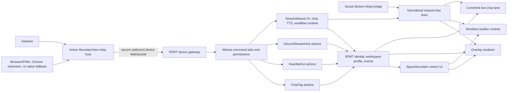

# SpaceMountain Ecosystem Production Roadmap

Updated: 2026-08-02

Status: active engineering source of truth

Owner: SPMT repository (`docs/ecosystem`)

Backlog authority: this file is the only active cross-suite execution queue. App-local TODO and roadmap files may remain only as historical release evidence; they do not own current priorities.

External adopter boundary: AETHERRA is separately owned and operated by Co-Owner `akhiteddy` and is intentionally deferred until the SPMT SDK and documentation are stable. Its product code, deploy, backup, and billing remain with its owner and do not block Gates 0 through 2 for the owner-owned and operated suite.

## Mission

Finish, harden, test, document, and either ship or deliberately retire everything already started in the SpaceMountain ecosystem before adding another major product surface.

This roadmap uses production evidence, not the existence of a page, route, container, or successful build, as the definition of done.

A feature is production-ready only when:

1. Its data and runtime owner are explicit.
2. Authentication, authorization, and tenant isolation are tested.
3. State survives refresh, browser/device changes, deploys, and machine rotation where required.
4. Normal use, empty state, dependency failure, timeout, and permission failure are visible and recoverable.
5. Automated tests and a real production smoke test exercise the same contract.
6. Logs identify the user/tenant, request, source app, and failure without exposing secrets.
7. Backup, restore, rollback, and owner support paths are documented and tested.
8. The UI tells the truth about unavailable, experimental, and ready capabilities.

## Immediate Product Decision

Stop starting unrelated features until Production Gates 0 through 3 are complete.

The immediate goal is not to make every idea large. It is to make the current identity, chat, settings, overlays, workflows, and app connections dependable enough that one account behaves consistently everywhere.

## Verified Production Snapshot

The full snapshot below was re-verified on 2026-07-17; the affected SPMT SDK, StreamWeaver, and DiscordStreamHub rows were re-verified on 2026-07-18 against local `main`, GitHub Actions, Fly state, live health endpoints, and current source.

| Product | Current production state | What is real now | What prevents production-ready status |
| --- | --- | --- | --- |
| SPMT (`spmt.live`) | Live, health passing, 12 real users at the latest slice | Identity, sessions, account recovery, partner SDK/app review, apps, Commlink messages/conversations, notifications, events, `WorkspaceProfileV1`, overlay workspace JSON, Athena memory/routes | Owner recovery operations still need a durable admin audit path; app identity adoption is incomplete; event authorization and retention need hardening; legacy overlay/builder storage remains unversioned; Athena reports capabilities it does not execute |
| SpaceMountain (`spacemountain.live`) | Live, health passing; current UI/desktop-overlay update pending deployment | Suite shell, launcher, rocket arena easter egg, SPMT mail/notifications/events, account-backed appearance and three URL slots, personal overlay canvas, builder definitions, MountainView surface | Shared-theme consumers exist for DSH, StreamWeaver, HearMeOut, and ChatTag; the fixed dock tray and Companion personal-overlay route still require deployment and live operator proof; builder execution and `App.tsx` code splitting remain open |
| StreamWeaver | Live, health passing | Bot/AI runtime, chat processing, TTS, public overlays/listeners, shared TTS mixer, tenant-owned chat/configuration/automation state, automated two-tenant fixture | The full concurrent live-path matrix, provider-token database migration, and canonical XP producer/display adoption remain open |
| DiscordStreamHub | Live, health passing | Discord interactions, dashboards, community/live state, calendar, shoutout/moderation flows, SPMT event bridge, first real SPMT workspace-theme consumer with retry UI | SPMT identity/session is not the only identity; community authority/spotlight contracts need completion; cross-app events and launch targets need full production verification |
| HearMeOut + DJ worker | Both live with passing checks | Rooms, LiveKit configuration, watch/listen state, Discord Activity paths, overlays, voice/media event publishing | Media behavior still has multiple truth paths; active work is summarized in this roadmap and the route inventory remains evidence; player/source/Activity/OBS behavior needs contract consolidation and end-to-end tests |
| ChatTag + bot | Both live with passing checks | Game UI/bot, health endpoint, event publishing, arena/game mechanics | SPMT player identity and linked accounts are incomplete; XP/level/reward authority is split across apps; app and bot event paths need a full two-user live test |
| MountainView inside rotator | Live, health passing, status reports `phone-side` and `connected:false` | SPMT owner sign-in, authenticated command definitions, direct app calls, voice routing, media/vision routes, memory/log/device tables, Android/Expo bridge work | No SPMT device identity/pairing; token encryption still needs its dedicated secret; no MountainView SPMT API key; no cloud device socket; hardware access still depends on a phone-side Bluetooth bridge |
| Fly machine rotator | Live, health passing | Machine rotation, log monitoring, MountainView host | Rotator reliability/security is coupled to experimental MountainView code; the boundary needs isolation even if both remain in one Fly app to avoid another bill |
| Space Mountain dashboard | Retired duplicate launcher; GitHub repository archived, local history retained | Historical static launcher concept | Do not deploy; SpaceMountain is the canonical authenticated suite shell and launcher |
| AETHERRA | Deferred external adopter; excluded from owned-suite gate certification | Separately owned and operated by Co-Owner `akhiteddy`; may consume the stable SPMT SDK later | No source or operational work is in scope until the SDK and documentation are complete; it does not block Gates 0 through 2 or readiness for Gate 3 |

All listed Fly-backed repositories had a successful latest GitHub deployment at this snapshot. That proves deployability, not complete product behavior.

## Persistence Hardening Ledger — 2026-07-16

This pass applies the workspace storage policy without changing database schemas before backup/restore proof. Browser storage remains acceptable only for device preferences, replay cursors, and disposable startup caches; it is not authentication or tenant app-state authority.

| App | Value classification | Durable authority | Hardened in this slice | Remaining gate |
| --- | --- | --- | --- | --- |
| StreamWeaver | Tenant automation variables are app state | Existing tenant-scoped volume store pending the Gate 8 database migration | Runtime handlers now load, cache, and write by tenant; legacy browser persistence was removed; an isolation/durability regression check was added | Complete the documented global botshare, AI/TTS, welcome, metrics, gamble, shared-chat, and voice tenant-state work, then migrate authoritative JSON only after backup/restore proof |
| DiscordStreamHub | SPMT token is session credential; profile fields are cache; community settings are app state | SPMT-validated HttpOnly DSH session plus DSH database/runtime | SPMT exchange/refresh moved server-side; browser token storage removed; logout clears the server cookie; embedded auth re-establishes the validated session | Replace remaining page-level local identity reads with one current-session client and move calendar/leaderboard/setup/theme settings to their explicit owners |
| HearMeOut | Shared watch queue/playback/progress are app state; listener volume/TTS replay state are device preferences | Existing `/data/watch-state.json` volume state pending the detailed media/database track | Watch state now saves through atomic replacement with a last-known-good backup and fallback; duplicate browser-only Discord identity was removed | Prove restart/restore on Fly, then consolidate media truth paths and migrate app state only after backup/restore evidence |
| ChatTag | Signed login token is session credential; displayed Twitch profile is cache | HttpOnly signed session cookie plus ChatTag volume state | Session token was removed from redirect URLs/local storage; profile hydration is server-authoritative; logout now clears the HttpOnly cookie through a server route | Adopt canonical SPMT identity/XP contracts and run the required two-user app/bot test |

Current evidence for this slice is local type checking plus the StreamWeaver tenant persistence regression check. Deployment, Fly restart survival, browser/device tests, and the common production smoke matrix remain required before marking the rows production-complete.

## Active Gate 0–2 Execution Queue

This is the current work queue. Items below supersede the former StreamWeaver and HearMeOut TODO files.

### Existing-user grandfathering contract

Identity adoption must not turn into a forced re-registration event. A first-party app may silently create or restore a canonical SPMT identity only after its backend has verified an existing signed app session against an immutable Twitch or Discord user ID. Usernames are display/handle candidates and never ownership proof. Name collisions create a stable suffixed handle instead of merging accounts.

The trusted app uses an app-bound `identity:write` credential, receives the SPMT session server-to-server, and stores it only in an HttpOnly app cookie. Imported identities begin in `provider-owned` credential state, appear in the canonical user set immediately, and can later choose a password and recovery code from their verified session. Legacy app sessions remain usable if SPMT is unavailable; they cannot grant new admin authority or mint an SPMT session unless their provider proof is revalidated. ChatTag volume users are backfilled in bounded idempotent batches without issuing browser sessions.

### Gate 0 — safety and truth

- [x] Keep the eight owned canonical repositories on `main` and aligned with `origin/main`.
- [x] Record the owned Fly apps, workers, health paths, repositories, and deployed commit labels in `production-manifest.json`.
- [x] Remove accidental workspace shell artifacts and duplicate extracted SDK output.
- [x] Remove the nonexistent `streamweaver-work-test` deployment from the live manifest and delete its stale local Fly config/deploy script.
- [x] Retire `space-mountain-dashboard` as a duplicate unauthenticated launcher; SpaceMountain is the canonical suite shell and launcher.
- [x] Configure SPMT owner recovery and the five fixed app OAuth client secrets, rotate the existing database client rows, and make missing production credentials fail readiness.
- [x] Replace MountainView's one-off owner password with SPMT OAuth, stage the dedicated token-encryption secret, remove rotator/Fly credential fallbacks, and reject production auth-disable mode.
- [x] Audit every app for production JWT/session/default credential fallbacks and make missing required secrets fail readiness.
- [x] Add `npm run smoke:suite` as the reproducible owned-suite smoke command; it proves local/origin/Fly build-SHA parity plus health and one critical feature route for every app and worker.
- [x] Add a Fly service health check to `dsh-clip-worker` using its existing `/health` route.
- [x] Capture and classify 24–48 hours of current errors after the persistence deployments.
- [x] Prove backup plus isolated restore for each owned database/volume and document RPO, RTO, operator, and rollback release.
- [x] Make Athena/MountainView capability output and every simulated UI action report configured, degraded, unavailable, or a real accepted job truthfully.

2026-07-28 completion evidence: every owned stateful Fly runtime was restored from a production snapshot onto an isolated temporary volume and inspector machine, validated without exposing records or secrets, timed, and destroyed without promotion. SQLite authorities passed `PRAGMA quick_check`; JSON/media authorities passed bounded parse and inventory checks. Observed RPO ranged from 4.6 to 17 hours and every RTO was below ten minutes. Exact source volume, snapshot, operator, rollback, and cleanup evidence is recorded in `GATE_0_BACKUP_RESTORE.md`.

### Gate 1 — identity, scopes, tenant isolation, and XP

- [x] Make SPMT session restore the primary identity in StreamWeaver, DSH, HearMeOut, ChatTag, MountainView, and SpaceMountain; provider OAuth remains a linked grant.
- [x] Grandfather existing ChatTag and Discord community members by immutable provider ID, and provide native Discord modal onboarding without collecting a password or requiring an external redirect.
- [ ] Verify direct and embedded login, logout, refresh, account switch, disconnect, export, and deletion with two accounts.
- [x] Issue one scoped, rotatable service credential per app/environment and add allowed/forbidden contract tests.
- [x] Finish StreamWeaver botshare isolation and foreign-chat mention rules; prove loose aliases cannot invoke another tenant's bot.
- [x] Pass `tenantId` through the remaining AI callers (`CommandManager`, LTM condense routes) and eliminate production global-config fallbacks.
- [x] Replace StreamWeaver global `user-stats.json`/`statsCache`, translation-user state, and classic-gamble settings with tenant-owned state.
- [ ] Verify walk-on, EventSub, welcome, metrics, shared-chat, clips, chat-monitor, polling, voice, and WebSocket paths with concurrent tenants; keep intentionally global Pokemon and partner check-in data global.
- [x] Make remaining `/api/chat/send`, AI memory/shoutout, TTS, gamble, welcome, and leaderboard routes reject missing tenant context where tenant state is required.
- [x] Add the automated two-tenant isolation fixture covering chat, replies, botshare, TTS, voice, overlays, workflows, and reconnect.
- [ ] Define the canonical SPMT XP/level/reward ledger, migrate legacy balances, map ChatTag/DSH/arena/SpaceMountain events with idempotency keys, and make shared displays read it.

2026-07-28 completion evidence: SPMT owns the `xp_ledger`, `/api/platform/xp` requires `xp:write`, duplicate awards are blocked by app-scoped idempotency keys, and `/api/xp` returns XP plus derived level. ChatTag, DSH, and SpaceMountain arena producers use canonical mappings; SpaceMountain, ChatTag, and DSH display canonical XP. DSH rejects non-Discord `chat_activity` before mapping it to `dsh.discord.message`. A read-only production scope audit proved the active ChatTag and DSH keys each hold `xp:write` without printing credential values.

2026-07-29 identity-attribution correction: a read-only copy of the live SPMT database proved that a DSH Twitch-path award had used the numeric Discord document key as a Twitch provider ID, creating one imported duplicate while the established account correctly retained both verified provider IDs. DSH now requires an explicit event or linked-account Twitch ID and otherwise routes a verified linked user through Discord identity. SPMT performs a narrow, idempotent startup reconciliation only when a provider-owned imported identity's Twitch ID exactly equals another linked account's Discord ID, the usernames agree, and that linked account already has a distinct Twitch ID. Focused routing and reconciliation tests cover the regression; the two-account live matrix remains open.

2026-07-29 historical-balance correction: the July 24 DSH canonical dual-write began without migrating the existing SQLite-backed leaderboard, and a July 28 guard then excluded Twitch chat activity from canonical awards. The cached DSH balance could also drift below its append-only event history: a read-only production copy proved one account's 1,971 primary-server events total 31,977 while its cached leaderboard document held only 13,601. The corrective implementation reconstructs the observed balance from `leaderboardEvents`, records app-bound versioned migration provenance, and adds only the missing DSH contribution. It never lowers XP and permits exactly one versioned upward correction when a stale cached-value migration preceded the event-ledger repair. DSH supplies immutable Twitch IDs on forwarded events and resumes idempotent Twitch-message awards. Keep this checkbox open until a deployed signed-in read proves the historical balance and a later Twitch message increments both stores once.

Implemented foundation awaiting coordinated production verification: app-bound `identity:write` grandfathering, provider-ID collision safety, server-only session issuance, imported-account claim/recovery setup, `xp:write` with app binding and idempotency, and allowed/forbidden contract coverage in the 175-check SPMT smoke suite. SpaceMountain, MountainView, DSH, HearMeOut, ChatTag, and StreamWeaver now have SPMT session paths; DSH/HearMeOut/ChatTag retain a non-admin compatibility path for existing sessions so migration does not become an outage. ChatTag has a bounded durable-user backfill, and DSH has a bot-secret-protected paginated Discord-member backfill plus a signed native Discord modal that creates a provider-owned SPMT identity and optionally registers a public Twitch handle for shoutout tracking. Neither migration invents or transmits passwords. Cross-app XP producers/displays and the two-account live matrix remain exit blockers.

Production preparation evidence on 2026-07-17: the formerly shared unbound platform key was replaced with separately generated, deployed, app-bound credentials for DSH, HearMeOut, ChatTag, and StreamWeaver using only `events:write` plus `identity:write` where grandfathering is implemented. Each live app verified its own app ID and scopes, and the old shared key was revoked. A pre-deploy SPMT SQLite copy was opened independently in read-only mode, passed `PRAGMA quick_check`, and contained 41 pre-backfill users. This proves the SPMT copy is readable; Gate 0 still requires equivalent isolated restore drills and RPO/RTO ownership for every authoritative store.

### 2026-07-17 Gate 0–2 handoff evidence

- All seven affected repository workflows completed successfully. `npm run smoke:suite` then verified exact local `HEAD` = `origin/main` = deployed Fly image SHA, HTTP health, and a critical feature route for all ten owned app/worker deployments in the manifest.
- Discord backfill scanned 363 guild members, skipped bots, processed all 349 eligible people, created 343 new provider-owned SPMT identities, reused six existing identities, and had zero failures.
- ChatTag backfill processed all 119 durable Twitch identities with zero failures. Provider records are never merged by display name; a cross-provider merge remains pending until the suite has proof that both immutable provider accounts belong to the same person.
- SPMT now contains 503 users: 349 Discord-linked, 119 Twitch-linked, and 490 provider-owned identities that can later choose credentials from a verified session without losing their current app access.
- Rotator's 24-hour actionable error list is clear at zero. Forty-eight unsafe historical ignore rules were removed from the volume-backed rule file with a recoverable pre-prune copy, leaving 25 rules limited to expected lifecycle/user-state noise. New actionable incidents are blocked from entering the ignore list and classified for code, auth/config, or external retry handling.
- Local worktrees for every canonical workspace repository are clean and match `origin/main`. The duplicate retired dashboard repository is also clean; AETHERRA and reference-only sources remain excluded by policy.
- Gates 0–2 are not falsely closed: Gate 0 still needs the 24–48 hour post-deploy observation and isolated restore/RPO/RTO proof for every remaining authoritative store; Gate 1 still needs the two-account/two-tenant live matrix, the full concurrent StreamWeaver path matrix, and XP producer/display adoption; Gate 2 still needs the shared theme client/consumer rollout and cross-device/conflict/isolation matrix.

Verified StreamWeaver work already removed from the active queue: tenant directory/API/WebSocket foundations, tenant-aware bot and TTS configuration APIs, tenant chat-mode storage, welcome tracker/memory paths, tenant metrics paths, tenant gamble overlay output, shared-chat token recovery, and tenant automation-variable persistence regression coverage. These still require the two-tenant suite before Gate 1 closes.

### 2026-07-18 Gate 0 observation evidence

- The initial 24-hour review station contained 28 stored fingerprints representing a smaller set of incident families. Current Fly logs proved Rotator's permanent fingerprint set could hide a recurring failure after its history record aged out. Rotator now uses a one-hour repeat cooldown and timestamped dedupe records so unresolved incidents return to the current picture without per-line alert spam.
- No ignore rule was added. The live volume-backed list remains at 25 narrow lifecycle/user-state rules.
- Narrow fixes were prepared for DiscordStreamHub's forum-forward request-body double read and Chat Tag's bot-to-app Kick broadcast authentication boundary. The latter preserves separate bot-to-app and app-to-StreamWeaver service credentials.
- StreamWeaver's tenant-metrics exception is fixed with no observed recurrence. Its `ladyheidi` Kick connection remains a tenant reauthorization/config issue. HearMeOut's DJ worker continues to encounter YouTube bot challenges and unresolved-source failures despite the browser upload/cache mitigation; that remains a visible external/auth dependency.
- Gate 0 is intentionally not checked complete: corrective deployments require a fresh observation slice, HearMeOut media extraction remains degraded, and isolated restore proof is still missing for every authoritative store except SPMT.
- The all-app log pass also found SPMT readiness intermittently exceeding Fly's five-second timeout because every 30-second probe ran a full `PRAGMA quick_check` over the growing production database and briefly acquired a write lock. Readiness is now lightweight; deep integrity remains mandatory in the isolated backup/restore workflow. Additional open auth/config evidence is HearMeOut's rejected Gemini key and a StreamWeaver broadcaster grant with no access/refresh token.

### 2026-07-19–20 Rotator learning and fresh observation baseline

- The protected pre-reset review covered 141 raw events, 103 stored proposal records, and 45 final grouped targets. Its final live cycle produced 45 classifications with zero provider failures, zero file changes, and zero `ready` or `verified` automatic fixes. Unsafe model drafts were never applied.
- Rotator now redacts credentials before storage/model/report use, protects the raw log export with the operator action token, excludes unverified historical repairs from model context, labels bounded source excerpts, discards excerpt-based patches, caps review concurrency, and requires a `ready` or `verified` quality verdict for automatic application.
- Exact deterministic lessons were added for Fly `PU02` HTTP/2 client cancellations and the shared Discord-chat malformed-JSON field signature. These remain visible classifications and did not broaden the ignore list, which remains at 25 rules.
- StreamWeaver, HearMeOut, DiscordStreamHub, and Rotator corrective commits passed local tests/builds, GitHub Actions, Fly health checks, and public feature/health verification. Chat Tag's reported null `players` failure was historical and its deployed guard was already present.
- The first reset exposed one additional Rotator defect: clearing volume files did not clear the running monitor's in-memory history and cooldown map, so a delayed NATS write restored retained pre-baseline events after an apparent zero. Rotator now filters by the persisted baseline timestamp and resets both in-memory stores when that timestamp changes.
- The authoritative protected reset archived the replayed evidence, cleared 173 active replay events, refreshed the report, and established `/data/error-baseline.json` at `2026-07-20T10:17:44.582Z`. Protected export and stored history remained at zero through the delayed replay interval that had failed twice. The 24-hour observation item remains unchecked until at least `2026-07-21T10:17:44.582Z`; backup/restore evidence remains an independent Gate 0 blocker.

### 2026-07-21–22 completed error observation and classifier hardening

- The protected post-baseline window ran for more than 48 hours and produced 61 stored records across the owned app/worker set. A full production review created 40 proposal records; all remained `review`, none reached `ready` or `verified`, and no automatic code change was applied.
- Three provider drafts demonstrated the remaining model-context risk: a generic Twitch ping timeout was attributed to HearMeOut Discord routes, another was attributed to StreamWeaver TTS timeouts, and a successful Pokémon pack message containing the card name `Computer Error` was attributed to Unicode/TTS. Existing quality gates blocked all three. Rotator now excludes that exact successful-send echo and deterministically classifies the observed Twitch IRC transport/authentication, EventSub ping, stale Server Action, Fly EOF/broken-pipe, LiveKit VoiceBridge, Discord cleanup, banned-channel, invalid Gemini-key, and unknown-channel families before model invocation.
- Expected user-state and successful fallback echoes are filtered only by exact signatures. Authentication/configuration and provider failures remain visible. The volume-backed ignore list remains at 25; no rule was added and no broad error, status-code, provider, or authentication suppression was introduced.
- Current operator-owned blockers are a ChatTag `channel:bot`/moderator authorization failure, invalid HearMeOut Gemini credential, YouTube extractor bot challenges, an invalid Discord voice-channel mapping, a StreamWeaver Twitch IRC credential failure, and a Twitch channel where the shared-chat bot is banned. LiveKit `429`, Fly transport, deployment-version, and Twitch ping events are classified as transient/external and require bounded recovery evidence rather than guessed patches.
- Rotator commit `0da1206` passed 109 tests, typecheck, build, GitHub deployment, and Fly health. The same pass found and repaired StreamWeaver's failed GitHub build by adding its declared `@google/genai` dependency; the pending compatibility/persistence batches for StreamWeaver (`9fe7036`), ChatTag (`e0bd6ba`), and DiscordStreamHub (`ee22a26`) passed their app-specific typecheck/build or isolation suites and were pushed as one deployment per affected app.
- All coordinated GitHub workflows completed successfully. `npm run smoke:suite` at `2026-07-22T14:34:33.618Z` passed all ten owned app/worker health and feature routes with exact local `HEAD` = `origin/main` = deployed Fly image SHA. The protected reset then archived the reviewed state at `/data/error-archives/2026-07-22T14-34-42-143Z`, cleared 70 final events plus 40 proposals, wrote the new baseline at `2026-07-22T14:34:42.174Z`, and remained at zero through the delayed replay check; the ignore list stayed at 25 and unauthenticated raw-log access stayed `401`.
- The 24–48-hour capture/classification item is complete. Gate 0 itself remains open because the non-SPMT isolated restore/RPO/RTO drills are still missing and the listed auth/config dependencies require operator credentials or channel actions. A new protected zero baseline may begin only after the current coordinated deployments pass Actions, Fly health, and the suite smoke matrix; recurring unresolved auth/config events must re-enter the queue.

### 2026-07-23 post-reset observation and deployment blocker

- The protected baseline started at `2026-07-22T14:41:22.444Z`. Its first nearly 24-hour slice stored 145 records: 128 StreamWeaver, 9 ChatTag bot, 4 DiscordStreamHub, and one each from HearMeOut, its DJ worker, ChatTag app, and the DSH clip worker. Replaying the records through the hardened local classifier produces 27 exact context/fallback echoes, 68 auth/config records, 31 code-owned records, 19 transient/external records, and zero unknown records.
- The code-owned set reduced to two real root causes: 27 legacy StreamElements fallback `401` records and four Twitch lookup echoes caused by trailing command punctuation. StreamWeaver `b3a53d8` now tries every configured TTS provider with bounded credential/quota cooldowns before the legacy endpoint, normalizes and encodes Twitch identifiers, and labels optional channel-metadata fallback without emitting a false failure. Its 61-test tenant isolation/persistence suite passed. The local Next production build reached the static worker but did not complete within four minutes; clean-environment deployment validation is still required.
- Rotator `8f0af4f` learned every observed family without adding an ignore rule: provider credential/quota failures and shared-chat `401` remain auth/config; recovered leaderboard rendering, Fly health transitions, Twitch transport/rate limits, and upstream `5xx` remain transient; only exact JSON child lines and handled fallback cascades are filtered before review. It also closes MountainView SQLite handles when each response completes. The full Rotator suite passed 116 tests, typecheck, and build. The volume ignore list remains 25.
- DiscordStreamHub's two 20-second leaderboard-render timeouts recovered on the next scheduled embed update, so no renderer change was made. The remaining operator-owned evidence includes a leaked/revoked StreamWeaver Gemini key, exhausted Gemini/OpenAI TTS quota, ChatTag `channel:bot`/moderator authorization, StreamWeaver shared-chat broadcaster authorization for `nephalem2`, the `infuse_carnage` bot ban, one missing StreamWeaver broadcaster grant, and an unavailable Discord history-channel mapping.
- GitHub accepted both source batches, but Fly rejected both remote builders before image creation with `403` because the `mtman-new` organization has overdue invoices. Therefore neither new SHA is deployed, the live apps remain on their previously healthy releases, parity is intentionally not claimed, and the 145-event queue was not erased. After billing is repaired, rerun each existing deployment once, require Actions plus Fly health/feature and `npm run smoke:suite` parity, then archive/clear only the handled evidence and begin the next protected zero baseline.
- `npm run smoke:suite` at `2026-07-23T14:07:36.214Z` confirmed all ten production health and feature routes at `200`. Eight app/worker entries retained exact local/GitHub/Fly SHA parity. The only parity failures were the two billing-blocked batches: StreamWeaver local/GitHub `b3a53d8` versus deployed `9fe7036`, and Rotator local/GitHub `8f0af4f` versus deployed `8a23c65`.
- Publishing this evidence advanced SPMT source to docs-only commit `6e4e92e`; its production-contract validation passed, then the same Fly billing `403` blocked image creation. The final smoke at `2026-07-23T14:11:11.817Z` again returned `200` for every route, with seven exact-parity entries and three billing-blocked SHA differences: SPMT docs, StreamWeaver, and Rotator. This final documentation correction uses a CI-skip commit so it does not create another known-doomed deploy attempt.

### 2026-07-24 recovered deployment, outage classification, and fresh baseline

- Billing was repaired and the queued hardening releases deployed. The post-correction `npm run smoke:suite` at `2026-07-24T14:45:03.812Z` returned `200` from every health and feature route and proved exact local `HEAD` = `origin/main` = deployed Fly image SHA for all ten app/worker entries.
- The protected window contained 148 records: 80 StreamWeaver, 40 ChatTag bot, 17 HearMeOut, 10 DiscordStreamHub, and one DSH clip-worker record. Replaying the final archive through Rotator `828bb9a` produces 77 exact context-only echoes, 58 transient/external records, 12 auth/config records, one code-owned record, and zero unknowns. Most records belong to one recovered Twitch/outbound connection interruption from approximately `2026-07-24T10:57Z` through `11:58Z`; they are grouped as transport evidence rather than sent to the repair model.
- Two DSH records exposed a real missing `xp:write` scope. The existing app-bound DSH key received only that scope and verified in place as `discord-stream-hub`; no secret was rotated and no app restart was needed. A later live XP request passed authorization and exposed the one code-owned defect: dotted DSH XP event types violated SPMT's lowercase-hyphen slug contract. DSH `bde2142` maps those event types to stable hyphenated slugs and emits rejected XP responses on one bounded log line.
- The pre-scope SPMT database plus WAL were copied off-platform before mutation. The database passed `PRAGMA quick_check`; its SHA-256 is `7D6EE2427C8E9DB9A5F9B424CFDB082332608B0F7497F15A4D2F1998A40EA96C` and the WAL SHA-256 is `4A38A291FC2E134B9C49BB6E42BE43CFA73DB7C354ABCCB0DE31C51ED94B28B6`. Two attempted online volume backups did not finish within the bounded SSH window and their incomplete files were removed. This copy is useful rollback evidence but does not satisfy the still-open isolated restore/RPO/RTO checkbox.
- Fresh traffic after the first reset exposed two more concrete DSH boundaries. The forum forward completed its Discord side effect but an unbounded optional legacy SPMT mirror consumed the caller's eight-second budget; DSH `a817251` bounds that mirror to 1.5 seconds. The StreamWeaver-to-DSH admin lookup repeatedly exceeded both its eight-second application deadline and a direct 15-second production probe because the route ignored its durable synchronized role state. DSH `49c2cd1` resolves cached member/role records first and bounds the live Discord fallback to 3.5 seconds. The identical production probe now returns `200` in 160 ms with `isAdmin=true`, `isMod=true`, and `matchedBy=role`.
- Rotator `828bb9a` passed 130 tests, typecheck, build, GitHub Actions, and Fly deployment. DSH passed typecheck and all web/clip-worker deployment jobs. It now treats the recurring admin timeout as code-owned, while the bounded forum abort and recovered Discord/DSH `5xx` responses remain transient/external. No volume ignore rule was added; the live list remains exactly 25 narrow rules.
- The first authenticated reset archived the original 148 records at `/data/error-archives/2026-07-24T14-25-30-497Z`. Two small correction slices were also archived after their fixes deployed: four records at `/data/error-archives/2026-07-24T14-38-50-978Z` and four at `/data/error-archives/2026-07-24T14-45-26-466Z`. The final protected baseline is `startedAt=2026-07-24T14:45:26.473Z`; it remained at zero events and zero proposals with 25 ignore rules through the delayed replay check at `2026-07-24T14:46:54Z`. Unresolved Twitch login and missing-broadcaster authorization must recur as auth/config evidence if still active; they were not ignored or marked fixed.
- The 24–48-hour capture/classification checklist item remains complete. Gate 0 itself remains open only where documented: isolated restore, measured RPO/RTO, operator, and rollback proof for each authoritative database/volume.

### 2026-07-27–28 extended Gate 0 observation and new baseline

- The post-hardening window ran for more than 86 hours and ended with 97 authoritative Rotator records, zero proposals, and the unchanged 25 narrow ignore rules. Rotator `374292f` deterministically classifies all 97 records as 53 auth/config, 28 transient/external, 13 code echoes, and three expected/operator records, with zero unknowns. Authentication, permission, provider, transport, and generic status-code families were not added to the ignore list.
- StreamWeaver `cd3ce12` repairs the live Crew source fallback and the MountainView/SPMT app-binding mismatch and bounds multiline Twitch/SPMT diagnostics. Chat Tag `7289488` normalizes malformed or mislabeled pack art, while `3cf9f7b` fixes the independently exposed ImageResponse layout defect and adds an executable PNG renderer test. Rotator `683e43c` plus `374292f` learned the new production families; its 131 tests, typecheck, and build passed.
- The existing Chat Tag app-bound SPMT key received only `xp:write` and verified live with `events:write`, `identity:write`, and `xp:write`. Fly snapshot `vs_mJOXmMev9pJmh94gDP5VN` completed before mutation. The timed-out online SQLite backup left an exact orphan process; it was terminated and its incomplete files were removed. The snapshot is useful rollback evidence but does not close the isolated restore requirement.
- All affected GitHub deployments succeeded. `npm run smoke:suite` at `2026-07-28T05:00:57.896Z` passed every health and feature route across all ten app/worker entries with exact local/GitHub/Fly SHA parity. The Chat Tag pack-preview feature probe separately returned `200 image/png` and 294,082 bytes.
- The protected reset archived 97 events and zero proposals at `/data/error-archives/2026-07-28T05-01-30-832Z`, wrote `startedAt=2026-07-28T05:01:30.867Z`, and retained exactly 25 ignore rules. Events and proposals remained at zero through the delayed monitor check at `2026-07-28T05:02:56Z`; the new 24-hour observation starts at the baseline timestamp.
- Remaining auth/config work needs owner or tenant action rather than automatic code: missing or insufficient Twitch grants, a rejected SeaArt account token, stale Discord channel/webhook mappings, a banned DSH Twitch mapping, and challenged HMO YouTube media. The only formal Gate 0 closure blocker remains the isolated restore plus measured RPO/RTO/operator/rollback proof for every authoritative store.

Additional verified isolation work: the current Kick user API contract is used when resolving tenant broadcaster/chat identity; LTM condense routes now require a tenant session and pass the tenant through AI config, generation, and storage; automation bot-name matching accepts tenant context. Tenant provider access/refresh tokens remain app state and must migrate from legacy volume JSON into encrypted database records only after Gate 0 backup/restore proof; they must never be placed in Fly secrets.

StreamWeaver hardening slice prepared on 2026-07-17 and extended on 2026-07-18: signed expiring tenant cookies replace unsigned tenant identity; authenticated legacy SPMT sessions receive a one-time server-validated upgrade; privileged HTTP and WebSocket mutations reject URL-only tenant claims; botshare requires explicit foreign addressing and bilateral opt-in; translation, classic gamble, user statistics, metrics, BRB, interaction history, media, avatar, workflow, and configuration state are tenant-owned; browser storage is limited to device audio/destination/replay choices. Public TTS playback is non-destructive and cursor-based so one listener cannot consume another listener's audio. The 56-test isolation suite now includes one automated two-tenant fixture for private/public chat, source-channel replies, botshare, TTS queues, voice settings, overlay data, generated workflows/actions/commands, and tenant-bound reconnect. The full concurrent live-path matrix remains required.

The same StreamWeaver slice preserves the owner-defined monthly pack pool as an ordered dynamic list of any current length; a viewer's numeric choice maps to that current list rather than a fixed 1–5 table. Discord embeds keep idle/talking avatar media in the thumbnail and place selected public/private GIFs or generated images in the large image slot; requested multi-image counts are preserved. Space Mountain check-in intersects current Twitch chatters with linked members of the configured Discord server, crew check-in reads the configured Discord group, and front seat awards 100 points. AI command creation now creates an inert command, saves and links its workflow, then enables it only after successful persistence with rollback on partial failure.

### Gate 2 — portable workspace and supported app settings

- [x] Implement `WorkspaceProfileV1`, revision conflicts, validation, export/import/reset, and redacted update events.
- [x] Move SpaceMountain appearance and three dock slots to the signed-in SPMT profile with one-time browser migration and offline cache semantics.
- [x] Split overlay scenes and workflow definitions out of the legacy `overlay_workspaces` blob into versioned owned records.
- [x] Add `activeOverlaySceneId`, TTS subscriptions, and app theme mappings to real consumers with conflict/retry UI.
- [x] Publish one versioned SPMT workspace/theme client with background, surface, text, accent, radius, density, and motion tokens.
- [x] Adopt the shared client one app at a time in DSH, StreamWeaver, HearMeOut, and ChatTag, with an explicit “follow SpaceMountain theme” switch.
- [x] Keep device-only volume, audio unlock, replay cursors, and transient layout state local; keep account/app state server-authoritative.
- [ ] Pass cross-device restore, second-account isolation, failed-save retry, embedded-app theme, and no-secret-in-profile tests.

2026-07-28 certification run: the SPMT 175-check suite passed its independent
second-account isolation, optimistic-conflict `409`, missing `If-Match` `428`,
export, reset, and database-persistence cases. SpaceMountain's 18-check
workspace suite passed portable restore, revision conflict/reload, failed-save
retry, account-switch guards, and no-token-in-profile/browser handling; its
typecheck and production build also passed. A signed embed loaded the real
account-backed StreamWeaver lane. The checkbox stays open because only one real
human account was available in the browser session; the second real account and
second physical-device proof cannot be replaced by fixtures.

### 2026-07-18 Gate 1–2 finishing evidence

- StreamWeaver's 56-test isolation suite, persistence verifier, lint, typecheck, and 202-page production build pass. The new two-tenant fixture exercises both tenant IDs through the exact state owners named in Gate 1, so that fixture checkbox is complete; it does not replace the still-open live EventSub/walk-on/polling/voice/WebSocket concurrency matrix.
- SPMT's hosted SDK 0.1.2 contains the versioned `WorkspaceThemeTokensV1` and `workspaceThemeTokens` exports. The 175-check SPMT smoke suite passes, and the versioned tarball is served from the production SPMT SDK mirror.
- DiscordStreamHub is the first real Gate 2 client adopter. Its authenticated server route reads the signed-in account's workspace profile, derives the shared tokens through `@spmt/sdk`, and applies background, surface, text, accent, radius, density, and motion metadata behind the existing “Follow SpaceMountain theme” switch. Failure stays visible and offers Retry; the local theme path remains available when the switch is off.
- DSH, HearMeOut, StreamWeaver, and ChatTag now contain real shared-theme adapters. The active overlay/TTS/app-theme mapping consumers and the cross-device, second-account, conflict/retry, embedded-app, and no-secret matrix remain open.
- StreamWeaver SeaArt character DMs are a deferred app-track improvement, not a Gate 0–2 closure claim: a tenant-configured character ID routes private app chat and Discord DMs through SeaArt character sessions, uses a separate optional character token, falls back to limited tourist chat when absent, parses streamed text, and removes the temporary upstream session.

### 2026-07-26 Gate 2 save regression repair and consumer rollout

- SpaceMountain's HttpOnly-session migration had left one broken proxy seam: the same-origin `/api/spmt` proxy did not forward the browser's `If-Match` header, so SPMT correctly rejected workspace writes with HTTP 428 even though the settings UI was signed in. Commit `cdfb0c829b8991933adb0d5bb78ec5552f7427b4` forwards only the required revision header alongside the server-held bearer token and adds a regression check that cookies are not forwarded. GitHub Actions run `30237336724` succeeded and the fresh live process returned health 200. A signed-in user save plus second-device restore remains required before the Gate 2 matrix can close.
- StreamWeaver commit `38daf35f9d8a2abf1dbb5fd6166cf7bb633bc88e` consumes `WorkspaceThemeTokensV1` through its HttpOnly SPMT session, stores the “Follow SpaceMountain theme” preference as SPMT app state, applies the tokens globally, and exposes loading, local, saving, error, and retry states. Its focused theme test, typecheck, and 212-page production build passed; GitHub Actions run `30238012429` succeeded and live `/api/health` reported the exact commit SHA.
- HearMeOut already shipped the same shared-client contract in commit `99570a319840b7cee94c07e6936068b1851c18cd`. ChatTag subsequently added the adapter; the 2026-07-28 UI alignment slice adds its missing explicit follow/local switch and makes the appearance metadata visibly affect the app chrome.

### 2026-07-27 canonical app surfaces, direct routes, and shared TTS mixer

- SpaceMountain commit `f81820c8ada05aa06c3139b6a75e4a9175a69515` replaces embedded StreamWeaver login URLs and the SpaceMountain-to-ChatTag proxy URL with one canonical surface registry. App cards now expose uniform Open and Dock actions, the registry publishes separate embed and popout targets, saved legacy slots migrate to canonical destinations, and the default audio slot is StreamWeaver's shared TTS studio.
- SpaceMountain commit `9f69b3efc1adfe553065c743be3243f2d86126e5` makes every documented first-load route (`/apps`, `/inbox`, `/forums`, `/rooms`, `/mtnview`, `/builder`, `/crew`, and `/help`, as well as the earlier settings/shop/arena routes) initialize the matching workspace instead of rendering Dashboard data under the requested URL.
- StreamWeaver commit `2d0e5e58656c510797ac7741fe4822b68394d68b` turns the existing shared player into an all-tenant TTS studio. It discovers tenant overlay and chat queues, lets the operator enable or disable each tenant, mixes both queue types chronologically, maintains the presence heartbeat required for paid synthesis, supports per-tenant and master volume, grid or compact ordering, voice selection, and configurable keyboard or on-screen PTT. Selection, order, layout, voice, and volume remain device preferences; no token or provider secret is written to the mixer URL.
- The same StreamWeaver slice distinguishes an expired SpaceMountain app connection from the still-valid StreamWeaver tenant session and offers a top-level OAuth reconnect that returns to Settings. This closes the false generic “Not authenticated” presentation; a current SPMT sign-in is still required to mint the replacement app token.
- Production browser evidence selected tenants `1026453815` and `94371378` together, enabled the mixer, and observed active overlay and chat-mixer presence for `1026453815`. The fresh SpaceMountain bundle rendered the canonical ChatTag, shared TTS, and DSH slots and the TTS studio iframe. Automated evidence includes SpaceMountain's 16-check workspace/URL smoke plus its production build and StreamWeaver's 18 focused session/TTS tests. The Gate 1 two-account login matrix, a signed-in reconnect/save/second-device restore, and Gate 4's revocable clean OBS output URL remain open; this slice does not claim those gates complete.

### 2026-07-27 signed embeds and Companion foundation

Implemented in source and covered by focused local checks:

- SpaceMountain now mints a 90-second, one-time, app-bound embed launch code
  from its HttpOnly SPMT session. StreamWeaver exchanges that code
  server-to-server with its OAuth client secret and stores the resulting
  StreamWeaver session plus SPMT access/refresh credentials in secure,
  partitioned HttpOnly cookies. Exact parent and target origins are enforced;
  user profile `postMessage` data is presentation only and cannot grant access.
- SPMT OAuth now issues rotating 30-day refresh credentials. StreamWeaver
  retries workspace/theme reads after an expired access token and rotates the
  refresh token without exposing either credential to browser JavaScript.
- The versioned Companion capability/security contract defines trust
  boundaries, grant and revocation behavior, exact action-to-capability
  mapping, replay/expiry rules, confirmation policy, local data ownership, and
  the outbound-only network boundary.
- The Companion source uses Electron's single-instance lock and system tray,
  keeps managed windows out of the taskbar, supports start-at-login and hidden
  startup, and supervises the existing `start:local` Next.js/WebSocket runtime
  without opening a console window.
- The local capability surface includes one click-through overlay, three
  persistent configurable popouts, OBS WebSocket scene selection, managed
  window mute/volume, a local media library, bounded MP4/MP3/GIF FFmpeg jobs,
  and an outbound authenticated WSS command client.
- SPMT SDK `0.2.1` publishes versioned Companion device, command, action, and
  capability types plus validation and client methods. SPMT stores hashed
  device tokens, supports user-owned pairing/revocation, queues expiring
  commands, and relays them only to the matching outbound device socket.
- HearMeOut's Discord Activity now exposes its request, queue, event, shared
  playback, volume, and all-room TTS controls inside Discord instead of hiding
  those working controls or requiring an external page for normal operation.

This is a foundation, not a production-certification claim. Remaining gates:

- [ ] Package and sign the Windows installer, verify clean install/uninstall,
  start-at-login, single-instance recovery, tray-only behavior, automatic
  update, and local server restart on a non-development Windows account. Source
  now restarts an unexpectedly exited managed server; clean-account proof,
  installer signing, and update delivery remain open.
- [ ] Add global hold-to-talk capture and explicit microphone-device routing.
  Managed HTML media now accepts a local output-device ID, but friendly device
  enumeration and hardware proof remain open. Keep account TTS subscriptions
  server-owned and volume/PTT/device choices local.
- [ ] Add resumable download/upload jobs, checksums, quotas, cancellation,
  malware/content boundary documentation, and explicit confirmation for file
  selection, external upload, overwrite, or delete. Current media support is
  deliberately limited to user-selected import and non-destructive transcode.
- [x] Add local confirmation UI and persistent reviewed-job history for
  `obs.media.play`, approved jingle playback, and song briefs. SPMT and the
  Companion both enforce the action/capability/workflow allowlists.
- [ ] Keep confirmation and audit coverage mandatory before any future
  `media.upload`, `media.delete`, shell, browser automation, or arbitrary OBS
  mutation capability can be granted.
- [ ] Run relay reconnect, duplicate delivery, expiry, revocation, queue
  overflow, malformed payload, and concurrent-device production tests. Add
  bounded retention/cleanup for completed and expired commands.
- [ ] Establish a server-verified Discord Activity-to-SPMT session grant before
  exposing Companion/OBS/local-media commands inside an Activity. Anonymous
  Activity media controls must never inherit local-device authority.
- [ ] Rebuild the DSH, ChatTag, and any future Discord Activities against that
  scoped Activity session so each becomes a complete in-Discord control surface
  for its own approved capabilities without external login/control links.
- [ ] Complete the signed-in two-account embed matrix: first load, third-party
  cookie restrictions, refresh rotation, account switch, logout, revocation,
  and second-device restore. Then verify exact deployed SHA parity for SPMT,
  SpaceMountain, StreamWeaver, and HearMeOut.

### 2026-07-27 shared bot research and reviewed creative workflows

Implemented in source without claiming production certification:

- StreamWeaver now has a generalized Research Mode. Explicit “I have a
  question” and search phrases open a tenant/user/channel-scoped retrieval
  path; ordinary mentions do not create search traffic.
- Tenant public runtime JSON owns enablement, selected knowledge packs, source
  allowlists, result limits, and cache policy. Curated knowledge-pack retrieval
  requires no external API key. Optional live internet retrieval uses
  `BRAVE_SEARCH_API_KEY` in environment/Fly secrets when an operator chooses to
  enable that enhancement.
- Professor Eevee automatically receives the first curated `vocaloid`
  knowledge pack. The pack distinguishes synthesis engines, voicebanks,
  characters, creators, songs, discovery metadata, and rights; the framework
  is subject-neutral and accepts future packs.
- Companion and SPMT implement `workflow.run` with a harmless `test.echo`
  contract. Companion source is now `0.2.0`; `audio.jingle.play` and
  `song.render.request` always require local
  approval. The Companion stores bounded review history, can restart an
  approved local jingle through a named OBS media input, and records an
  engine-neutral song brief, writes an approved manifest inside the local
  media library, and detects the named rendered output without granting a shell.
- No arbitrary shell, bundled copyrighted media, undocumented VOCALOID CLI,
  tenant upload/download, or viewer-submitted job is exposed. Those last two
  surfaces remain deliberately deferred.
- Focused source checks cover research intent/settings, workflow review,
  payload bounds, the harmless workflow, and Companion syntax. SPMT typecheck
  covers the expanded SDK/server contract.

Core production proof still required: live knowledge-pack answers on Twitch and
Discord; two-tenant isolation; paired SPMT-to-Companion `test.echo`; approval,
expiry, rejection, replay, and revocation behavior; real OBS media playback;
and licensed-renderer operator proof. Live internet retrieval is optional and
does not block knowledge-pack Research Mode or the core launch gate. If enabled,
it still requires a configured provider credential and a sourced-answer smoke
test.
StreamWeaver's app-owned implementation record is
`docs/RESEARCH_AND_CREATIVE_WORKFLOWS.md`.

### 2026-07-28 Research and Companion production worksheet

Status values mean: **done** has current production or automated evidence;
**operator** requires the real account/device/application surface; **optional**
does not block the core launch; **deferred** is intentionally outside this
release.

| Work item | Status | Current evidence or next proof |
| --- | --- | --- |
| Research intent and two-minute follow-up | Done | StreamWeaver current-main typecheck and focused tests pass; deployed source includes direct and two-step routing |
| Curated tenant knowledge-pack retrieval | Done | No external API key required; Professor Eevee receives the built-in `vocaloid` pack and tenants can select future subject-neutral packs |
| Live internet retrieval | Optional | Adapter is deployed but `BRAVE_SEARCH_API_KEY` is not configured; enable only when current web results are worth the provider dependency |
| Untrusted retrieved-context boundary | Done | Prompt contract labels retrieved material as untrusted and applies source, uncertainty, safe-search, timeout, cache, and allowlist bounds |
| Automated tenant isolation | Done | Research state is tenant/platform/channel/user scoped and the focused settings/intent suite passes |
| Live two-tenant Twitch and Discord matrix | Operator | Use two real tenants concurrently and prove one tenant cannot arm, retrieve, configure, or answer through the other |
| SPMT relay and SDK `0.2.1` | Done | Relay/SDK merge `48615d9c665a793bab58a36177a4edde6564033d` is in current-main ancestry; SDK metadata and versioned tarball are live |
| StreamWeaver cloud deployment | Done | Research/Companion merge `776d51299ed4d5a5556ccc68173796d26ceb41c1` and no-key default merge `d91af1723cdbee923c6a4d3a8dd2ca42ac4fee70` are in current-main ancestry |
| Companion harmless `test.echo` locally | Done | Companion syntax and workflow suite pass; it performs no file, OBS, audio, browser, or process work |
| Real paired-device `test.echo` | Operator | Companion is not currently installed/running on the operator PC; pair it to SPMT and record accepted, delivered, completed, and audit states |
| Approval, rejection, expiry, replay, and revocation | Operator | Automated contract coverage exists; run the matrix through a real paired Companion and verify stale or revoked work cannot execute |
| OBS approved-library jingle playback | Operator | Start OBS and Companion, select an existing media input and approved local file, then prove restart playback without arbitrary path access |
| Reviewed song manifest and output detection | Done | Companion tests prove local review, bounded manifest creation, no second approval after relay approval, and named-output detection |
| Licensed renderer execution | Operator | Select a documented, locally installed renderer and add an explicitly allowlisted adapter; no undocumented VOCALOID CLI is assumed |
| Signed installer and updates | Source ready; credential blocked | Companion `0.3.0` uses `electron-updater`, publishes `latest.yml` plus blockmaps, checks on startup and every six hours, exposes a manual check, and asks before restart/install. The release workflow fails closed unless `WINDOWS_CERTIFICATE_P12` and `WINDOWS_CERTIFICATE_PASSWORD` exist. No trusted code-signing certificate is installed locally or configured in GitHub, so a signed public installer cannot yet be produced. |
| Friendly device enumeration and global PTT | Operator | Current source retains the output-device ID and local PTT controls; real device enumeration/global hotkey behavior still needs a desktop design and operator proof. |
| Persistent SpaceMountain dock tray | Source done | The three account-backed slots now remain fixed at the bottom while another app is active; deploy and verify all three headers plus an expanded cross-origin app on desktop and mobile |
| Companion personal overlay window | Source done | Companion now opens the controls-free `desktopOverlay=1` SpaceMountain canvas in its transparent Electron window, restores prior visibility, and exposes click-through, opacity, and always-on-top controls; package and prove it above a real desktop app |
| Shared UI effect parity | Source done | DSH, HearMeOut, StreamWeaver, and ChatTag now map shared density, sidebar collapse/style/position, top-bar style, tab style/position, avatar visibility, chat transparency, glass/blur/border/radius, particles, shooting stars, animation speed, and motion to semantic app surfaces; unsupported surfaces are ignored and each app keeps its local fallback |
| Tenant uploads/downloads | Deferred | Requires resumability, checksums, quotas, cancellation, malware/content boundaries, and explicit file confirmations |
| Viewer-submitted creation | Deferred | Do not expose until tenant authorization, moderation, rate/cost limits, review, audit, and abuse controls are complete |

This worksheet closes the cloud deployment and SHA-parity items for this slice.
It does not convert the paired-device, OBS, renderer, installer, or two-tenant
operator rows into source-only claims.

#### Final shared-UI and desktop operator pass

Run this matrix after the other production task has deployed exact source
parity. Test one signed-in owner account first, then a second account to prove
isolation.

- [ ] Change theme colors, glow, stars, nebula, glass, blur, borders, and radius
  in SpaceMountain; refresh StreamWeaver, DSH, HearMeOut, and ChatTag and verify
  each follows without making text unreadable.
- [ ] Test compact, comfortable, and spacious density at desktop and mobile
  widths.
- [ ] Test docked, floating, and hidden sidebars plus collapsed/expanded and
  left/right placement in StreamWeaver, DSH, and HearMeOut. ChatTag has no
  persistent sidebar and should remain stable.
- [ ] Test transparent/glass top bars and pills/underline/cards tabs. For Radix
  tab groups also test top/bottom/left/right placement and keyboard focus.
- [ ] Turn avatars off and confirm names, messages, tooltips, and navigation
  remain understandable.
- [ ] Set chat opacity low/high in StreamWeaver raw chat, DSH Discord messages,
  and HearMeOut Space Mountain chat; Twitch's cross-origin iframe retains its
  provider styling.
- [ ] Disable particles, shooting stars, smooth transitions, and all motion in
  turn; confirm reduced-motion mode has no lingering decorative animation.
- [ ] Turn follow mode off in each app, change its local theme/tuning, refresh,
  then re-enable follow mode and verify the account workspace wins again.
- [ ] Expand all three fixed SpaceMountain docks over another desktop app and
  at a mobile width; verify headers, collapse, volume/mute, and cross-origin
  content remain usable.
- [ ] Install/run Companion `0.2.1`, open the personal overlay, and verify
  transparency, opacity, click-through, always-on-top above a real application,
  multi-monitor placement, hide/show, and restart restoration.
- [ ] Sign out, sign in as a second tenant, and verify no appearance, local
  fallback, dock URL, overlay state, or app-owned setting crosses accounts.
- [ ] Record deployed SHA parity and screenshots for one desktop and one mobile
  width before changing this row from source done to operator verified.

Exact current SHA is deliberately not frozen into this worksheet because the
documentation commit itself advances `main`. Certification must compare
`origin/main` with the live health/build label at verification time; on
2026-07-28 that dynamic comparison passed for both StreamWeaver and SPMT.

Browser-persistence audit snapshot after the 2026-07-17 hardening pass:

- SpaceMountain now uses a same-origin HttpOnly SPMT session and account-backed arena state. A one-time server-validated upgrade converts a still-valid legacy browser token before deleting it.
- DiscordStreamHub now derives current identity/admin state from the SPMT session. Existing validated legacy sessions remain regular-user compatible but cannot confer admin authority. Theme and operational channel settings use SPMT app state and retain a local compatibility shadow only until the account bridge succeeds.
- HearMeOut now stores reusable themes and saved popout layouts in SPMT app state, and shared overlay visibility/hidden-user choices in room state. Voice volume/noise/PTT controls, live popout coordinates, audio unlock, and TTS replay cursors remain intentionally device-local. Legacy values are deleted only after an account-backed save succeeds.
- StreamWeaver avatar files/display mode, shoutout-overlay mode, bot identity/personality, tenant automation, overlay, and workflow choices now read from and save to tenant-owned server state. Browser storage remains only for device audio output, replay cursor, and voice destination/autosend choices that do not transfer safely between devices.
- ChatTag browser username/avatar values are display caches only and are cleared when the server session is absent; they must never regain authentication authority.

### Deferred app-track work after Gate 3 opens

StreamWeaver generation hardening remains an app track, not a Gate 0–2 blocker: typed generation controls, effective-config preview, DM response parity and lifecycle logs, provider health, image metadata/retention, registry previews/filtering, Perchance guardrails, and backup/debug tooling.

The former StreamWeaver Kick broadcast TODO is folded here as deferred app-track work: cross-channel ChatTag broadcast slug resolution, non-tenant Kick listening, and Kick AI/TTS response parity must use the current Kick public API contract and tenant/provider grants. It is not a separate active queue and does not override Gates 0–3.

HearMeOut media consolidation remains an app track, not a Gate 0–2 blocker: preserve the movie-style watch-session contract as the backbone; adapt music into the same accepted media contract; keep voice separate; align watch page, Discord Activity, rooms, and overlay players; add separate OBS media/voice outputs; add telemetry and playback smoke tests; deprecate old routes only after usage evidence. On 2026-07-28 the duplicate root Activity routes and legacy music state/control routes became compatibility wrappers around the canonical watch-session handlers, and legacy Activity/music/DJ-debug hits gained privacy-safe `[RouteTelemetry]` records. No route or dead file was removed because the required observation window has not elapsed. `hearmeout-main/docs/HEARMEOUT_MEDIA_ROUTE_INVENTORY.md` remains the evidence inventory, while this roadmap owns the queue.

## Direct Answers To The Current Questions

### Is Athena OS ready, and should MountainView glasses use it?

Not yet.

Athena currently has three different partial meanings:

1. SPMT exposes Athena metadata, memory, context, and command routes.
2. StreamWeaver is the working AI/chat/TTS runtime and contains the real Athena persona/bot behavior.
3. MountainView directly selects and calls app endpoints, falling back to StreamWeaver when SPMT/Athena authorization is unavailable.

The first Gate 0 slice removes the false-success behavior: SPMT reports capability states, rejects command dispatch as unavailable without creating fake jobs, and SpaceMountain no longer offers the simulated Athena Send control. A durable command job and adapter dispatcher still need to be built in Gate 6.

Decision:

- SPMT will own the Athena control plane: user context, permissions, memory index, command jobs, app adapter registry, audit, and results.
- StreamWeaver will own the Athena runtime: model calls, conversational context, bot personality, TTS, and workflow execution.
- Each app will own its actual domain action.
- MountainView will use Athena only after command jobs, scoped adapters, and result delivery pass Gate 6.
- Until then, MountainView must label direct StreamWeaver/app routing honestly rather than calling it completed Athena OS routing.

### Is the inbox like Social Stream Ninja now?

Partially. Commlink now has first-class Mail, Live Chat, Notifications, and App
Events lanes. Live Chat opens StreamWeaver's authenticated tenant dock through
the signed embed handoff instead of copying high-volume viewer chat into SPMT.

What exists as of 2026-07-28:

- Normalized Twitch, YouTube, Kick, Discord, and Social Stream bridge events.
- Bounded tenant replay, deduplication, validation dead letters, cursor polling,
  and platform/source/channel/text/type filters.
- Source/channel cards, roles, badges, donations, memberships, media links,
  connection/degraded state, and stable source IDs.
- Tenant-persisted pin, queue, feature, auto-show, next, and clear controls.
- Separate Commlink lanes for mail, live chat, notifications, and app events.
- Authenticated SSE push with automatic reconnect plus polling fallback.
- Per-user read cursors and saved filters.
- Manual TTS listen/stop and destination-validated Twitch replies.
- A transparent featured-message browser source with style, duration, clear,
  and optional queue auto-advance.
- Bridge heartbeat, stale-health reporting, bounded persistent dedupe cursor,
  and reconnect state.

What is missing:

- Verified reply and moderation adapters for Discord, YouTube, Kick, and
  Social Stream. Twitch reply is enabled; moderation remains disabled.
- Shared-mixer routing and explicit collaborator operator/viewer grants. Manual
  dock TTS is implemented.
- Bot feed subscriptions and per-bot reply permissions.
- Live two-source, OBS browser-source, TTS, reply, reconnect, and tenant
  isolation operator proof.

The target is one Commlink workspace with separate but connected lanes for Mail, Live Chat, Notifications, and App Events. High-volume raw chat remains owned by StreamWeaver; SPMT indexes safe summaries and authorization metadata rather than duplicating every chat database.

### Is the builder like Social Stream Ninja now?

No. It is a saved form, not an automation engine.

The current page stores rows containing one trigger, one filter, one action, and one destination inside the SPMT overlay-workspace JSON. `Test` only displays a local notification. There are no executable nodes, branches, state, retries, credentials, run history, payload inspector, or output renderer.

Social Stream parity requires, at minimum:

- Chat, event, source, OBS, timing, random, and custom triggers.
- Message, integration, media, overlay, OBS, TTS, state, and webhook actions.
- AND/OR/NOT logic plus gates, counters, throttles, and delays.
- Templates, transforms, branches, idempotency, and loop protection.
- Dry runs using recorded/synthetic payloads.
- Import/export, templates, versioning, run history, retries, and visible node failures.

This is Gate 5, after tenant isolation and normalized chat are safe.

### Do overlays, URL slots, and themes persist across apps now?

The owner contract and all four current theme adapters are implemented; desktop and cross-device operator proof is still incomplete.

- `WorkspaceProfileV1` stores every current SpaceMountain appearance control and all three dock slots in the signed-in SPMT account with validation and revision conflicts.
- SpaceMountain migrates `spmtEmbedSlots` once, uses an account-specific local cache only for startup/offline visibility, and shows save, retry, conflict, reload, and reset states.
- Overlay widget positions still load through the legacy compatibility workspace while versioned overlay scenes are the long-term owner; builder rows have a separate versioned workflow contract.
- DiscordStreamHub, StreamWeaver, HearMeOut, and ChatTag consume the shared theme tokens and retain app-owned fallback or fine-tuning controls.
- SpaceMountain exposes a controls-free `?desktopOverlay=1` canvas for the local Companion. Electron owns transparency, click-through, always-on-top, opacity, remembered bounds, and restart restoration.
- The three account-backed URL slots are a fixed bottom tray so an active embedded app no longer pushes them below the viewport.

Gate 2 remains open only for the live cross-device/account/conflict/no-secret matrix. The Companion overlay still needs a packaged Windows build and real desktop operator proof before it is production-certified.

### Can the glasses connect directly to the cloud without the mobile app?

The cloud can own nearly all intelligence, state, credentials, and integrations. The current glasses still need a nearby radio gateway, but that gateway does not have to be the primary phone or a large native control app. It can be a supported computer, Chromebook, Android tablet, or spare Android phone.

The present MountainView runtime explicitly reports `bridgeMode: "phone-side"`. The AiMB/RDGlass work in this repository uses Android Bluetooth/BLE and headset media-button behavior. The currently available Meta Wearables toolkit also exposes supported glasses to iOS/Android applications rather than providing a general direct-to-third-party-cloud runtime.

Production target:

- Make `MountainView Relay` host-neutral and keep one cloud protocol regardless of which local host is used.
- Ship a stable HTTPS browser/PWA relay first for foreground use on platforms where Chrome Web Bluetooth can access the glasses' required BLE GATT services.
- Add a Manifest V3 Chrome extension/side-panel relay for desktop convenience, pairing state, launch-on-use, and diagnostics. It must survive extension service-worker restarts and must not rely on an immortal background worker.
- Keep a thin native Android foreground-service relay as the reliability fallback for 24/7 background reconnect, media buttons, camera/audio paths, or BLE characteristics unavailable to the browser.
- Add a desktop native tray relay only if the glasses require Bluetooth Classic/RFCOMM, vendor-native APIs, or background behavior Chrome cannot provide.
- The relay owns only Bluetooth/BLE, microphone/camera/button capture, audio output, local permission prompts, reconnect, and a short offline buffer.
- It holds one revocable SPMT device token, not app provider credentials.
- It maintains a secure outbound WebSocket to the SPMT device gateway.
- Athena, StreamWeaver, Commlink, storage, workflows, and all app calls run in the cloud 24/7.

This makes the system primary-phone-free whenever another compatible host is nearby. It does not make the glasses radio-gateway-free: a local device must still speak Bluetooth unless the exact glasses expose their own supported Internet runtime.

Browser constraints are part of the design, not hidden edge cases:

- Web Bluetooth requires a secure context and a user gesture for the initial device chooser.
- Support is limited to compatible Chrome/platform combinations and BLE GATT capabilities; it must be proven against the exact glasses before committing.
- A normal browser page/PWA is the portable route for Android tablets and spare phones. Do not make mobile Chrome-extension support a requirement.
- Manifest V3 extension workers can be terminated while idle, so pairing/session state must persist and the relay must reconnect idempotently.
- Standard headset audio may be handled by the host OS and browser microphone/speaker APIs. Glasses camera, hardware buttons, and vendor-specific commands require documented BLE/serial/native access and cannot be assumed.
- A foreground browser/PWA is valid for interactive use. The native Android relay remains the supported always-on option until device and OS soak tests prove equivalent browser behavior.

## Canonical Ownership And Data Boundaries

| Concern | Production owner | Storage/transport rule |
| --- | --- | --- |
| Account, profile, linked identities, session | SPMT | SPMT database and signed sessions |
| Device identity, pairing, revocation | SPMT | Device records and short-lived pairing codes; hashed device tokens |
| Portable appearance, URL slots, workspace selection | SPMT | Versioned workspace profile JSON in database |
| Overlay scenes and read-only output grants | SPMT + SpaceMountain renderer | SPMT database; SpaceMountain renders; no provider secrets in scene JSON |
| App install, permissions, launch targets | SPMT | Registry plus scoped grants |
| Notifications, account messages, app summaries | SPMT Commlink | SPMT database |
| Raw normalized live chat and bot memory | StreamWeaver | Tenant-scoped StreamWeaver database/storage |
| TTS queues, playback, bot responses | StreamWeaver | Tenant-scoped replayable queues |
| Workflow definitions, execution, and run history | StreamWeaver | Tenant-scoped database; SPMT authorizes identity/scopes |
| Discord/community state | DiscordStreamHub | DSH database/runtime; publish summaries to SPMT |
| Rooms, voice, media, playback | HearMeOut | HearMeOut database/runtime; publish summaries to SPMT |
| Game mechanics and match state | ChatTag | ChatTag database/runtime |
| Canonical cross-app XP/level | SPMT profile stats | App reward events map into one ledger/API |
| Athena jobs, permissions, context index, audit | SPMT | Durable job records and scoped dispatch |
| Athena model/chat/TTS runtime | StreamWeaver | Tenant-scoped model and memory services |
| MountainView relay protocol and device session | SPMT + MountainView | One versioned protocol shared by browser/PWA, extension, and native relay hosts |
| Hardware Bluetooth/BLE and capture | Active MountainView relay host | Local only; browser/PWA where proven, Chrome extension for desktop convenience, native relay where background/vendor access is required |
| AETHERRA product state and operations | Co-Owner `akhiteddy` | Separately owned database, billing, deployment, and backups; SPMT receives only granted identity/profile/events |
| AETHERRA SPMT integration contract | SPMT SDK + partner adapter | OAuth/scopes, `/api/me`, portable theme tokens, events/webhooks, revocation, and conformance tests |
| Secrets | Fly/GitHub secret stores | Never JSON, database output, client bundle, logs, or URLs |
| Public operational config | Volume-backed JSON | Non-secret URLs, flags, capability settings |
| App state | Owning app database | No local JSON as production source of truth |

## Target System


```mermaid
flowchart LR
    G["Glasses"] --> R["Active MountainView relay host"]
    RH["Browser/PWA, Chrome extension, or native fallback"] --> R
    R -->|"secure outbound device WebSocket"| D["SPMT device gateway"]
    D --> A["Athena command jobs and permissions"]
    A --> SW["StreamWeaver AI, chat, TTS, workflow runtime"]
    A --> DSH["DiscordStreamHub actions"]
    A --> HMO["HearMeOut actions"]
    A --> CT["ChatTag actions"]
    SW --> C["Normalized shared-chat feed"]
    SSN["Social Stream Ninja bridge"] --> C
    C --> I["Commlink live-chat lane"]
    C --> B["Workflow builder runtime"]
    C --> O["Overlay renderer"]
    SPMT["SPMT identity, workspace profile, events"] --> I
    SPMT --> O
    SPMT --> WEB["SpaceMountain control UI"]
    WEB --> B
    WEB --> O
    DSH --> SPMT
    HMO --> SPMT
    CT --> SPMT
    SW --> SPMT
```

## Production Gate 0 — Stabilize, Secure, And Tell The Truth

No feature expansion passes this gate until all items below are complete.

### Step 0.1 — Create a production inventory manifest

For every Fly app, domain, repository, process, volume, worker, OAuth application, webhook, and scheduled job, record:

- Purpose and owner.
- Repository and deployed commit.
- Public and internal URLs.
- Fly app, process, region, size, machine count, volume, and auto-start/stop policy.
- Required secret names and public runtime config file.
- Database/volume location and backup policy.
- Health and deep-readiness endpoints.
- Upstream/downstream dependencies.
- Monthly keep/retire/consolidate decision.

Include the dashboard and all owned bot/worker apps. External adopters are added only when their owners begin a formal SPMT integration; AETHERRA is deferred and excluded from the current certification inventory.

### Step 0.2 — Capture a reproducible live baseline

1. Record current commits and successful deploy runs.
2. Save health, readiness, and key route responses.
3. Record current Fly machine/volume state.
4. Save a redacted secret-name inventory.
5. Capture 24–48 hours of errors by app and group them by root cause.
6. Create one reproducible smoke script per app.
7. Add the baseline to a release manifest rather than scattered TODO files.

### Step 0.3 — Remove credential fallbacks

1. Use SPMT OAuth for MountainView owner authentication and set the dedicated `MOUNTAINVIEW_TOKEN_ENCRYPTION_KEY` Fly secret; no app-specific owner password is required.
2. Set a scoped MountainView SPMT service credential after Gate 1's device/service contract exists.
3. Remove fallback to `mountainview-dev`, `mountainview-dev-key`, `FLY_API_TOKEN`, and the rotator action token.
4. Fail startup or report not-ready when required production secrets are absent.
5. Configure `SPMT_ADMIN_RECOVERY_KEY`, issue the locked-out tenant a recovery code through the owner path, and document rotation.
6. Audit JWT/session fallback strings in every app and remove production defaults.
7. Add rate limits and audit entries to login, recovery, pairing, token, webhook, and workflow-trigger routes.

### Step 0.4 — Prove backup and restore

1. Identify every authoritative database and volume.
2. Create a backup now.
3. Restore each database into an isolated temporary app or local fixture.
4. Verify account, configuration, messages, workflows, overlays, room/game state, and device records as applicable.
5. Document RPO/RTO and who can perform recovery.

### Step 0.5 — Make health truthful

Each service needs:

- Liveness: process responds.
- Readiness: database/volume and required internal dependencies work.
- Dependency detail: degraded dependencies without leaking credentials.
- Version/build SHA.
- Capability flags derived from configured and tested adapters, not hardcoded optimism.

Change Athena from `status: online` with every capability `true` to `ready`, `degraded`, `configured`, or `unavailable` per capability.

### Step 0.6 — Add visible product truth

Mark scaffolds, simulated test buttons, unavailable hardware controls, and experimental media paths clearly. Never return `routed: true` unless a durable job was accepted; never show success unless the target result is known.

### Gate 0 exit criteria

- Every paid runtime has an owner/source/keep decision.
- Every required secret has no production fallback.
- Backup and restore are proven.
- Athena and MountainView capability/status output is truthful.
- A baseline smoke pack and error inventory exist.
- No unresolved P0 auth, data-loss, or cross-tenant issue remains open.

## Production Gate 1 — One Identity, Strict Tenant Isolation, One XP Ledger

### Step 1.1 — Finish SPMT identity adoption

For DSH, StreamWeaver, HearMeOut, ChatTag, MountainView, and SpaceMountain:

1. Use SPMT OAuth/session restore as the primary signed-in identity.
2. Keep provider OAuth as a linked grant, not another app identity.
3. Replace local/fake identity and manual ID entry where the SPMT account supplies it.
4. Validate top-level and embedded login/logout/session refresh together.
5. Register exact launch/callback URLs and allowed origins.
6. Add account deletion/export and provider disconnect behavior.

### Step 1.2 — Enforce server-to-server scopes

1. Inventory every SPMT write performed by each app.
2. Issue a unique scoped credential per app/environment.
3. Verify audience, app ID, tenant/user subject, scopes, expiry, and request ID.
4. Reject a key for another app or scope.
5. Rotate keys without downtime.
6. Add contract tests for allowed and forbidden writes.

### Step 1.3 — Finish StreamWeaver tenant isolation before shared chat

Resolve all active high/medium tenant TODOs, especially:

- Botshare mode and cross-bot mention matching.
- AI and TTS configuration.
- Shared-chat tokens and mode.
- Walk-on shoutout, EventSub, welcome, metrics, stats, gamble, clips, translation, and chat monitor state.
- Voice and WebSocket broadcasts.
- `/api/chat/send`, AI memory, TTS, leaderboard, and other global API routes.

Test with two tenants concurrently. Tenant A must not change, hear, invoke, read, or reply through tenant B.

### Step 1.4 — Create canonical profile stats

1. Add an SPMT XP/level/reward ledger contract.
2. Map ChatTag, DSH, arena, and SpaceMountain rewards into typed ledger events.
3. Keep game-specific state in ChatTag.
4. Make every shared level display read the canonical endpoint.
5. Add idempotency keys so event retries cannot award twice.

### Gate 1 exit criteria

- Two accounts can use every app in the same browser and separate browsers without state leakage.
- Embedded and direct login/logout/refresh work.
- Every server write is scoped and attributable.
- One XP/level value appears across SpaceMountain, arena, ChatTag, and DSH.

## Production Gate 2 — Portable Workspace, Theme, URL Slots, And Settings

### Step 2.1 — Define `WorkspaceProfileV1`

Add a versioned account-backed contract containing only non-secret user state:

```ts
type WorkspaceProfileV1 = {
  schemaVersion: 1;
  revision: number;
  appearance: {
    themeId: string;
    glowIntensity: number;
    starDensity: number;
    glassOpacity: number;
    blurStrength: number;
    borderStrength: number;
    cornerRadius: string;
    density: string;
    animation: { enabled: boolean; speed: number; particles: boolean };
  };
  dockSlots: Array<{
    id: 1 | 2 | 3;
    title: string;
    url: string;
    collapsed: boolean;
    volume: number;
    muted: boolean;
  }>;
  activeOverlaySceneId: string | null;
  ttsSubscriptions: string[];
  appThemeMappings: Record<string, string>;
  updatedAt: string;
};
```

Overlay scenes and workflow definitions get their own records; do not keep expanding one unvalidated layout blob.

### Step 2.2 — Build the SPMT API

1. Add database migration, validation, revision, and timestamps.
2. Add authenticated GET/PUT/PATCH APIs.
3. Support optimistic concurrency using revision/ETag.
4. Return validation errors per field.
5. Publish `workspace.profile.updated` events without embedding private URLs in broad event feeds.
6. Add export/import and reset-to-default.

### Step 2.3 — Migrate SpaceMountain

1. Replace `/api/user/:id/preference` with the authenticated SPMT profile API.
2. Load the profile after session restoration.
3. Migrate `spmtEmbedSlots` from localStorage once, then mark migration complete.
4. Move all theme sliders/toggles into the versioned profile.
5. Add save state, last-saved time, retry, conflict, offline, and reset UI.
6. Keep a local cache only for fast startup; SPMT remains authoritative.

### Step 2.4 — Share supported settings with apps

1. Publish a small versioned SPMT client package/helper.
2. Give every app a shared token map: background, surface, text, accent, radius, density, motion.
3. Let apps map shared tokens to their own visual system instead of forcing identical CSS.
4. Keep app-only preferences in the owning app.
5. Add a per-app “follow SpaceMountain theme” switch.

### Gate 2 exit criteria

- Change theme, overlay selection, URL slots, and TTS subscriptions on device A; device B restores them after login.
- Sign out and sign in as another user; no settings cross over.
- Supported embedded apps visibly adopt shared theme tokens.
- A failed save is visible and retryable.
- No secret/token is stored in the profile JSON or custom URL query by default.

## Production Gate 3 — Combined Commlink And Social Stream-Style Inbox

The canonical UI, ChatSpace, multi-panel Desk, provider-fidelity, portable
settings-sync, Social Stream Ninja reference, capability-preservation, phased
integration, verification, and rollback plan is
`docs/ecosystem/COSMO_COMMLINK_INTEGRATION_PLAN.md`. Keep detailed product
requirements there rather than maintaining a competing copy in this roadmap.

### Step 3.1 — Freeze the normalized message contract

StreamWeaver owns a tenant-scoped `SharedChatEventV1` with:

- Stable event ID and upstream source ID.
- Tenant, platform, source, channel, and event type.
- Sender ID/name/avatar/badges/roles.
- Message text, sanitized HTML, media, links, donation, membership, reward, and reply context.
- Original timestamp, received timestamp, edited/deleted state.
- `meta` for provider-specific extensions.
- Deduplication, reflection, and routing markers.

2026-07-28 progress: StreamWeaver has the typed `SharedChatEventV1` contract
and normalizers for Twitch, Discord, YouTube, Kick, and the Social Stream
bridge. Twitch and Discord listeners plus Social Stream ingress record
normalized tenant replay events. Tests cover validation, normalization,
isolation, replay deduplication, dead letters, cursor/query behavior, and
operator-state isolation.

### Step 3.2 — Finish ingestion

1. Treat Social Stream Ninja as a supported bridge/reference, not copied code.
2. Finish its managed listener with reconnect, backoff, heartbeat, replay cursor, deduplication, and per-tenant configuration.
3. Normalize existing Twitch, Discord, Kick, YouTube, and app events into the same contract where available.
4. Store bounded replay history and retention policy.
5. Record dead-letter events that fail validation.

2026-07-28 status: items 1, 3, 4, and 5 are implemented. The helper reconnects
with bounded exponential backoff, sends an explicit tenant header, performs
WebSocket ping/pong health checks, writes stale-readable health state, and
persists a bounded dedupe cursor across reconnects. Social Stream does not
expose a historical replay protocol on this listener path, so the cursor
prevents duplicate forwarding rather than requesting missed upstream history.
The local helper now discovers volume-backed
`config/social-stream-bridges.json`; its supervisor reconciles one isolated
listener process per enabled tenant and restarts unexpected exits. The bridge
token remains environment-secret and is not stored in public runtime JSON.

### Step 3.3 — Expose safe feed APIs

1. Paginated history with cursor.
2. Authenticated WebSocket/SSE live feed.
3. Source, channel, role, donation, membership, text, and event filters.
4. Feature/pin/queue state.
5. Reply/send-back capability metadata per source.
6. Read/unread and per-user cursor state.
7. Bot subscription scopes and reply destination rules.

2026-07-28 status: bounded history, cursor polling, authenticated SSE,
platform/source/channel/text/type/role/donation/membership filters, reply
capability metadata, tenant-persisted feature/pin/queue state, per-user read
cursors, and saved filters are implemented. Bot subscription scopes remain
open.

### Step 3.4 — Rebuild Commlink as four lanes

1. Mail: SPMT direct/group/app conversations.
2. Live Chat: StreamWeaver normalized feed.
3. Notifications: actionable SPMT notifications.
4. App Events: searchable summaries, not noisy raw logs.

The Live Chat lane must include:

- Source/channel badges and message cards.
- Search and saved filters.
- Pin, queue, feature, next, auto-show, clear-feature.
- TTS listen/mute/skip routing to the shared mixer.
- Reply where the source supports it.
- Media/donation/member rendering.
- Operator/view-only modes.
- Connection/replay/degraded indicators.

2026-07-28 status: all four Commlink lanes and the signed StreamWeaver Live
Chat embed exist. The dock implements source filters, search, source/channel
cards, roles/badges, donations/memberships/media links, connection/degraded
status, SSE reconnect, saved filters, per-user unread state, persistent
pin/queue/feature/next/auto-show/clear controls, manual TTS, and
destination-validated Twitch replies. Other reply/moderation adapters,
shared-mixer routing, and explicit collaborator operator grants remain open and
are labeled rather than simulated.

2026-07-30 coordinated Pass 5–7 source status: the SPMT-owned Commlink surface
now calls StreamWeaver's tenant-authenticated show-control bridge for
pin/queue/feature/next/clear and listener-gated TTS. SPMT records idempotent
operator receipts and persists panel roles, explicit sync groups, typed smart
staging rules, and allowlisted control bindings in account app state. The
production dock renders typed event counts, discovers the existing named
featured-chat OBS output, drives paired Companion commands through the existing
capability relay, and deep-links bot/AI, voice, translation, avatar, Discord,
HearMeOut, and ChatTag capabilities to their owners. The SDK exposes feed,
operator, control, and integration contracts. Commlink is now the primary SPMT
messaging navigation; the old inbox is retained and labeled as rollback, and
cleanup remains unapproved. Audible TTS, live paired-device execution,
forced-reconnect behavior, and two simultaneous signed-in browser accounts
remain operator proof rather than source-only claims.

### Step 3.5 — Add the featured-message output

Create a clean scene widget and browser-source URL for the selected message. It must support labels, styling, duration, queue advance, clear, and a transparent empty state.

2026-07-28 status: implemented at
`/overlay/shared-chat-featured?tenant=<TENANT_ID>` with platform/channel/sender
labels, glass/solid/minimal styles, configurable duration, clear, optional
queue auto-advance, and an empty transparent state. Real OBS playback remains
an operator proof gate.

2026-07-28 signed operator proof: SpaceMountain loaded the signed Live Chat
embed for tenant `94371378` and simultaneously rendered current Twitch and
Discord records. A harmless Twitch status message was pinned, queued, advanced,
and featured. The public OBS browser-source route rendered the correct
platform/channel/sender/message, then returned to its transparent empty state
after the configured 15-second duration. Temporary pins were removed and the
queue returned to zero. Reply and audible TTS were deliberately not transmitted
during this non-disruptive proof, so those two side effects remain explicit
operator checks.

### Step 3.6 — Unify support, staff reports, disputes, and technical tickets

Build one SPMT-owned ticket system instead of leaving `SPMT Support`, existing
ticket concepts, and `!mtfixit` as unrelated paths. The system must accept
intake from SPMT, each registered app, Discord interactions, and supported chat
commands while preserving the original source and tenant.

Required intake and user experience:

1. Treat `!ticket` as the provisional universal command and retain `!mtfixit`
   as a compatible technical-support alias until command analytics support a
   deliberate migration.
2. When provider permissions allow, delete the user's public command
   immediately and replace it with a minimal `Ticket` button. If deletion is
   unavailable, do not claim it succeeded and avoid reposting private details.
3. The button interaction opens an ephemeral ticket chooser with a short
   explanation, links/buttons for the current rules, documentation, concepts,
   privacy notice, and emergency guidance, and ticket types including general
   help, app/technical issue, staff report, conduct warning/infraction,
   dispute/appeal, account/billing, and security/privacy/safety.
4. Collect structured user details in a modal, confirm what evidence will be
   attached, allow safe supplemental files or links, issue a stable ticket ID,
   and show the submitter the status and next expected step.
5. Keep raw ticket content out of public chat. Direct-message notifications may
   thank the submitter or alert authorized owners, but sensitive evidence stays
   in the authenticated ticket record; DMs contain only a privacy-minimized
   summary and secure deep link.

Required escalation and authority model:

- Staff/crew can request help, record an observation, or report to moderators.
- Moderators can warn within their granted policy scope, document action, and
  escalate staff, user, or content matters to administrators.
- Administrators can coordinate investigation and take only the actions in
  their explicit permission schedule; they escalate owner-only, conflicted,
  legal, payment, safety, privacy, or high-impact matters.
- The owner and co-owner receive the final ordinary escalation and decision
  authority. Define a separate recusal/alternate-review path for a report about
  an owner or co-owner rather than allowing the subject to be the sole reviewer.
- Every assignment, view, comment, warning, status change, escalation,
  evidence access, decision, appeal, reopen, and close action is attributed to
  a named SPMT identity and timestamped in an append-only audit history.

Required evidence contract:

- On submission, issue a correlation ID and request a bounded evidence snapshot
  from every registered app and surface relevant to the ticket. Each adapter
  returns its app/version, health state, route/surface, tenant-safe actor and
  session references, recent correlated events, and configuration/status needed
  to reproduce the issue; unsupported or unavailable adapters are recorded.
- For disputes or infractions, preserve the reported event plus a bounded
  before/after context window, applicable rule/policy version, moderation state,
  and prior action references. Preserve edits/deletions where the provider
  lawfully exposes them.
- Never interpret “snapshot every app and surface” as permission to copy entire
  databases, unrelated private conversations, credentials, tokens, payment
  details, or unrestricted logs. Redact secrets and unrelated personal data,
  apply category-specific retention, hash immutable evidence, record chain of
  custody, and restrict access by role and conflict state.
- Support legal hold, export, deletion/anonymization rules, appeal evidence,
  duplicate-ticket linking, abuse/rate limits, and explicit emergency routing.

Production proof requires tests for command deletion success/failure, ephemeral
interaction privacy, modal validation, duplicate/retry idempotency, cross-tenant
denial, every role transition, owner/co-owner and recusal routing, evidence
redaction/integrity/retention, unavailable app adapters, user status visibility,
and complete audit export. The UI must call this planned until those paths are
deployed and verified.

### Gate 3 exit criteria

- Two real sources stream simultaneously into one account.
- Refresh/reconnect does not duplicate or lose the replay window.
- Feature/queue/pin/TTS/reply are verified against real sources.
- Tenant A cannot subscribe or reply to tenant B.
- A bot can be granted read-only feed access without reply access.
- Unified ticket intake is either production-verified or remains explicitly
  labeled as a post-Gate-3 planned capability with no simulated success state.

2026-07-28 deployment evidence:

- StreamWeaver commit `a92302e31f00f6b22e70ec7dd7240af6345e75a2`
  deployed successfully in Actions run `30335155411`; Fly machine health and
  `/api/health` report the same SHA.
- SpaceMountain commit `837306138d35cc1f116e332ceb9184abc3f70b32`
  deployed successfully in Actions run `30334666865`; Fly reports the same
  build SHA.
- Live unauthenticated checks prove replay, SSE, operator, and bridge-health
  APIs reject with `401`; `/shared-chat` redirects to login; the featured OBS
  page loads publicly; and its tenant-scoped data feed returns `200` with a
  transparent empty payload.
- The signed Commlink embed, simultaneous Twitch/Discord rendering,
  feature/queue/pin controls, timed clearing, and public OBS output are proven.
  Gate 3 remains open for reconnect/dedupe under forced interruption, audible
  TTS, a transmitted Twitch reply, and cross-tenant feed/reply denial.
- Mail and live chat remain distinct data types even though they share one workspace.

## Production Gate 4 — Overlay Studio And Stable URLs

### Step 4.1 — Split editor from output

Create explicit routes:

- `/crew/overlays` — authenticated editor and preview.
- `/overlay/{sceneSlug}` — controls-free renderer.
- `/overlay/{sceneSlug}/preview` — authenticated preview with diagnostics.

Output authorization uses a revocable, hashed, read-only scene grant. Do not put an SPMT login token or provider secret in an OBS URL.

### Step 4.2 — Create scene records

Each scene includes:

- Canvas size/aspect preset and responsive rules.
- Widget IDs, type, source app, position, size, crop/fit, opacity, z-index, anchors, visibility, interactivity, and audio policy.
- Theme override or shared-theme inheritance.
- Revision, owner, created/updated timestamps.
- Read-only output grant(s).

### Step 4.3 — Add production editor behavior

1. Drag, resize, snap, guides, layers, lock, hide, duplicate, and delete.
2. Desktop, portrait, mobile, and custom preview sizes.
3. Responsive anchors and safe-area bounds.
4. Undo/redo and explicit save state.
5. Scene duplicate, import/export, and template library.
6. Widget connection, iframe refusal/CSP, audio-unlock, and stale-data diagnostics.
7. Never show editor controls on output routes.

### Step 4.4 — Add app widget manifests

Apps publish safe, discoverable widget entries:

- ChatTag: game, arena, leaderboard, status.
- HearMeOut: now playing, room, voice/media outputs.
- StreamWeaver: avatar, alerts, TTS mixer, featured chat, counters.
- DSH: shoutout, live spotlight, calendar.
- MountainView: device health and capture status only where privacy permits.
- Custom URL: with framing/CSP compatibility test and warning.

### Step 4.5 — Preserve and improve the three bottom slots

1. Keep exactly three convenience slots.
2. Store them in `WorkspaceProfileV1`.
3. Add mute/volume, collapse, reload, health, and open-direct controls.
4. Do not consume them for multiple TTS listeners; use one shared mixer widget with many selected queues.
5. Allow a slot to be promoted into an overlay scene widget.

### Gate 4 exit criteria

- Build a scene on one device and load its output URL in another browser/OBS profile.
- No editor chrome appears in output.
- Refresh/deploy does not move widgets or reset audio choices.
- Revoking the scene grant disables the old URL.
- Broken iframe/audio/source states are visible in preview.
- TTS from multiple selected queues plays through one mixer and one volume/mute control.

## Production Gate 5 — Real Workflow Builder And Runtime

### Step 5.1 — Define `WorkflowDefinitionV1`

Use a graph contract with:

- Typed trigger, logic, state, transform, action, and destination nodes.
- Versioned node configuration schemas.
- Edges and branch labels.
- Enabled/draft state, revision, owner, tenant, scopes.
- Retry, timeout, failure, concurrency, and idempotency policy.
- Created/updated/published versions.

### Step 5.2 — Move ownership to StreamWeaver

1. Store definitions, versions, secrets references, and run history in a tenant-scoped database.
2. Keep credentials in secret/grant storage, referenced by ID only.
3. Let SpaceMountain remain the builder UI.
4. Use SPMT identity/scopes to authorize edit, publish, test, and execute.
5. Migrate current four-field rows as disabled draft templates; never pretend they already executed.

### Step 5.3 — Implement the minimum useful node catalog

Start with:

- Triggers: normalized chat, app event, Commlink, webhook, time interval, time of day, manual test.
- Filters: source, channel, user/role, contains/starts/ends/regex, donation/member, event type.
- Logic/state: AND, OR, NOT, delay, gate, counter, throttle, random chance.
- Actions: feature message, TTS, show/hide overlay widget, send Commlink notification, run StreamWeaver command, call scoped app action, webhook.
- Destinations: StreamWeaver, overlay scene/widget, DSH, HearMeOut, ChatTag, MountainView device, Commlink.

Add OBS, Spotify, MIDI, custom JS, and destructive moderation only after the core authorization/audit path is safe.

### Step 5.4 — Build testing and operations

1. Synthetic and recorded payload test runner.
2. Per-node input/output inspector with redaction.
3. Dry run that blocks side effects.
4. Explicit live test requiring confirmation for external sends.
5. Run history, duration, retries, result, and failed node.
6. Replay from a selected event.
7. Idempotency and no-reflection/loop detection.
8. Disable/kill switch per workflow and per tenant.

### Step 5.5 — Give the builder stable URLs

- `/builder` — workflow list.
- `/builder/{workflowId}` — editor.
- `/builder/{workflowId}/runs` — run history.
- Scoped webhook trigger URLs with rotatable secrets.
- Import/export files that never include credentials.

### Gate 5 exit criteria

- A chat message can pass through a filter, trigger TTS and an overlay, and create a visible run record.
- A failure identifies the exact node and can be retried safely.
- A replay cannot duplicate a completed external side effect.
- Cross-tenant execution is impossible in automated tests.
- Import/export and publish/version rollback work.

## Production Gate 6 — Turn Athena From Labels Into A Real Control Plane

### Step 6.1 — Create durable command jobs

Replace the current record-only response with:

1. Accept authenticated command and context.
2. Create a job ID with `queued` status.
3. Resolve intent and candidate app adapter.
4. Check user/app/device permissions.
5. Request confirmation for destructive or external side effects.
6. Dispatch through a scoped adapter.
7. Store progress, result, error, and source references.
8. Publish result to the requesting web/device session and relevant Commlink lane.

### Step 6.2 — Build a real adapter registry

Each adapter declares:

- App and action ID.
- Input/output schema.
- Required user and service scopes.
- Idempotency behavior.
- Timeout/retry rules.
- Read-only/destructive classification.
- Health and version.

Start with safe read/list/open actions, then StreamWeaver TTS/commands, HearMeOut room actions, DSH community actions, ChatTag status, and overlay scene controls.

### Step 6.3 — Build context deliberately

Athena receives:

- Current user and linked identities.
- Installed apps and grants.
- Bounded recent Commlink/app summaries.
- Explicitly granted shared-chat excerpts.
- Current room/stream/game/device state.
- Relevant workflow/job history.
- User memory with provenance and deletion controls.

It does not receive every tenant's raw chat, secrets, or unbounded logs.

### Step 6.4 — Connect StreamWeaver as runtime

1. Define the authenticated model/runtime call contract.
2. Pass tenant, bot/persona, context references, and allowed tools.
3. Return structured intent/tool requests and user-facing response.
4. Route TTS through the shared mixer/device channel.
5. Add provider/model fallback and visible degraded state.
6. Add prompt/tool evaluation fixtures and cost/rate controls.

### Step 6.5 — Make UI truthful and useful

1. SpaceMountain submits real jobs.
2. Show queued/running/waiting-confirmation/succeeded/failed.
3. Link every result to its source app and audit record.
4. Replace hardcoded crew/skills “ready” states with adapter health.
5. Allow memory review/delete and bot/chat feed permission controls.

### Gate 6 exit criteria

- Athena executes at least one read and one safe write in every core app through scoped adapters.
- The UI never reports success before a target result.
- Failed/unavailable adapters are visible and do not silently fall back to the wrong action.
- Memory and source provenance are inspectable/deletable.
- Two-tenant tool and context isolation tests pass.

## Production Gate 7 — MountainView Cloud Device Architecture

### Step 7.1 — Isolate MountainView from rotator authority

To avoid another Fly bill initially, MountainView may remain in the `mtman-machine-rotator` Fly app, but it must have a separate module boundary, database tables/files, scoped secrets, logs, and health/readiness. It must not use the Fly management token or rotator action token for MountainView encryption or user authentication.

Split into another Fly process/app only if load, failure isolation, or security testing proves the shared deployment unsafe.

### Step 7.2 — Add SPMT device pairing

1. User opens MountainView setup in SpaceMountain.
2. SPMT creates a short-lived pairing code/QR.
3. Relay exchanges the code for a device ID and revocable device token.
4. SPMT stores hashed token, owner, device model, capabilities, last seen, app version, and revocation state.
5. User can name, inspect, revoke, and re-pair the device.
6. Pairing, capture, and command permissions are separate grants.

### Step 7.3 — Add the cloud device gateway

1. Authenticated outbound WebSocket from relay to SPMT.
2. Heartbeat, reconnect with backoff, sequence numbers, acknowledgement, and bounded replay.
3. Typed events: button, transcript, audio chunk/reference, image/frame, QR, battery, connection, permission, error.
4. Typed commands: speak, play tone, request capture, update status, show supported display payload, stop session.
5. Per-device rate/size limits and media upload grants.
6. Correlation ID from device event through Athena job and app result.

### Step 7.4 — Define one host-neutral relay protocol

Create a versioned `MountainViewRelayV1` contract independent of the host implementation:

- Capability negotiation for BLE GATT, headset audio, buttons, camera, display, foreground/background mode, and offline buffering.
- Device event and cloud command schemas, sequence numbers, acknowledgements, retry/idempotency keys, and protocol-version negotiation.
- One SPMT pairing/device token flow for every host; tokens are revocable per relay installation.
- Local privacy indicators and permission state for microphone/camera/capture.
- Persisted reconnect state with no provider credentials and no cloud business logic on the host.

The relay UI on every host should show only paired account/device, hardware connection, cloud connection, permissions, last command/result, reconnect, privacy, unpair, and diagnostics. Integrations, command templates, AI memory, workflow configuration, credentials, and history belong in the cloud UI.

### Step 7.5 — Prove the exact hardware transport

Before choosing the default host, inventory the exact glasses model and test:

1. Whether Chrome can discover the device and required BLE GATT services after an explicit user action.
2. Which characteristics provide notifications, button events, status, camera/capture commands, or audio controls.
3. Whether the device instead requires Bluetooth Classic/RFCOMM, a vendor SDK, or a native mobile-only entitlement.
4. Whether normal host headset audio supplies the microphone/output path independently of device-control BLE.
5. Reconnect behavior after tab sleep, screen lock, browser restart, Bluetooth loss, and network loss.
6. Windows, ChromeOS, macOS, and Android Chrome support for the exact operations—not just generic Web Bluetooth availability.

Publish a capability matrix with evidence. Do not select a browser relay based only on the presence of Bluetooth pairing in the operating system.

### Step 7.6 — Ship the browser/PWA relay

1. Serve it from a stable HTTPS route such as `mtnview.spmt.live/relay` or the equivalent final domain.
2. Use Web Bluetooth only after an explicit Connect action and remember the selected device/session safely where the platform permits.
3. Use browser microphone/output APIs for standard headset audio; request camera separately and visibly.
4. Pair with SPMT, maintain the authenticated cloud WebSocket, expose connection/permission diagnostics, and allow immediate revoke/unpair.
5. Register as a PWA for a dedicated window and easy launch on computers, Chromebooks, Android tablets, and spare Android phones.
6. Treat foreground/interactive operation as the initial support level and display a warning when the page loses the ability to relay.

### Step 7.7 — Ship the Chrome extension relay

Use a Manifest V3 extension as a desktop convenience layer, not as a different backend:

1. Put Connect, status, permissions, privacy, and diagnostics in an extension page or side panel.
2. Reuse `MountainViewRelayV1`, SPMT pairing, and the same device/cloud session records.
3. Persist all recoverable state because the extension service worker can be terminated while idle.
4. Make reconnect and event delivery idempotent; an active WebSocket may extend worker activity on supported Chrome versions but is not the sole lifecycle guarantee.
5. Prove which extension context can perform the needed Bluetooth/media operations; do not assume an offscreen document has Bluetooth access.
6. Keep the PWA path for tablet/phone Chrome instead of depending on mobile extension installation.

### Step 7.8 — Keep native reliability fallbacks narrow

- Android: foreground service, boot/reconnect behavior, media-button capture, clear persistent notification, battery guidance, and crash restart for true always-on use.
- Desktop: native tray bridge only if Classic Bluetooth, a vendor library, or background behavior requires it.
- iOS: support only what the platform/vendor SDK permits and state suspension limitations honestly.

All native hosts must remain thin implementations of the same relay protocol; none owns Athena, StreamWeaver, app credentials, or workspace state.

### Step 7.9 — Route through Athena

1. Relay sends transcript/capture reference to SPMT.
2. SPMT creates an Athena job using device/user grants.
3. Athena uses StreamWeaver/app adapters.
4. Job result returns to the device socket.
5. StreamWeaver creates spoken audio or text; relay plays it through the active headset route.
6. Relevant result is stored in device command history and Commlink; raw media follows retention/privacy policy.

### Step 7.10 — Decide gateway-free hardware feasibility

For the exact glasses model, require documented proof of:

- Independent Wi-Fi/cellular Internet transport.
- Programmable third-party runtime or supported cloud protocol.
- Camera/microphone/button access.
- Background process lifecycle.
- Secure token storage and update path.
- Acceptable battery/thermal behavior.

If any are absent, keep the relay. A computer, Chromebook, Android tablet, or spare Android phone can replace the primary phone when the hardware/browser capability matrix passes, but it does not eliminate the nearby Bluetooth gateway.

### Gate 7 exit criteria

- Pair/unpair/revoke works without developer intervention.
- The same paired device/session model works from at least one desktop Chrome browser/PWA and the Android reliability fallback.
- Extension/PWA/native relay reconnects after the lifecycle events each host claims to support, Bluetooth loss, network loss, process restart, and cloud deploy.
- One voice command and one image capture complete through cloud Athena and return a result.
- No provider, Fly, or broad SPMT credentials exist on the relay.
- Camera/mic use is visible, permissioned, and auditable.
- A 24-hour native-relay soak and a foreground browser/extension soak record connection uptime, suspension behavior, battery effect, retries, and no duplicate command execution.

## Production Gate 8 — Finish Each App Track

These tracks can run after shared contracts stabilize, but each must pass the common release gate.

### StreamWeaver

1. Finish all tenant isolation from Gate 1.
2. Finish Social Stream listener and normalized feed.
3. Make shared TTS queues replayable and tenant-scoped.
4. Implement workflow engine/run history.
5. Add SPMT identity/grants to owner controls while preserving intended public listeners/overlays.
6. Replace JSON production app state with database-backed state where still authoritative.
7. Add contract/e2e tests for chat, reply, bot routing, TTS, workflow, and reconnect.

### HearMeOut

Use the consolidated HearMeOut app track in this roadmap and the route inventory as evidence:

1. Baseline known-good and known-bad movie/music flows.
2. Freeze one media contract and routing source of truth.
3. Reject unplayable shared media before enqueue.
4. Align watch page, Discord Activity, rooms, and overlay players.
5. Stabilize LiveKit voice and separate media/voice audio state.
6. Add media-only and voice-only OBS URLs.
7. Deprecate old routes only after live traffic evidence.
8. Add player, worker, Activity, and overlay telemetry and real playback smoke tests.

### DiscordStreamHub

1. Complete SPMT OAuth/session restore and linked identity use.
2. Make DSH the authoritative online/spotlight/community endpoint.
3. Register dashboard, calendar, leaderboard, review, shoutout, and spotlight launch targets.
4. Publish scoped, deduplicated events and user-facing notifications.
5. Test Discord interaction, OAuth callback, review persistence, Twitch callback, and worker handoff.
6. Verify clip worker health/readiness; it currently has no Fly health check.

### ChatTag

1. Adopt SPMT profile/link identity.
2. Map rewards into canonical XP ledger.
3. Register game/arena/leaderboard/reward/overlay targets.
4. Verify game and bot event paths with two linked users.
5. Archive the completed spam TODO after production verification.
6. Resolve or explicitly remove Quackverse references if no maintained app exists in the workspace.

### SpaceMountain

1. Split `App.tsx` into owned route/features after regression tests exist.
2. Drive apps and launch targets from SPMT registry.
3. Finish portable settings, Commlink, overlay studio, builder, and Athena job UI.
4. Add iframe health/auth/error surfaces.
5. Code-split large routes and enforce a bundle budget.
6. Add desktop/mobile/touch/keyboard accessibility e2e tests, including the arena easter egg.

### SPMT

1. Harden auth, recovery, scopes, events, device pairing, workspace profiles, and Athena jobs.
2. Add event retention/replay and notification mapping policies.
3. Publish and version a real shared client/SDK.
4. Add admin support tools with audit and least privilege.
5. Add user export/delete and app grant/revocation controls.
6. Implement the unified support/ticket evidence and escalation contract from
   Step 3.6, including staff-to-moderator-to-administrator-to-owner routing.
7. Implement SPMT-authenticated crew and partner applications: submission,
   acknowledgment DM, role-specific rules/responsibilities/perks packet,
   attributed voting, approval/denial notice, versioned agreement URLs,
   electronic assent, signed-copy delivery, and a durable application record.
8. Preserve application provenance including applicant SPMT identity, submitted
   answers and attachments, submission/decision/signature timestamps, time in
   each status, who was eligible to vote, each recorded vote and time, recusals,
   decision reason, exact agreement/policy versions and hashes, acceptance
   evidence, notifications, role activation, later amendments, and offboarding.
   OAuth establishes account identity but must not be treated as agreement by
   itself; require an explicit assent action and Owner-approved electronic-records disclosure.

### Dashboard decision — retire

`space-mountain-dashboard` is retired and its GitHub repository is archived. It is an unauthenticated static launcher without a unique user or operational contract, while SpaceMountain already owns the authenticated suite-shell and launcher role. Preserve its clean local/Git history and do not deploy it.

### AETHERRA — deferred external SPMT SDK adopter

AETHERRA remains separately owned and operated by Co-Owner `akhiteddy`; its product state, billing, source, deploys, backups, and roadmap remain under that ownership. No AETHERRA work is part of the owner-owned suite's Gate 0 through Gate 2 plan. Revisit this section only after the SPMT SDK and documentation are stable and the Owner chooses to begin integration.

1. After reactivation, record the Co-Owner, source-of-truth repository, deploy target, test environment, support path, and data-controller boundary; importing the source here is not required.
2. Finish and version the minimal SPMT SDK/client contract before claiming integration: authorize/login, callback/session validation, `/api/me`, scoped grants, refresh/logout, event publish, webhook verification, and grant revocation.
3. Define the least scopes AETHERRA needs and keep AETHERRA database, billing, rooms, cards, queues, and game rules outside SPMT.
4. Map portable SPMT profile/theme tokens into AETHERRA without letting either app overwrite the other's product settings.
5. Publish at least one real AETHERRA event to Commlink and consume one SPMT notification/webhook with idempotency and tenant checks.
6. Add black-box SDK conformance tests runnable against staging by both the SPMT repository and the partner repository.
7. Verify AETHERRA's backup/restore and billing-webhook behavior with Co-Owner `akhiteddy` before production certification.
8. Document disconnect/revoke behavior so removing the SPMT grant does not delete or corrupt the partner's AETHERRA account.
9. Never confuse AETHERRA GameVerse with Athena OS; similarity of the names does not imply a runtime or ownership relationship.

## Production Gate 9 — Reliability, Security, Testing, And Updates

### Common CI gate for every deploy

1. Install from lockfile.
2. Typecheck.
3. Lint touched code plus full lint where stable.
4. Unit and contract tests.
5. Build.
6. Database migration test forward and rollback/restore rehearsal.
7. Secret/config policy check.
8. Dependency vulnerability report with triaged exceptions.
9. Container start and readiness check.
10. Deploy to production only from reviewed `main`.
11. Verify GitHub conclusion, Fly machine version/checks, and feature smoke.
12. Keep previous image/release identified for rollback.

### Shared end-to-end matrix

| Area | Required test |
| --- | --- |
| Identity | Register, recover, login, refresh, logout, embedded restore, provider link/unlink, revoke |
| Tenant isolation | Two users concurrently across chat, TTS, workflows, overlays, devices, rooms, games, app events |
| Portable settings | Save on A, restore on B, conflict, offline/retry, reset, user switch |
| Combined chat | Two sources, reconnect/replay, edit/delete, dedupe, filters, queue/feature, reply, TTS |
| Overlay | Editor/output separation, OBS URL, token revoke, responsive scene, iframe/CSP failure, audio unlock |
| Builder | Dry run, live run, branch, throttle, retry, failure, idempotency, loop prevention, audit |
| Athena | Permission, confirmation, dispatch, progress, result, unavailable adapter, context provenance |
| MountainView | Pair, reconnect, voice, image, result audio, revoke, permission denial, 24-hour soak |
| HearMeOut | Movie, music, room, Activity, LiveKit, overlay, media-only, voice-only, worker failure |
| DSH | Discord interaction, OAuth, spotlight, calendar, review, Twitch callback, clip worker |
| ChatTag | Linked users, bot/game event, XP award idempotency, arena, overlay |
| Recovery | Database restore, volume restore, previous image rollback, credential rotation |

### Observability

1. Standard JSON logs with service, build SHA, tenant/user hash, request/correlation ID, route/action, status, duration, dependency, and error code.
2. Never log tokens, authorization headers, private media, full recovery codes, or provider payload secrets.
3. Central dashboard for availability, error rate, latency, job/workflow failures, chat reconnects, device uptime, playback errors, and queue depth.
4. Alert on health failure, crash loop, backup age, database errors, OAuth spikes, cross-tenant guard failures, dead letters, and repeated workflow/device retries.
5. Synthetic checks must exercise one real user flow, not only `/api/health`.

### Dependency and code cleanup

1. Inventory Node/Next/React/Expo/Fly base image versions.
2. Update one app at a time behind its regression suite.
3. Remove confirmed dead routes/files only after usage search and one deploy cycle with replacement telemetry.
4. Replace giant stateful components and global JSON stores incrementally.
5. Add ownership comments/docs at integration seams, not commentary everywhere.

### Gate 9 exit criteria

- Every deployment is reproducible and feature-smoked.
- Critical alerts and restore procedures have been exercised.
- No untriaged critical dependency/security finding remains.
- A failed release can be rolled back without guessing.

## Production Gate 10 — Documentation Consolidation

### Current inventory

- 321 tracked Markdown files across the eight local repositories.
- 78 exact duplicate groups.
- 156 tracked files participate in duplicate groups.
- The main duplication is `web/docs` plus `web/public/docs`, and `web/spec` plus `web/public/spec`.
- Build output adds another ignored/generated copy under `web/dist`, producing 424 Markdown files physically present at audit time.
- The local Social Stream Ninja reference has its own extensive documentation and is not counted as authored SpaceMountain product documentation.

### Step 10.1 — Create one documentation registry

For every tracked Markdown file, record:

- Canonical owner/app.
- Status: active, reference, historical, generated, or replace/delete candidate.
- Last verified date.
- Runtime/contracts it describes.
- Replacement/canonical link.

### Step 10.2 — Establish canonical trees

1. SPMT owns platform/API/identity/event/Athena/device contracts.
2. Each app owns only its app-specific operational and product docs.
3. SpaceMountain owns UI/overlay/builder/Commlink usage docs, not duplicate platform specs.
4. Author `web/docs` and `web/spec` once.
5. Generate/copy the deployable public tree during build.
6. Treat `dist` as generated output, never authored documentation.

### Step 10.3 — Merge active roadmaps

1. This file is the cross-ecosystem source of truth.
2. HearMeOut's active media work is consolidated into this roadmap; route inventories remain app-owned evidence.
3. StreamWeaver's active multi-tenant and generation work is consolidated into this roadmap.
4. App TODOs that say complete move to release notes/history and duplicate queues are removed.
5. Stale SPMT ecosystem handoff/roadmap files link to this roadmap instead of maintaining contradictory queues.

### Step 10.4 — Validate before deleting

1. Search code, builds, links, and deploy scripts for each duplicate tree.
2. Add Markdown link validation.
3. Build and verify deployed docs.
4. Archive historical decision records.
5. Delete only in reviewed, app-scoped cleanup commits.
6. Re-run docs count, duplicates, link test, build, deploy, and live URL checks.

### Gate 10 exit criteria

- One current roadmap and one docs index exist.
- Every doc has an owner/status or is generated.
- No authored/public/dist triple is maintained manually.
- All internal and live documentation links pass.
- Old TODOs cannot be mistaken for current work.

## Exact Execution Order

Do not work on later phases around an unresolved earlier safety/ownership dependency.

### Release 1 — Safety and truth

1. Owned-suite production inventory manifest and dashboard decision owner; deferred external adopters are excluded.
2. Error/log baseline and reproducible smoke scripts.
3. Backup/restore proof.
4. MountainView SPMT authentication, dedicated encryption secret, and removal of fallbacks.
5. Configure owner recovery and recover the locked-out tenant.
6. Truthful Athena/MountainView capability UI and APIs.
7. Rate limits, auth validation, and correlation IDs on critical routes.

### Release 2 — Identity and isolation

1. StreamWeaver critical tenant-state fixes.
2. SPMT session adoption in each app.
3. Scoped per-app service credentials.
4. Canonical XP/level ledger.
5. Two-user cross-app isolation suite.

### Release 3 — Portable workspace

1. `WorkspaceProfileV1` and API.
2. Theme and three-slot migration.
3. Overlay scene records and TTS subscriptions.
4. Shared theme token client.
5. Cross-device and cross-account tests.

### Release 4 — Combined Commlink

1. `SharedChatEventV1`.
2. Managed Social Stream listener and native source normalization.
3. History/live feed, dedupe, retention, and reply capabilities.
4. Mail/Live Chat/Notifications/App Events UI.
5. Feature/queue/pin/TTS/reply and featured output.
6. Unified ticket intake, ephemeral chooser/modal, hierarchical escalation, and
   privacy-minimized owner/co-owner notifications.
7. Cross-app evidence adapters, redaction, retention, chain of custody, audit,
   appeal, and recusal behavior.

### Release 5 — Overlay Studio

1. Scene editor and output routes.
2. Read-only output grants.
3. Widget manifests and diagnostics.
4. Responsive/layer/save controls.
5. OBS and multi-device validation.

### Release 6 — Workflow runtime

1. Graph contract and database.
2. Core triggers/filters/state/actions.
3. Dry run, inspector, run history, retries, idempotency.
4. Stable builder, run-history, webhook, and import/export URLs.
5. Live cross-app workflow validation.

### Release 7 — Athena and MountainView

1. Durable Athena jobs and adapter registry.
2. StreamWeaver runtime contract.
3. SPMT device pairing and gateway.
4. `MountainViewRelayV1` plus exact-hardware BLE/native capability matrix.
5. Browser/PWA relay and desktop Chrome extension using the same protocol.
6. Thin Android always-on fallback and desktop native fallback only if hardware testing requires it.
7. Voice/image/result path, lifecycle/failure tests, and soak tests.
8. Exact-hardware gateway-free feasibility decision.

### Release 8 — Finish app-specific tracks

1. HearMeOut media/Activity/OBS consolidation.
2. DSH community/identity/worker completion.
3. ChatTag identity/XP/overlay completion.
4. SpaceMountain component/performance/accessibility cleanup.
5. Dashboard merge/retire decision. AETHERRA conformance is a later partner-scheduled release after the SDK and documentation stabilize.
6. SPMT-authenticated crew/partner applications, voting, decisions, versioned
   agreement delivery and explicit electronic assent, with complete provenance.

### Release 9 — Production certification and docs

1. Full e2e and failure matrix.
2. Security/dependency review.
3. Restore and rollback game day.
4. Soak tests and alert validation.
5. Documentation registry, consolidation, and live link verification.
6. Tag a stable release manifest for the whole ecosystem.

## First 20 Engineering Tickets

These are the next concrete tasks, in dependency order:

1. Add `PRODUCTION_INVENTORY.md` with every paid runtime, source, commit, owner, URL, volume, secret names, health, and decision.
2. Add feature smoke scripts for all public health and critical routes.
3. Capture and classify 24–48 hours of production errors.
5. Verify MountainView SPMT owner authentication and its dedicated encryption secret.
6. Verify MountainView development and rotator/Fly credential fallbacks remain removed.
7. Configure SPMT owner recovery, recover the locked-out account, and test rotation.
8. Make Athena capability/status responses reflect real adapters.
9. Replace SpaceMountain's simulated Athena prompt with a clearly unavailable state until jobs exist.
10. Close StreamWeaver high-priority cross-tenant botshare/alias leaks.
11. Close StreamWeaver global AI/TTS/shared-chat state leaks.
12. Add the two-tenant automated isolation fixture.
13. **Completed 2026-07-13:** define and migrate `WorkspaceProfileV1` with validation, revision conflicts, export/import/reset, redacted events, and two-account tests.
14. **Completed 2026-07-13:** fix SpaceMountain authenticated theme/settings save and cross-device load with visible offline, conflict, retry, reload, and reset states.
15. **Completed 2026-07-13:** migrate the three bottom URL slots from `localStorage` once and keep only a per-account startup/offline cache.
16. Split overlay scenes from builder definitions in storage.
17. Define `SharedChatEventV1` and managed Social Stream listener.
18. Build the Commlink Live Chat lane with reconnect/replay first.
19. Add pin/queue/feature/TTS/reply plus featured output.
20. Begin Overlay Studio only after tickets 10–19 pass their gates.

## Global Stop Conditions

Stop a release and fix the cause if any of these occur:

- Cross-tenant data, voice, chat, TTS, workflow, overlay, or command leakage.
- Missing or fallback production secret.
- Data migration without a verified backup/restore.
- UI success without a target result.
- Duplicate external side effect after retry/replay.
- Unauthenticated privileged/device/output URL.
- Health passing while the feature's required database/dependency is unusable.
- Unknown source code for a deployed paid runtime.
- Documentation or roadmap claiming a scaffold is production-ready.

## Completion Definition For The Ecosystem

The current ecosystem is considered production-ready when:

1. One SPMT account restores identity and portable workspace state across every app.
2. Two tenants can operate concurrently without leakage.
3. Commlink combines mail, normalized live chat, notifications, and app summaries with Social Stream-style controls.
4. Overlay scenes persist, render from clean revocable URLs, and work in OBS.
5. Builder workflows execute with audit, failure handling, idempotency, and versioning.
6. Athena performs real permissioned app jobs and reports real results.
7. MountainView uses one secure host-neutral relay protocol; a proven browser/PWA or extension can replace the primary phone, while native fallbacks cover unsupported/background hardware paths and exact constraints are documented honestly.
8. HearMeOut media, DSH community workflows, ChatTag identity/XP, StreamWeaver chat/TTS, and workers pass their app test matrices.
9. Every owned paid app has a recorded source owner, operational owner, health, backups, alerts, and keep decision. External adopter certification is separate and nonblocking.
10. A clean docs registry and release manifest let another developer operate and recover the system without relying on chat history.
