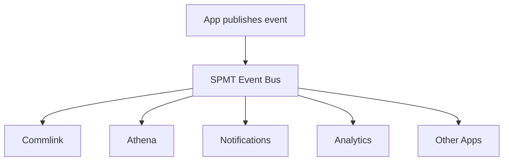

# Ecosystem Event Bus

The Event Bus prevents tight coupling between apps.

Apps publish events. SPMT routes those events to subscribers such as Athena, Commlink, notifications, analytics, and future apps.



## Event Shape

```json
{
  "id": "evt_123",
  "type": "reward.earned",
  "sourceApp": "chat-tag",
  "actor": "user_123",
  "timestamp": "2026-07-04T12:00:00Z",
  "payload": {}
}
```
