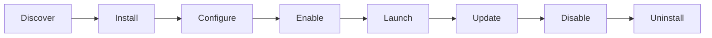

# Shipyard

Shipyard manages app lifecycle.

## App Metadata

Every app should provide:

- id
- name
- description
- launch URL
- auth URL
- version
- latest version
- health status
- permissions
- install state
