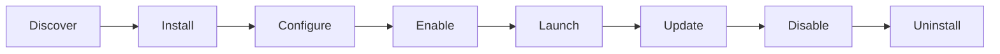

# Shipyard Specification

## Principle

Shipyard manages app lifecycle and discovery.

## Lifecycle

## App States

- `available`
- `installed`
- `enabled`
- `disabled`
- `needs_update`
- `broken`
- `planned`
- `beta`
- `experimental`

## Required Card Fields

Every Shipyard app card should be able to show:

- name
- description
- category
- status
- version
- update available
- permissions
- launch action
- install/enable/disable action
- health state

## Rules

- SpaceMountain.live renders the Shipyard UI.
- SPMT owns app metadata and install state.
- Apps expose launch targets and version/health data.
- First-party apps may have special protections from disabling if required.
